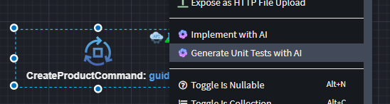
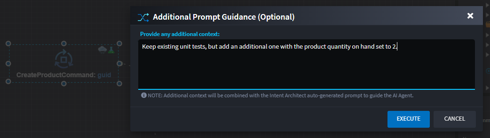
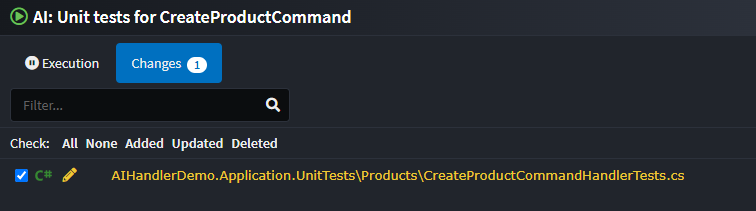
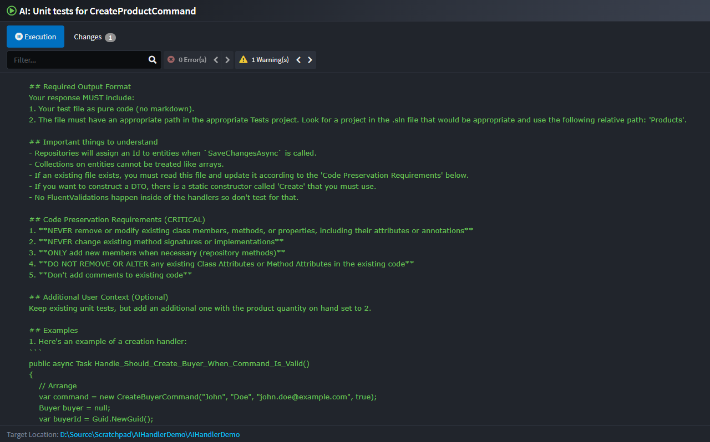

# Intent.AI.UnitTests

The **Intent.AI.UnitTests** module uses AI to automatically implement unit tests for the `Handler` method of a `Command` or `Query`, based on full context from generated code and model metadata provided by Intent Architect.

> [!NOTE]
> To reliably generate unit tests, this module should be used in conjunction with the [`Intent.UnitTesting`](https://docs.intentarchitect.com/articles/modules-dotnet/intent-unittesting/intent-unittesting.html) module.  
> The `Intent.UnitTesting` module generates the test infrastructure (e.g. test project and dependencies), while `Intent.AI.UnitTests` handles the test implementation.

> [!NOTE]
> To use this feature, ensure that the required [User Settings](https://docs.intentarchitect.com/articles/modules-common/intent-common-ai/intent-common-ai.html#user-settings) have been completed — including a valid API key for your selected AI provider.

## Implement with AI

To generate unit tests for a `Command` or `Query` handler, right-click on the element and select **Generate Unit Tests with AI**:

### Influencing Factors

The quality, relevance, and output location of the generated tests depend on several key factors.

#### Intent Modeling

Before using **Generate Unit Tests with AI**, make sure:

- **Generated Code is up-to-date**: Run the Software Factory to apply all outstanding code changes.
- **Command/Query is mapped**: Ensure the `Command` or `Query` is associated with the appropriate `Entity` using a `Create Entity`, `Update Entity`, or `Query Entity` action (a dotted line should appear between the elements).
- **Unit Test infrastructure is Set Up**: Ensure the `Intent.UnitTesting` module has been installed, and that the `Command` or `Query` in question has the `Unit Test` stereotype applied.

#### Adjusting the Prompt

While Intent Architect supplies a default prompt and relevant file context to the AI provider, you can optionally provide additional context to refine the unit test generated.

Enter extra prompt details here:

> 💡 It’s recommended to try the default implementation first. If needed, rerun with added context to improve results.

> [!NOTE]
>
> AI responses are **not deterministic** — each execution may produce different results. Use the [additional context prompt](#adjusting-the-prompt) to guide the AI toward your desired implementation.

### Code Changes

Once the AI Agent completes the task, suggested code changes will be displayed for review:

You can review and apply the changes through the familiar _Software Factory_ interface. If the results aren’t satisfactory, rerun the feature with revised prompt guidance.

### Execution Output

Full logs of the execution, including the AI prompt and any errors, are available in the **Execution** tab:

