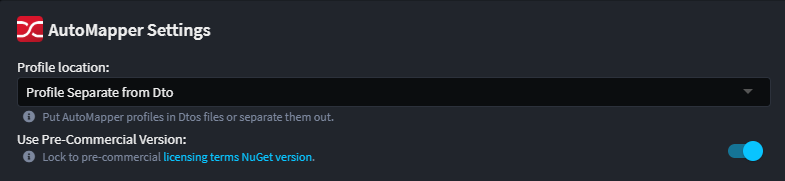

# Intent.Application.AutoMapper

AutoMapper is a popular object-to-object mapping library for .NET that simplifies the process of transferring data between objects, especially between domain models and data transfer objects (DTOs). By configuring mapping profiles, developers can automate the copying of properties between objects with similar structures, reducing repetitive code and potential errors. It supports advanced features like custom value converters, conditional mappings, and flattening complex object graphs, making it a powerful tool for clean, maintainable code in layered application architectures.

## Settings

### Profile Location

This setting controls where the AutoMapper **Profile** classes are generated.

#### Profile in Dto

This option co-locates the Dto's Profile in the Dto's file. This option can be convenient if you want to see all this information together.

```csharp
public class CustomerDto : IMapFrom<Customer>
{
    public CustomerDto()
    {
        ...
    }

    public Guid Id { get; set; }
    public string Name { get; set; }
 
    ...

    public void Mapping(Profile profile)
    {
        profile.CreateMap<Customer, CustomerDto>();
    }
}
```

#### Profile Separate from Dto

This option separates the Dot's Profile in the Dto file. The Profiles often have internal dependencies, like **Domain Entities**, this option allows you to easily split out your Dto's into a stand alone contract project with no additional dependencies.

```csharp
public class CustomerDtoProfile : Profile
{
    public CustomerDtoProfile()
    {
        CreateMap<Customer, CustomerDto>();
    }
}
```

## Commercial License Options

Starting with **AutoMapper v15.0**, a [commercial license](https://www.jimmybogard.com/automapper-and-mediatr-commercial-editions-launch-today/) is required. All versions prior to v15.0 remain free to use.

From version `5.3.0+` of `Intent.Application.AutoMapper`, you can control which version is used via the `Use Pre-Commercial Version` application setting:



- **Enabled** : Locks AutoMapper to the last free version (pre-commercial).
- **Disabled** : Uses the latest **commercial edition**.

> [!WARNING]  
> If you choose to use a commercial version, you must obtain and configure a valid license key.  
> License keys can be requested following the instructions in [Jimmy Bogard's article](https://www.jimmybogard.com/automapper-and-mediatr-commercial-editions-launch-today/).  

Keys should be configured in your `appsettings.json` under:

``` json
{
  "AutoMapper": {
    "LicenseKey": "<your-license-key>"
  }
}
```

Alternatively, you can set it as an environment variable:

```
 AutoMapper__LicenseKey=<your-license-key>
```