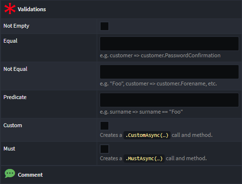

# Intent.Application.FluentValidation

This module contains a designer stereotype and common logic used by various other modules which have templates for generating [FluentValidation](https://fluentvalidation.net/) files for different realizations of data contract.

This module does not itself contain templates, but has common logic used by other modules. For example the `Intent.Modules.Application.MediatR` module uses common functions from this module when generating validators for `Command`s and `Query`s. The `Intent.Modules.Application.FluentValidation.Dtos` module similarly uses the common logic for generating validators for `DTO`s.

## Configuring validation rules for fields on contracts

When this module is installed a `Validations` stereotype is automatically applied to all `DTO-Field` in the services designer. Depending the current `Type` selected for the field, different options will show, for example, here are the options for a `guid`:

And here are the options for a `string`:

For details on the different rules and how they work, refer to the [FluentValidation Docs](https://docs.fluentvalidation.net/en/latest/built-in-validators.html).

## Implicit/inferred validation rules

In some cases this module automatically generates particular validation rules to fields when not explicitly specified on the `Validation` stereotype.

### Max Length

A `Max Length` validation rule is generated when a field is mapped to an attribute which has the `Text Constraints` stereotype applied with its `MaxLength` property set

### Not Null

A `Not Null` validation rule is generated for when a field with a nullable type when it's `Is Nullable` checkbox is unchecked.

## Notes on validation rules

### Custom Validator

When the `Custom` property's checkbox is checked, a `CustomAsync(…)` rule is generated along with a field specific method stub which it delegates to. Compared to a [Predicate Validator](#predicate-validator) rule, `Custom` rules allow specifying custom validation failure messages. See the [FluentValidation Docs](https://docs.fluentvalidation.net/en/latest/custom-validators.html#writing-a-custom-validator) for more information on Custom Validators.

### Predicate Validator

When the `Must` property's checkbox is checked, a `MustAsync(…)` rule is generated along with a field specific method stub which it delegates to. Compared to a [Custom Validator](#custom-validator) rule, `Must` rules work with simple predicates and do not allow specifying of custom validation failure messages. See the [FluentValidation Docs](https://docs.fluentvalidation.net/en/latest/custom-validators.html#predicate-validator) for more information on Predicate Validators.
