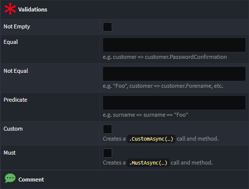
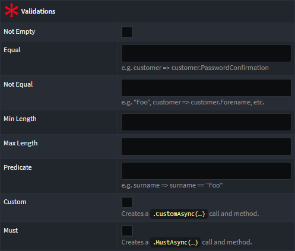

# Intent.Application.FluentValidation

This module provides a designer stereotype and common logic used by various other modules to generate [FluentValidation](https://fluentvalidation.net/) files for different implementations of data contracts.

While this module does not contain templates on its own, it includes common logic utilized by other modules. For example, the `Intent.Modules.Application.MediatR` module uses functions from this module to generate validators for `Command`s and `Query`s. Similarly, the `Intent.Modules.Application.FluentValidation.Dtos` module relies on this logic for generating validators for `DTO`s.

## Configuring Validation Rules for Fields on Contracts

When this module is installed, a `Validations` stereotype is automatically applied to all `DTO-Field` items in the Services Designer. Depending on the selected `Type` for the field, different options will be displayed. For example, here are the options for a `guid` field:

And here are the options for a `string` field:

### Custom Validation Rules

While the default available rules can handle most validation scenarios, you can select the `Custom` or `Must` option to create custom validation rules. This will generate a method in the validator (which is ignored by Intent Architect) to allow custom validation logic.

#### Custom Validator

When the `Custom` property checkbox is selected, a `CustomAsync(…)` rule is generated, along with a field-specific method stub to which it delegates. Unlike the [Predicate Validator](#predicate-validator), `Custom` rules allow you to specify custom validation failure messages. For more information, refer to the [FluentValidation Docs on Custom Validators](https://docs.fluentvalidation.net/en/latest/custom-validators.html#writing-a-custom-validator).

#### Predicate Validator

When the `Must` property checkbox is selected, a `MustAsync(…)` rule is generated, along with a field-specific method stub. Compared to a [Custom Validator](#custom-validator), `Must` rules work with simple predicates and do not allow for specifying custom validation failure messages. For more details, see the [FluentValidation Docs on Predicate Validators](https://docs.fluentvalidation.net/en/latest/custom-validators.html#predicate-validator).

For details on all available validation rules and how they work, refer to the [FluentValidation Docs](https://docs.fluentvalidation.net/en/latest/built-in-validators.html).

## Implicit/Inferred Validation Rules

In certain cases, this module automatically generates specific validation rules for fields when they are not explicitly specified in the `Validation` stereotype. These cases include:

### Max Length

A `Max Length` validation rule is generated when a field is mapped to an attribute that has the `Text Constraints` stereotype applied, with the `MaxLength` property set.

### Not Null

A `Not Null` validation rule is generated for fields with nullable types when the `Is Nullable` checkbox is unchecked.
