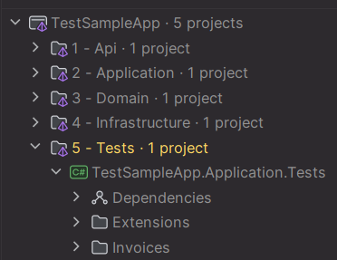
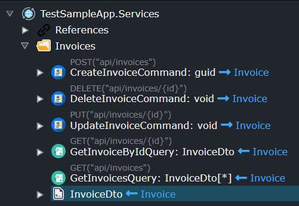
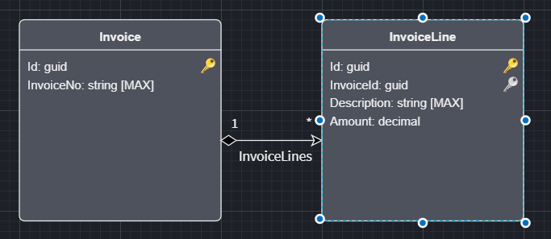
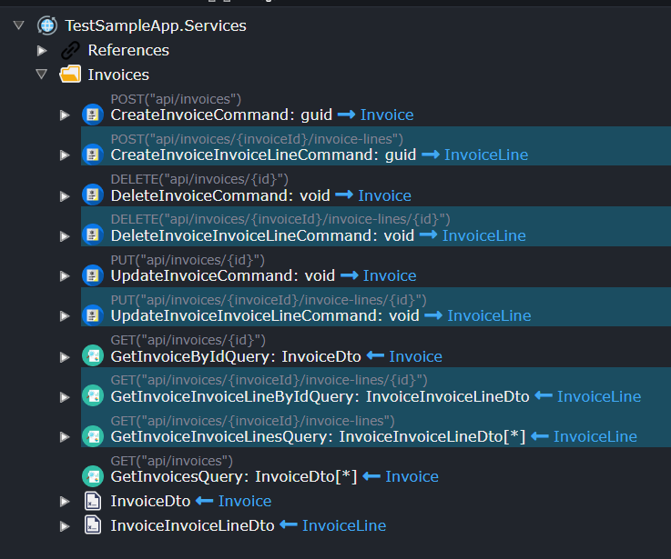

# Intent.Application.MediatR.CRUD.Tests

This module generates unit tests for using [XUnit](https://xunit.net/), [NSubstitute](https://nsubstitute.github.io/), [FluentAssertions](https://fluentassertions.com/) and [AutoFixture](https://autofixture.github.io/).

Some of the terms used in this module:
- [SUT](http://xunitpatterns.com/SUT.html) - System Under Test.

## Where are the tests generated?

Once this module is installed and the Software Factory executed, you will notice a new solution folder and project like this in your IDE:



## What kind of tests are generated?

This module only targets the MediatR CRUD services like this:



Only the mapped Commands and Queries that can be identified as CRUD-based services are selected for generating tests to test their respective Command/Query handlers.

There are the following kinds of tests available:

- Create Handler Tests
- Update Handler Tests
- Delete Handler Tests
- Get-By-Id Handler Tests
- Get-All Handler Tests
- Paginated-Get Handler Tests
- Fluent Validation Tests

All of the above (except the paginated and fluent validation tests) will have tests also for nested entities.

Nested Entities can be explained like this. If I have a domain like this:



I can generate CRUD services like this:



Those services will also have unit tests generated.

## Examples of Unit Tests

### CreateInvoiceCommandHandlerTests (Command Handler Test)

This does a positive-test against the Command Handler.

```csharp
public class CreateInvoiceCommandHandlerTests
{
    public static IEnumerable<object[]> GetSuccessfulResultTestData()
    {
        var fixture = new Fixture();
        yield return new object[] { fixture.Create<CreateInvoiceCommand>() };
    }

    [Theory]
    [MemberData(nameof(GetSuccessfulResultTestData))]
    public async Task Handle_WithValidCommand_AddsInvoiceToRepository(CreateInvoiceCommand testCommand)
    {
        // Arrange
        var invoiceRepository = Substitute.For<IInvoiceRepository>();
        var expectedInvoiceId = new Fixture().Create<System.Guid>();
        Invoice addedInvoice = null;
        invoiceRepository.OnAdd(ent => addedInvoice = ent);
        invoiceRepository.UnitOfWork
            .When(async x => await x.SaveChangesAsync(CancellationToken.None))
            .Do(_ => addedInvoice.Id = expectedInvoiceId);

        var sut = new CreateInvoiceCommandHandler(invoiceRepository);

        // Act
        var result = await sut.Handle(testCommand, CancellationToken.None);

        // Assert
        result.Should().Be(expectedInvoiceId);
        await invoiceRepository.UnitOfWork.Received(1).SaveChangesAsync();
        InvoiceAssertions.AssertEquivalent(testCommand, addedInvoice);
    }
}
```

> ** NOTE **
>
> `GetSuccessfulResultTestData` can be Intent-Ignored in order for user-defined tests data to be supplied.

### CreateInvoiceCommandValidatorTests (Fluent Validation Test)

This does both positive and negative test cases against the Fluent Validator for the Command Handler.

```csharp
public class CreateInvoiceCommandValidatorTests
{
    public static IEnumerable<object[]> GetSuccessfulResultTestData()
    {
        var fixture = new Fixture();
        var testCommand = fixture.Create<CreateInvoiceCommand>();
        yield return new object[] { testCommand };
    }

    [Theory]
    [MemberData(nameof(GetSuccessfulResultTestData))]
    public async Task Validate_WithValidCommand_PassesValidation(CreateInvoiceCommand testCommand)
    {
        // Arrange
        var validator = GetValidationBehaviour();
        var expectedId = new Fixture().Create<System.Guid>();
        // Act
        var result = await validator.Handle(testCommand, () => Task.FromResult(expectedId), CancellationToken.None);

        // Assert
        result.Should().Be(expectedId);
    }

    public static IEnumerable<object[]> GetFailedResultTestData()
    {
        var fixture = new Fixture();
        fixture.Customize<CreateInvoiceCommand>(comp => comp.With(x => x.InvoiceNo, () => default));
        var testCommand = fixture.Create<CreateInvoiceCommand>();
        yield return new object[] { testCommand, "InvoiceNo", "not be empty" };
    }

    [Theory]
    [MemberData(nameof(GetFailedResultTestData))]
    public async Task Validate_WithInvalidCommand_FailsValidation(
        CreateInvoiceCommand testCommand,
        string expectedPropertyName,
        string expectedPhrase)
    {
        // Arrange
        var validator = GetValidationBehaviour();
        var expectedId = new Fixture().Create<System.Guid>();
        // Act
        var act = async () => await validator.Handle(testCommand, () => Task.FromResult(expectedId), CancellationToken.None);

        // Assert
        act.Should().ThrowAsync<ValidationException>().Result
        .Which.Errors.Should().Contain(x => x.PropertyName == expectedPropertyName && x.ErrorMessage.Contains(expectedPhrase));
    }

    private ValidationBehaviour<CreateInvoiceCommand, System.Guid> GetValidationBehaviour()
    {
        return new ValidationBehaviour<CreateInvoiceCommand, System.Guid>(new[] { new CreateInvoiceCommandValidator() });
    }
}
```

> ** NOTE **
>
> `GetSuccessfulResultTestData`, `GetFailedResultTestData` can be Intent-Ignored in order for user-defined tests data to be supplied. `GetValidationBehaviour` can also be Intent-Ignored in order to control how a Validator is constructed especially when user-defined services are being injected in the constructor.
