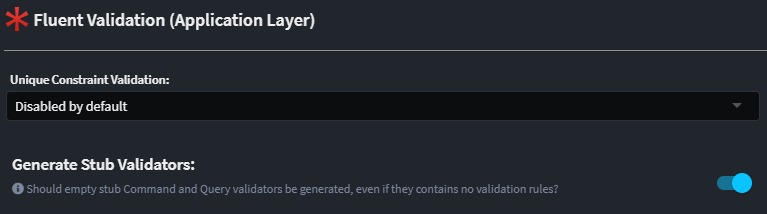

# Intent.Application.MediatR.FluentValidation

This module provides the logic and templates for creating `Command` and `Query` validators using [FluentValidation](https://fluentvalidation.net/).

## Creating Command/Query Validators

By default, a `validator` is automatically generated for every `Command` and `Query`. This includes cases where the validator would otherwise be empty (unlike the validators for `DTOs`, which are only created when necessary: [see here](https://github.com/IntentArchitect/Intent.Modules.NET/blob/master/Modules/Intent.Modules.Application.FluentValidation.Dtos/docs/README.md#creating-dto-validators)).

This behavior can be controlled using the `Generate Stub Validators` application setting. When enabled (the default), this setting generates a validator for every `Command` and `Query`, even if no validations are specified. If disabled, a `validator` will only be generated if it contains actual validation rules.

