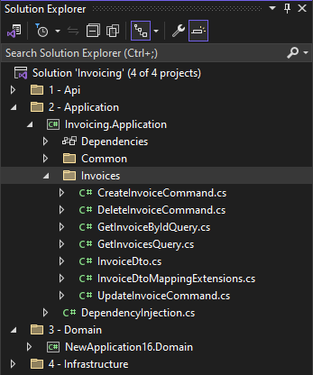
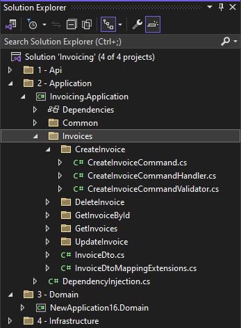
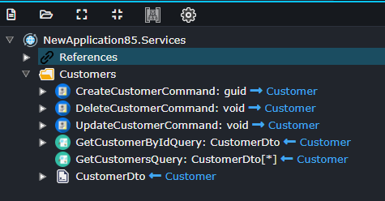

# Intent.Application.MediatR

This Intent Architect module realizes a CQRS design pattern using MediatR, for Service's modeled in the Services Designer using the CQRS paradigm.

CQRS (Command Query Responsibility Segregation) using MediatR is a software design pattern and library combination that separates read and write operations in an application. MediatR serves as the Mediator, handling commands and queries, and routing them to their respective command and query handlers. Commands represent intentions to change the application's state, while queries retrieve data without making modifications. This approach promotes separation of concerns, scalability, and testability, allowing for clearer codebases and aligning well with Domain-Driven Design principles, ultimately resulting in more maintainable and efficient applications.

This module produces the following artifacts:

- **Command Interface** - `ICommand` interface for identifying commands.
- **Query Interface**- `IQuery` interface for identifying querys.
- **Commands** - Classes representing all the modelled `Command`s.
- **CommandHandlers** - MediatR request handlers for all the modelled `Command`s
- **Querys**- Classes representing all the modelled `Query`s.
- **QueryHandlers** - MediatR request handlers for all the modelled `Query`s

## CQRS Settings

### CQRS Settings - Consolidate Command/Query associated files into single file

When set to `disabled` (the default), each command/query is generated into its own sub-folder with its handler and validator (when applicable) alongside it in the same sub-folder.



When set to `enabled`, commands and queries no longer have their own sub-folders and files which used to be generated alongside them are now instead generated into the handler/command file itself.



## Examples

This module consumes:



And produce artifacts similar to:

### Command Example

```csharp
public class CreateCustomerCommand : IRequest<Guid>, ICommand
{
    public CreateCustomerCommand(string name, string surname, string email)
    {
        Name = name;
        Surname = surname;
        Email = email;
    }

    public string Name { get; set; }
    public string Surname { get; set; }
    public string Email { get; set; }
}
```

### CommandHandler Example

```csharp
public class CreateCustomerCommandHandler : IRequestHandler<CreateCustomerCommand, Guid>
{

    public async Task<Guid> Handle(CreateCustomerCommand request, CancellationToken cancellationToken)
    {
        ...
    }
}

```

For more information on MediatR, check out their [official GitHub](https://github.com/jbogard/MediatR/).

## Command nullable properties

Nullable properties will have a default value set as _null_ in the Command constructor, providing there are no non-nullable properties which occur after them (as defined in the in the Intent Architect Services designer).

Notice in the below example, the _name_ property, even though nullable does not have a default value set. This is due to the fact there are non-nullable properties which are declared after _name_ in the designer.

```csharp
public class CreateCustomerCommand : IRequest<Guid>, ICommand
{
    public CreateCustomerCommand(string? name, string surname, string email)
    {
        Name = name;
        Surname = surname;
        Email = email;
    }

    public string? Name { get; set; }
    public string Surname { get; set; }
    public string Email { get; set; }
}
```

To ensure the default is set to null, in the Intent Architect Services designer the _name_ property should be moved to after all non-nullable properties, which will then result in the following code:

```csharp
public class CreateCustomerCommand : IRequest<Guid>, ICommand
{
    public CreateCustomerCommand(string surname, string email, string? name = null)
    {
        Surname = surname;
        Email = email;
        Name = name;
    }

    public string Surname { get; set; }
    public string Email { get; set; }
    public string? Name { get; set; }
}
```
