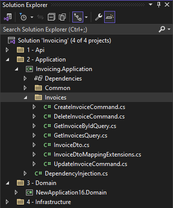
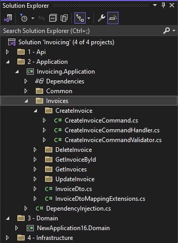

# Intent.Application.MediatR

This Intent Architect module realizes a CQRS design pattern using MediatR, for Service's modeled in the Services Designer using the CQRS paradigm.

CQRS (Command Query Responsibility Segregation) using MediatR is a software design pattern and library combination that separates read and write operations in an application. MediatR serves as the Mediator, handling commands and queries, and routing them to their respective command and query handlers. Commands represent intentions to change the application's state, while queries retrieve data without making modifications. This approach promotes separation of concerns, scalability, and testability, allowing for clearer codebases and aligning well with Domain-Driven Design principles, ultimately resulting in more maintainable and efficient applications.

This module produces the following artifacts:

- **Command Interface** - `ICommand` interface for identifying commands.
- **Query Interface**- `IQuery` interface for identifying querys.
- **Commands** - Classes representing all the modelled `Command`s.
- **CommandHandlers** - MediatR request handlers for all the modelled `Command`s
- **Querys**- Classes representing all the modelled `Query`s.
- **QueryHandlers** - MediatR request handlers for all the modelled `Query`s

## CQRS Paradigm

**Intent.Application.MediatR** implements the **CQRS Paradigm** (Command Query Responsibility Segregation), which:

- Separates read and write responsibilities into distinct models optimized for their respective purposes
- Models each operation as a discrete request/response object (use case-centric)
- Enables specialized pipeline behaviors (validation, logging, transactions)
- Provides loose coupling through the mediator pattern
- Ideal for systems with complex requirements or high scalability demands

This paradigm is appropriate when:
- Your operations benefit from independent optimization and pipeline behaviors
- You want strict separation between commands and queries
- Individual operations have complex, distinct concerns
- You require loose coupling via the mediator pattern

## Alternative Paradigm: Traditional Application Services

The **Traditional Service Paradigm** is available through the `Intent.Application.ServiceImplementations` module and:

- Combines read and write logic into a single service
- Uses a unified data model and service structure
- Groups operations naturally by business capability
- Simplifies development with a traditional object-oriented approach
- Common in systems with straightforward requirements or minimal scalability concerns

This paradigm is appropriate when:
- Your domain model and service structure are naturally unified
- Operations are grouped by business capability
- You prefer a class-based approach with methods
- Your team is familiar with traditional service-oriented patterns

## CQRS Settings

### CQRS Settings - Consolidate Command/Query associated files into single file

When set to `disabled` (the default), each command/query is generated into its own sub-folder with its handler and validator (when applicable) alongside it in the same sub-folder.



When set to `enabled`, commands and queries no longer have their own sub-folders and files which used to be generated alongside them are now instead generated into the handler/command file itself.



## Examples

This module consumes:


And produce artifacts similar to:

### Command Example

```csharp
public class CreateCustomerCommand : IRequest<Guid>, ICommand
{
    public CreateCustomerCommand(string name, string surname, string email)
    {
        Name = name;
        Surname = surname;
        Email = email;
    }

    public string Name { get; set; }
    public string Surname { get; set; }
    public string Email { get; set; }
}
```

### CommandHandler Example

```csharp
public class CreateCustomerCommandHandler : IRequestHandler<CreateCustomerCommand, Guid>
{

    public async Task<Guid> Handle(CreateCustomerCommand request, CancellationToken cancellationToken)
    {
        ...
    }
}

```

For more information on MediatR, check out their [official GitHub](https://github.com/jbogard/MediatR/).

## Property default values

When designing in the Intent Architect Services designer, Commands can be created with properties, and these properties can have default values. When a default value is supplied, it will be used in the constructor of the Command, provided the property is _not proceeded by another property which does not have a default value._.

In the below example, in the Service designer, the _name_ property was set with a default value, however it is not being used in the constructor. This is due to the fact there are properties proceeding it which do not have a default value.

```csharp
public class CreateCustomerCommand : IRequest<Guid>, ICommand
{
    public CreateCustomerCommand(string? name, string surname, string email)
    {
        Name = name;
        Surname = surname;
        Email = email;
    }

    public string? Name { get; set; }
    public string Surname { get; set; }
    public string Email { get; set; }
}
```

To ensure the default is set, in the Intent Architect Services designer the _name_ property should be moved to after all properties without a default value, which will then result in the following code:

```csharp
public class CreateCustomerCommand : IRequest<Guid>, ICommand
{
    public CreateCustomerCommand(string surname, string email, string? name = "my default value")
    {
        Surname = surname;
        Email = email;
        Name = name;
    }

    public string Surname { get; set; }
    public string Email { get; set; }
    public string? Name { get; set; }
}
```

The designer will also raise a warning if the Command has been incorrectly configured (but will still allow the Software Factory to be executed)

## Commercial License Options

Starting with **MediatR v13.0**, a [commercial license](https://www.jimmybogard.com/automapper-and-mediatr-commercial-editions-launch-today/) is required. All versions prior to v13.0 remain free to use.

From version `4.5.0+` of `Intent.Application.MediatR`, you can control which version is used via the `Use Pre-Commercial Version` application setting:


- **Enabled** : Locks MediatR to the last free version (pre-commercial).
- **Disabled** : Uses the latest **commercial edition**.

> [!WARNING]  
> If you choose to use a commercial version, you must obtain and configure a valid license key.  
> License keys can be requested following the instructions in [Jimmy Bogard's article](https://www.jimmybogard.com/automapper-and-mediatr-commercial-editions-launch-today/).  

Keys should be configured in your `appsettings.json` under:

``` json
{
  "MediatR": {
    "LicenseKey": "<your-license-key>"
  }
}
```

Alternatively, you can set it as an environment variable:

```
 MediatR__LicenseKey=<your-license-key>
```
