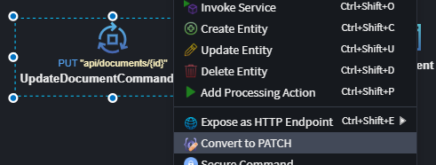

# Intent.AspNetCore.Controllers.JsonPatch

Adds [RFC 7396](https://datatracker.ietf.org/doc/html/rfc7396) JSON Merge Patch support to generated ASP.NET Core Controller PATCH endpoints while preserving Clean Architecture boundaries.

## Overview

`Intent.AspNetCore.Controllers.JsonPatch` implements HTTP PATCH using **RFC 7396 (JSON Merge Patch)** semantics:

- Omitted properties mean "leave unchanged."
- Properties present with `null` mean "set to null."

The module integrates merge patching into generated ASP.NET Core Controllers, Commands, DTOs, handlers, and service operations without leaking HTTP transport concerns into domain logic.

## Making an Existing Command / Service Operation a PATCH Endpoint

If you already have a Command or Service Operation and it is not exposed as an HTTP endpoint yet, you can expose it directly as PATCH from the designer:

1. Select the existing Command or Service Operation.
2. Open the action/context menu.
3. Choose **Expose as HTTP Endpoint**.
4. Select **Expose as HTTP Patch Endpoint**.


If the operation is already exposed as an HTTP endpoint, you can also use **Convert to PATCH** from the same action/context menu.



After this, generation will wire the operation for RFC 7396 merge-patch semantics using the patterns described below.

## What This Module Does

When enabled, this module:

- Replaces PATCH body parameters with `JsonMergePatchDocument<T>` in generated ASP.NET Core Controllers.
- Injects an `IPatchExecutor<T>` abstraction into Commands/DTOs so application code can apply patches without depending on transport types.
- Generates patch execution infrastructure (`JsonMergePatchExecutor<T>`) that applies [RFC 7396](https://datatracker.ietf.org/doc/html/rfc7396) patches.
- Generates PATCH-specific interaction strategy behavior for both MediatR and traditional service paths.
- Updates OpenAPI/Swagger metadata so clients see the expected payload schema (without exposing internal `PatchExecutor`).
- Overrides non-public DTO setter settings (`init`, `private`, etc.) to `public` for properties participating in JSON patch scenarios.

## Why This Module Exists

### Default Behavior Without This Module

Without this module, update mapping behavior in `Intent.Modules.Application.DomainInteractions` will introduce `if-null` checks over Command / DTO properties that are nullable, leaving the PATCH payload ambiguous in intent:

- Omitted field and explicitly-null field won't overwrite existing values.
- Intentionally setting a value to `null` will not reflect due to the shortcoming in communicating intent from the caller to the application layer.

### What Changes with This Module

This module introduces a merge-patch executor pipeline that preserves [RFC 7396](https://datatracker.ietf.org/doc/html/rfc7396) intent from transport all the way through application handling, so omitted and explicit-null behaviors can be distinguished correctly.

## Design Tradeoffs Considered

### Why Not Expose Entities Directly?

Exposing entities directly was considered because it can reduce processing overhead when service layers are kept thin.

The major downside is contract safety: exposing entity graphs publicly can unintentionally expose internal persistence structure and fields that should remain hidden.

This module deliberately avoids that risk by keeping explicit inbound application contracts (Command / DTO) and explicit mapping boundaries.

### Why JSON Merge PATCH + Contract Mapping?

The chosen approach preserves separation between transport contracts, application contracts, and domain models while still supporting omitted-vs-null semantics required by PATCH.

Data flow remains explicit and mapped. No mapper dependency is required in this pattern, although mapper integration could be added in future if it provides value.

## Generated Artifacts

### PATCH Executor Abstraction

- `IPatchExecutor<T>` interface with `ApplyToAsync(T target, CancellationToken cancellationToken = default)`.
- Used by generated Commands/DTOs, keeping application contracts transport-agnostic.

```csharp
public interface IPatchExecutor<T>
{
    Task ApplyToAsync(T target, CancellationToken cancellationToken = default);
}
```

### PATCH Executor Implementation

- `JsonMergePatchExecutor<T>` wraps `JsonMergePatchDocument<T>` from [Morcatko](https://github.com/Morcatko/Morcatko.AspNetCore.JsonMergePatch).
- Applies patch document to the target object.
- Optionally validates the patched object when validator integration is available (like FluentValidation).

### Controller Generation Changes (ASP.NET Core Controllers)

- PATCH endpoints consume `JsonMergePatchDocument.ContentType` (`application/merge-patch+json`).
- PATCH body parameter type becomes `JsonMergePatchDocument<T>`.
- Generated controller code creates and passes a patch executor into the command/DTO pipeline.

### OpenAPI/Swagger Support

- Generated operation filter/transformer adjusts the PATCH request schema (and ensures no internal fields are present on the schema level).

## PATCH Execution Pattern

For generated PATCH update flows, handlers/service operations follow this order:

1. Query the entity.
2. Hydrate the incoming request through `LoadOriginalState(entity, request)`.
3. Apply the incoming json diff on the original request with `await request.PatchExecutor.ApplyToAsync(request, cancellationToken)`.
4. Apply the new request changes to the retrieved entity using `ApplyChangesTo(request, entity)`.
5. Persist changes.

This ordering matters because original state is captured before mutation, [RFC 7396](https://datatracker.ietf.org/doc/html/rfc7396) patch intent is applied once to request state, and then mapped entity updates run in a controlled way.

## Why This Pattern Is Structured This Way

- PATCH hydration requires current persisted values to exist before merge semantics can be applied reliably.
- The handler/service operation is where all required dependencies already exist (data access, state load, apply, save), so the work can be done once.
- Moving hydration and patch application into middleware/controller orchestration typically introduces duplicate data lookups, orchestration complexity, or cross-layer state handling.
- Keeping the flow inside the operation avoids those costs and keeps the read-modify-write cycle cohesive.

### Why Apply Patch to the Incoming Command / DTO?

Using the incoming request object for patch application is a pragmatic tradeoff:

- It avoids creating and synchronizing a second intermediate object.
- It keeps one coherent object through state load, patch apply, validation, and update mapping.
- It is a small compromise made specifically for PATCH semantics, where some transport concern naturally influences application flow.

The module minimizes this compromise by containing transport-specific behavior behind `IPatchExecutor<T>`.

### Command / DTO Shape

For PATCH payload models, setter accessibility is forced to `public` where needed so merge-patch application can mutate target members, even if your global DTO Settings use non-public setters.

```csharp
public class UpdateCustomerCommand
{
    public Guid Id { get; private set; }
    public string? DisplayName { get; set; }
    public string? Email { get; set; }
    public IPatchExecutor<UpdateCustomerCommand> PatchExecutor { get; private set; }

    public UpdateCustomerCommand(Guid id, IPatchExecutor<UpdateCustomerCommand> patchExecutor)
    {
        Id = id;
        PatchExecutor = patchExecutor;
    }
}
```

### Handler / Service Implementation Pattern

```csharp
public async Task<ResultDto> Handle(UpdateThingCommand request, CancellationToken cancellationToken)
{
    var entity = await _repo.FindByIdAsync(request.Id, cancellationToken);

    LoadOriginalState(entity, request);
    await request.PatchExecutor.ApplyToAsync(request, cancellationToken);
    ApplyChangesTo(request, entity);

    await _unitOfWork.SaveChangesAsync(cancellationToken);
    return entity.MapToResultDto(_mapper);
}
```

The same pattern is applied in traditional service operation generation.

## Validation and Serialization Behavior

### Validation Behavior

- If a validator provider interface is present (for example with FluentValidation integration), validation executes after patch application in `JsonMergePatchExecutor<T>`.
- For MediatR PATCH commands, generated code bypasses pre-handler pipeline validation so validation runs against the patched shape, not the incomplete pre-patch shape.
- Pre-handler validation bypass is opt-in and only applied for PATCH command scenarios.

### Serialization Behavior

- The library `Morcatko.AspNetCore.JsonMergePatch.NewtonsoftJson` is configured for PATCH merge-patch media type handling using the Newtonsoft JSON serializer.
- Normal API JSON processing remains the default pipeline (typically `System.Text.Json`) unless separately changed in your host configuration.

In short: Newtonsoft is introduced for merge-patch content type handling, not as a global replacement for all JSON serialization.

## RFC 7396 Implications

### Pros

- Compact partial-update payloads.
- Explicit "nulling" support (`"field": null`).
- Omitted fields are preserved.
- Straightforward client authoring compared to operation-based patch formats.

### Cons

- Patching is member-root merge behavior, not operation-path behavior.
- Nested complex objects and collections are replaced at that member level.
- Not ideal for fine-grained collection element edits.

Example:

```json
{
  "address": {
    "city": "Cape Town"
  }
}
```

`address` is treated as the replacement payload for that member context, not as deep path-by-path operations.

## Scope

Current support is **ASP.NET Core Controllers only**.

## When To Use

- You need [RFC 7396-compliant](https://datatracker.ietf.org/doc/html/rfc7396) PATCH semantics.
- Clients must distinguish omitted vs explicitly-null fields.
- You want transport-aware merge patching without violating Clean Architecture boundaries.

## Feedback and Improvements

If you have suggestions on how to improve this PATCH pattern, contact [support@intentarchitect.com](mailto:support@intentarchitect.com) or create an Issue on the Intent Architect Support repository.


