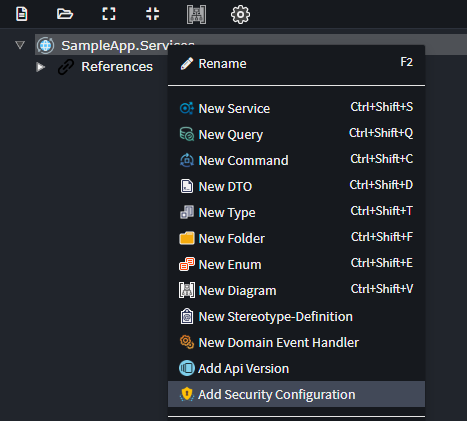
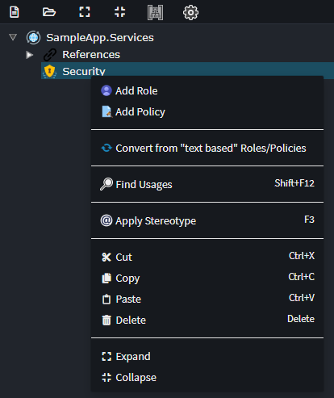
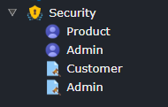
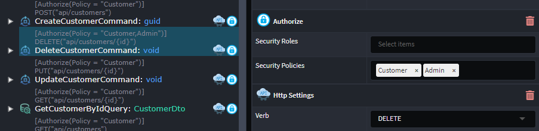
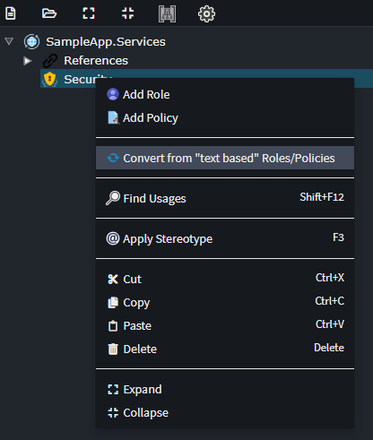

# Intent.AspNetCore.Controllers

This module realizes the ASP.Net core controller pattern based on Service modeling.

## What are ASP.Net Core Controllers?

An ASP.NET Core controller is a class that serves as an intermediary between the HTTP client and the application logic. It is a lightweight, stateless component that handles HTTP requests and responses. This controller pattern is focused on Web API scenarios which returning data rather than HTML views. This type of controller provides essential functionalities such as routing, model binding, and response formatting. It is equipped with methods and attributes that facilitate handling of HTTP verbs (GET, POST, PUT, DELETE) and can return various result types like Ok, BadRequest, and NotFound. By inheriting from ControllerBase, developers can create RESTful services and APIs efficiently, leveraging built-in features for request processing, validation, and serialization.

To learn more check out the official [documentation](https://learn.microsoft.com/en-us/aspnet/core/web-api/?view=aspnetcore-8.0).

## Modeling Role / Policy based security

In the service designer you can now model your `Role`s and  `Policy`s and reference these on your end points.

On the Service Package, Right Click and select `Add Security Configuration`.

On the `Security Configuration` element, Right Click and select `Add Role` or `Add Policy`.

One you've configured your `Role`s and or `Policy`s it will look as follows.

You can now configure these as your Roles / Policies on your `Command`s, `Query`s or `Service Operation`s on the `Authorize` or `Secured` stereotypes.

### Convert from our previous version of security

If you have already have your security configured on our older paradigm, you can upgrade to this new paradigm.

On the Service Package, Right Click and select `Add Security Configuration`.

On the `Security Configuration` element, Right Click and select `Convert from 'text based' Roles/Policies`.

This will created `Role`s and `Policy`s based on the current text configuration, write up you security stereotypes to point to these new `Element`s.

> **Note:**
>
> If you are using `+` notation, this is not currently supported. Please reach out to us at https://github.com/IntentArchitect/Support should you need this support added."
