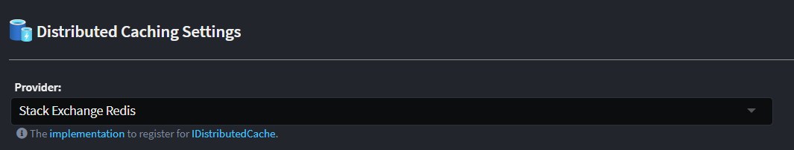

# Intent.AspNetCore.DistributedCaching

This module enables support for [distributed caching](https://learn.microsoft.com/aspnet/core/performance/caching/distributed) for an application through the [`IDistributedCache`](https://learn.microsoft.com/dotnet/api/microsoft.extensions.caching.distributed.idistributedcache) and [`IDistributedCacheWithUnitOfWork`](#the-idistributedcachewithunitofwork-interface) interfaces. A distributed cache is a cache shared by multiple app servers, typically maintained as an external service to the app servers that access it.

## Settings

### Provider

Used to select the implementation to be registered for `IDistributedCache`, at present the following options are available:

- [Memory](https://learn.microsoft.com/aspnet/core/performance/caching/distributed#distributed-memory-cache)
- [Stack Exchange Redis](https://learn.microsoft.com/aspnet/core/performance/caching/distributed#distributed-redis-cache)

Please log on issue on our [Github Support](https://github.com/IntentArchitect/Support) should you require a different provider.

## The `IDistributedCacheWithUnitOfWork` interface

This interface can be used when mutations to the underlying `IDistributedCache` should not be persisted until the `SaveAllChangesAsync()` method on it is used. This would be used in cases where you only want to persist data after all other work, including persistence to a database, has been completed, for scenarios like preventing the cache being mutated prior to an attempt to save to the database which fails.

The `IDistributedCacheWithUnitOfWork` interface is registered as a singleton to allow it to be used by other singletons, but uses [`AsyncLocal<T>`](https://learn.microsoft.com/dotnet/api/system.threading.asynclocal-1) to allow isolation when used by different services and scopes.

`IDistributedCacheWithUnitOfWork` does not enable unit of work unless its `EnableUnitOfWork()` is used. `EnableUnitOfWork()` returns an `IDisposable` which must be used to release `AsyncLocal<T>` values.

## The `DistributedCacheExtensions` class

These extension methods add convenient methods for JSON serializing into and out of DistributedCache.