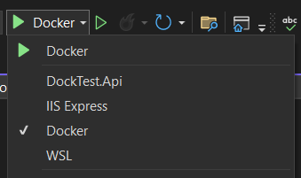

# Intent.AspNetCore.Docker

The module installs Docker support into your ASP.Net Core solution, similar to how Visual Studio would do if you select `enable Docker support` on solution creation.

## Running and debugging your solution under Docker

The easiest way to run or debug your solution in Visual Studio is to simply choose "Docker" as your Debug Target:



## Configuration and Environment Variables

To configure your .NET app, typically an ASP.NET Core app, you can use `appsettings.json` and/or environment variables.

- **appsettings.json**: This file is used to store configuration settings. ASP.NET Core supports multiple `appsettings.json` files for different environments, such
  as `appsettings.Development.json` and `appsettings.Production.json`. These files allow you to override settings based on the environment your application is running in. For more
  details, see [ASP.NET Core Configuration](https://learn.microsoft.com/en-us/aspnet/core/fundamentals/configuration/).

- **Environment Variables**: ASP.NET Core can also read configuration settings from environment variables. These can be set in the `launchSettings.json` file or directly in the
  Dockerfile or Docker Compose file. Environment variables prefixed with `ASPNETCORE_` or `DOTNET_` are to [override specific launch or system variables](https://learn.microsoft.com/en-us/aspnet/core/fundamentals/configuration/#non-prefixed-environment-variables). For more information on
  environment variables and their precedence, refer
  to [ASP.NET Core Environment Variables](https://learn.microsoft.com/en-us/aspnet/core/fundamentals/configuration/).

Environment variables have a higher preference than `appsettings.json` settings. This means that if a setting is defined in both `appsettings.json` and as an environment variable,
the environment variable's value will be used. This behavior is particularly useful for sensitive information that should not be stored in source control or for settings that vary
between environments.

For example, consider the following `appsettings.json` configuration:

```json
 {
  "ConnectionStrings": {
    "DefaultConnection": "Server=(localdb)\\mssqllocaldb;Database=aspnet-WebApplication1-53bc9b9d-9d6a-45d4-8429-2a2761773502;Trusted_Connection=True;MultipleActiveResultSets=true"
  }
}
```

And an environment variable:

In this case, the environment variable `ConnectionStrings__DefaultConnection` will override the `DefaultConnection` setting in `appsettings.json`.

### Basic Docker cli commands

#### Docker build

From a terminal in the folder of the project with the entry point of your application:

```bash
docker build -f ./Dockerfile -t <image-name> ..
```

`-f` specifies the Dockerfile to use, `-t` specifies the docker image name, and the `..` at the end specifies the working directory.

See [Docker's documentation](https://docs.docker.com/reference/cli/docker/buildx/build/) for more information.

#### Docker run

```bash
docker run -P <image-name> ..
```

`-P` publishes exposed ports to random ports.

See [Docker's documentation](https://docs.docker.com/reference/cli/docker/container/run/) for more information.

### Pass Environments variables via arguments

Execute docker command:

```powershell
docker run -it --name "your-container-name" -e ConnectionStrings__DefaultConnection="Server=myserver;Database=mydatabase;User Id=myuser;Password=mypassword;" <image-name>
```

### Pass ENV file with configured Environment Variables

Create an `.env` file:

```text
ConnectionStrings__DefaultConnection=Server=myserver;Database=mydatabase;User Id=myuser;Password=mypassword;
```

Execute docker command:

```powershell
docker run -it --name "your-container-name" --env-file ./.env <image-name>
```

## Troubleshooting

There are scenarios where you need to clear out your local `.vs` folder.

- If you change your development hosting option i.e., from Docker to Local Kestrel.
- To regenerate the Docker certificate setup, when running the dockerized solution.
