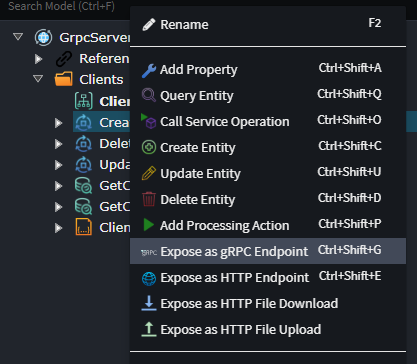
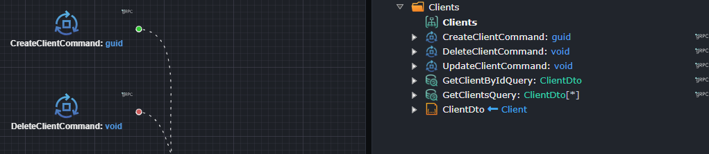

# Intent.AspNetCore.Grpc

This module allows exposing Services Operations, Commands and Queries over [gRPC](https://grpc.io/) using the [Grpc.AspNetCore NuGet package](https://www.nuget.org/packages/Grpc.AspNetCore).

gRPC is a modern, open source, high-performance remote procedure call (RPC) framework that can run anywhere. gRPC enables client and server applications to communicate transparently, and simplifies the building of connected systems.

## Exposing services over gRPC

To expose a service over gRPC right-click it in the designer and select the `Expose as gRPC Endpoint` option:



This option is available on the following element types:

- **Command**
- **Operation**
- **Query**
- **Service** (equivalent to using the option on all the Operations of the Service)

In the Intent Architect designers you can tell at a glance which services are exposed as they will have a gRPC icon visible on them on diagrams and the tree view:



## Generated patterns for exposed services

### Proto files for messages

For each exposed service, required contracts are recursively identified and corresponding [Protobuf messages](https://developers.google.com/protocol-buffers) are generated for them along with closed generic versions of contracts as applicable, for example:

```proto
syntax = "proto3";

option csharp_namespace = "GrpcServer.Api.Protos.Messages.Clients";

package grpc_server.api.protos.messages.clients;

message ClientDto {
    string id = 1;
    string name = 2;
}
```

### Proto files for services

For CQRS services, here is an example:

```proto
syntax = "proto3";

import "google/protobuf/empty.proto";
import "google/protobuf/wrappers.proto";
import "Messages/Clients/ClientDto.proto";
import "Messages/Clients/CreateClientCommand.proto";
import "Messages/Clients/DeleteClientCommand.proto";
import "Messages/Clients/GetClientByIdQuery.proto";
import "Messages/Clients/GetClientsQuery.proto";
import "Messages/Clients/UpdateClientCommand.proto";

option csharp_namespace = "GrpcServer.Api.Protos.Services.Clients";

package grpc_server.api.protos.services.clients;

service Clients {
    rpc CreateClient (messages.clients.CreateClientCommand) returns (google.protobuf.StringValue);
    rpc DeleteClient (messages.clients.DeleteClientCommand) returns (google.protobuf.Empty);
    rpc UpdateClient (messages.clients.UpdateClientCommand) returns (google.protobuf.Empty);
    rpc GetClientById (messages.clients.GetClientByIdQuery) returns (messages.clients.ClientDto);
    rpc GetClients (messages.clients.GetClientsQuery) returns (messages.clients.ListOfClientDto);
}
```

For traditional services here is an example:

```proto
syntax = "proto3";

import "google/protobuf/empty.proto";
import "google/protobuf/wrappers.proto";
import "Messages/Clients/ClientCreateDto.proto";
import "Messages/Clients/ClientDto.proto";
import "Messages/Clients/ClientUpdateDto.proto";

option csharp_namespace = "GrpcServer.Api.Protos.Services";

package grpc_server.api.protos.services;

service ClientsTraditionalService {
    rpc CreateClient (ClientsTraditionalServiceCreateClientRequest) returns (google.protobuf.StringValue);
    rpc UpdateClient (ClientsTraditionalServiceUpdateClientRequest) returns (google.protobuf.Empty);
    rpc FindClientById (ClientsTraditionalServiceFindClientByIdRequest) returns (messages.clients.ClientDto);
    rpc FindClients (google.protobuf.Empty) returns (messages.clients.ListOfClientDto);
    rpc DeleteClient (ClientsTraditionalServiceDeleteClientRequest) returns (google.protobuf.Empty);
}

message ClientsTraditionalServiceCreateClientRequest {
    messages.clients.ClientCreateDto dto = 1;
}

message ClientsTraditionalServiceUpdateClientRequest {
    string id = 1;
    messages.clients.ClientUpdateDto dto = 2;
}

message ClientsTraditionalServiceFindClientByIdRequest {
    string id = 1;
}

message ClientsTraditionalServiceDeleteClientRequest {
    string id = 1;
}
```

Because gRPC services don't allow having more than a single parameter, all operations which have at least one parameter always have a corresponding "request" message generated for it.

### `.csproj` entries for `.proto` files

`<Protobuf />` entries are added to an `<ItemGroup/>` element in the `.csproj` file for all `.proto` files [so that they are detected by the tooling](https://learn.microsoft.com/aspnet/core/grpc/basics?view=aspnetcore-9.0#add-a-proto-file-to-a-c-app):

```xml
<ItemGroup>
  <Protobuf Include="Protos\Messages\Clients\CreateClientCommand.proto" ProtoRoot="Protos" />
  <Protobuf Include="Protos\Messages\Clients\DeleteClientCommand.proto" ProtoRoot="Protos" />
  <Protobuf Include="Protos\Messages\Clients\GetClientByIdQuery.proto" ProtoRoot="Protos" />
  <Protobuf Include="Protos\Messages\Clients\GetClientsQuery.proto" ProtoRoot="Protos" />
  <Protobuf Include="Protos\Messages\Clients\UpdateClientCommand.proto" ProtoRoot="Protos" />
  <Protobuf Include="Protos\Messages\Clients\ClientDto.proto" ProtoRoot="Protos" />
  <Protobuf Include="Protos\Services\Clients\ClientsService.proto" ProtoRoot="Protos" GrpcServices="Server" />
  <Protobuf Include="Protos\Messages\Clients\ClientCreateDto.proto" ProtoRoot="Protos" />
  <Protobuf Include="Protos\Messages\Clients\ClientUpdateDto.proto" ProtoRoot="Protos" />
  <Protobuf Include="Protos\Services\ClientsTraditionalService.proto" ProtoRoot="Protos" GrpcServices="Server" />
</ItemGroup>
```

### Partials classes for messages with helper methods

Due to there being a differences in the types available on ProtoBuf files and .NET, the C# files generated by the `Grpc.AspNetCore` NuGet package's source generator cannot be used as is for application layer contracts and require that they be "mapped" over.

To facilitate these mappings, each [message](#proto-files-for-messages) has a corresponding [partial class](https://learn.microsoft.com/dotnet/csharp/programming-guide/classes-and-structs/partial-classes-and-methods#partial-classes) generated for it which includes two methods:

- **ToContract** - Creates a new instance of an application contract type from the current instance of the protobuf type.
- **Create** - A static factory method for creating a protobuf message type from an application contract instance.

For example:

```csharp
public partial class ClientCreateDto
{
    public Application.Clients.ClientCreateDto ToContract()
    {
        return new Application.Clients.ClientCreateDto
        {
            Name = Name
        };
    }

    [return: NotNullIfNotNull(nameof(contract))]
    public static ClientCreateDto? Create(Application.Clients.ClientCreateDto? contract)
    {
        if (contract == null)
        {
            return null;
        }

        var message = new ClientCreateDto
        {
            Name = contract.Name
        };

        return message;
    }
}
```

The above convenience methods result in subsequent mapping code being concise and tidy.

### Service implementations

The generated services have code which automatically uses the above mapping methods to dispatch service methods accordingly.

Here is an example of a CQRS service:

```csharp
public class ClientsService : Clients.ClientsBase
{
    private readonly ISender _mediator;
    public ClientsService(ISender mediator)
    {
        _mediator = mediator ?? throw new ArgumentNullException(nameof(mediator));
    }
    public override async Task<StringValue> CreateClient(CreateClientCommand request, ServerCallContext context)
    {
        var result = await _mediator.Send(request.ToContract(), context.CancellationToken);
        return new StringValue { Value = result.ToString() };
    }
    public override async Task<Empty> DeleteClient(DeleteClientCommand request, ServerCallContext context)
    {
        await _mediator.Send(request.ToContract(), context.CancellationToken);
        return new Empty();
    }
    public override async Task<Empty> UpdateClient(UpdateClientCommand request, ServerCallContext context)
    {
        await _mediator.Send(request.ToContract(), context.CancellationToken);
        return new Empty();
    }
    public override async Task<ClientDto> GetClientById(GetClientByIdQuery request, ServerCallContext context)
    {
        var result = await _mediator.Send(request.ToContract(), context.CancellationToken);
        return ClientDto.Create(result);
    }
    public override async Task<ListOfClientDto> GetClients(GetClientsQuery request, ServerCallContext context)
    {
        var result = await _mediator.Send(request.ToContract(), context.CancellationToken);
        return ListOfClientDto.Create(result);
    }
}
```

Here is an example of a traditional service, also notice how concerns such as transactions, event bus publishing and validation are handled inline since unlike the CQRS above, there are not MediatR behaviors covering them:

```csharp
public class ClientsTraditionalService : Protos.Services.ClientsTraditionalService.ClientsTraditionalServiceBase
{
    private readonly IClientsTraditionalService _appService;
    private readonly IValidationService _validationService;
    private readonly IUnitOfWork _unitOfWork;

    public ClientsTraditionalService(IClientsTraditionalService appService,
        IValidationService validationService,
        IUnitOfWork unitOfWork)
    {
        _appService = appService ?? throw new ArgumentNullException(nameof(appService));
        _validationService = validationService ?? throw new ArgumentNullException(nameof(validationService));
        _unitOfWork = unitOfWork ?? throw new ArgumentNullException(nameof(unitOfWork));
    }

    public override async Task<StringValue> CreateClient(
        ClientsTraditionalServiceCreateClientRequest request,
        ServerCallContext context)
    {
        await _validationService.Handle(request.Dto.ToContract(), context.CancellationToken);
        Guid result;

        using (var transaction = new TransactionScope(TransactionScopeOption.Required,
            new TransactionOptions { IsolationLevel = IsolationLevel.ReadCommitted }, TransactionScopeAsyncFlowOption.Enabled))
        {
            result = await _appService.CreateClient(request.Dto.ToContract(), context.CancellationToken);
            await _unitOfWork.SaveChangesAsync(context.CancellationToken);
            transaction.Complete();
        }
        await _eventBus.FlushAllAsync(context.CancellationToken);
        return new StringValue { Value = result.ToString() };
    }

    // ...
}
```

### Exception translating interceptor for gRPC services

To translate exceptions to appropriate responses a gRPC interceptor is generated:

```csharp
public class GrpcExceptionInterceptor : Interceptor
{
    private readonly IWebHostEnvironment _webHostEnvironment;

    public GrpcExceptionInterceptor(IWebHostEnvironment webHostEnvironment)
    {
        _webHostEnvironment = webHostEnvironment;
    }

    public override async Task<TResponse> UnaryServerHandler<TRequest, TResponse>(
        TRequest request,
        ServerCallContext context,
        UnaryServerMethod<TRequest, TResponse> continuation)
    {
        try
        {
            return await base.UnaryServerHandler(request, context, continuation);
        }
        catch (Exception e)
        {
            switch (e)
            {
                case ValidationException exception:
                    throw new Status
                    {
                        Code = (int)Code.InvalidArgument,
                        Message = "Bad request",
                        Details =
                        {
                            Any.Pack(
                                new BadRequest
                                {
                                    FieldViolations =
                                    {
                                        exception.Errors.Select(x => new BadRequest.Types.FieldViolation { Field = x.PropertyName, Description = x.ErrorMessage })
                                    }
                                })
                        }
                    }.ToRpcException();
                case ForbiddenAccessException:
                    throw new Status { Code = (int)Code.PermissionDenied, Message = "Permission denied" }.ToRpcException();
                case UnauthorizedAccessException:
                    throw new Status { Code = (int)Code.Unauthenticated, Message = "Unauthenticated" }.ToRpcException();
                case NotFoundException exception:
                    throw new Status { Code = (int)Code.NotFound, Message = exception.Message }.ToRpcException();
                default:
                    if (_webHostEnvironment.IsDevelopment())
                    {
                        throw new Status
                        {
                            Code = (int)Code.Internal,
                            Message = "Internal error",
                            Details =
                            {
                                Any.Pack(e.ToRpcDebugInfo())
                            }
                        }.ToRpcException();
                    }

                    throw;
            }
        }
    }
}
```

### ASP.NET Core configuration of gRPC

The final pattern to tie all the above together is the `GrpcConfiguration` class which is called from `Startup.cs` / `Program.cs` to register everything as needed:

```csharp
public static class GrpcConfiguration
{
    public static IServiceCollection ConfigureGrpc(this IServiceCollection services)
    {
        services.AddGrpc(
            options =>
            {
                options.Interceptors.Add<GrpcExceptionInterceptor>();
            });
        services.AddGrpcReflection();
        return services;
    }

    public static IEndpointRouteBuilder MapGrpcServices(this WebApplication app)
    {
        app.MapGrpcService<ClientsService>();
        app.MapGrpcService<ClientsTraditionalService>();

        if (app.Environment.IsDevelopment())
        {
            app.MapGrpcReflectionService();
        }

        return app;
    }
}
```

This pattern will automatically add services as they are exposed through the Services Designer in Intent Architect.

> [!NOTE]
> [gRPC Server Reflection](https://github.com/grpc/grpc/blob/master/doc/server-reflection.md) is automatically enabled when the process is running in a development environment to allow easy testing with tools such as [gRPCurl](https://github.com/fullstorydev/grpcurl) and [gRPCui](https://github.com/fullstorydev/grpcui).

## Authentication and Authorization

[gRPC can use ASP.NET Core authentication](https://learn.microsoft.com/en-us/aspnet/core/grpc/authn-and-authz?view=aspnetcore-9.0) and this module will automatically add `Authorization` and `AllowAnonymous` attributes to services and methods as needed depending on how you've [modelled service security in the Intent Architect Services Designer](https://docs.intentarchitect.com/articles/application-development/modelling/services-designer/securing-services/securing-services.html).
