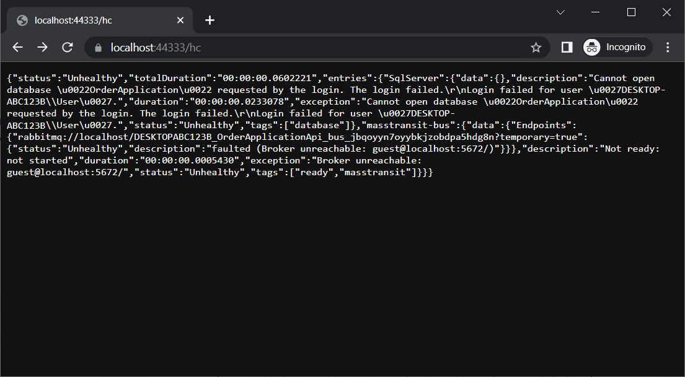
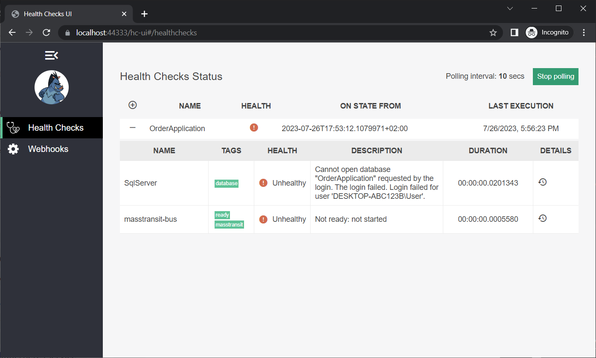
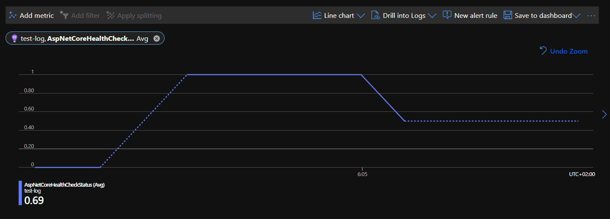
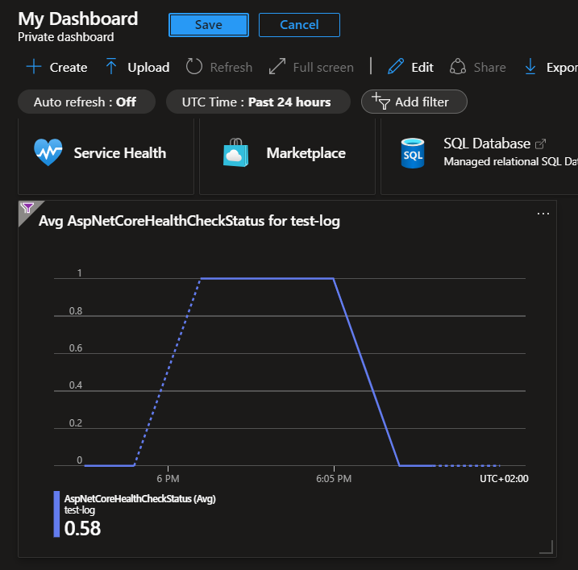

# Intent.AspNetCore.HealthChecks

Once this module is installed you have access to a health checks endpoint. Start your application and navigate to `/hc`.

By enabling the `Health Checks UI` setting, the module will install the `Health Checks UI` library that will give you the ability to visually see what your health checks look like when you browse to `/hc-ui`.

By setting the `Publish Events` setting to `Azure Application Insights` the system will periodically publish events to Application Insights to give you a close-to-real-time metric view of how your application is fairing by drawing a line that goes from 0 to 1. 0 means completely offline, and 1 means everything is online and healthy.

With these metrics you can setup alert systems or pin it to your dashboard to see in real-time.

