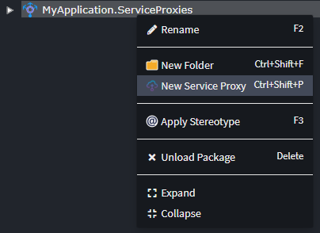
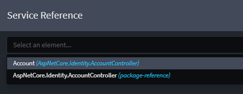
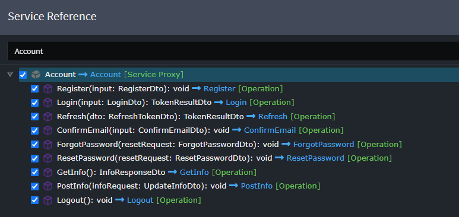
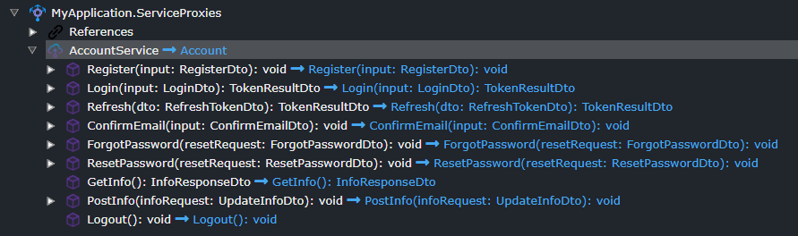

# Intent.Modules.AspNetCore.Identity.AccountController.Metadata

This module contains a metadata representation of the endpoints generated by the [Intent.Modules.AspNetCore.Identity.AccountController](../) module for use with service proxy designers, such as `Web Client` (from the `Intent.Modelers.WebClient` module) and `Service Proxies` (from the `Intent.Modelers.ServiceProxies` module).

## Creating a service proxy using the metadata

### Install the module

Install the module you would normally choose to generate service proxies, for example:

- For calls between microservices, the `Intent.Integration.HttpClients` module.
- For calls from a Blazor web assembly application, the `Intent.Blazor.HttpClients` module.
- For calls from an Angular application, the `Intent.Angular.ServiceProxies` module.

### Choose the endpoints you wish to generate for

In a Service Proxies/Web Client designer, right-click the package or folder in which you wish to create the proxy and choose the `New Service Proxy` option:



In the dropdown, select the `Account (AspNetCore.Identity.AccountController)` option:



Select the operations for which you wish to create service proxies:



Click `DONE`.



When you run the Software Factory, it will now generate the selected endpoints.

### Configure the endpoint URL in your `appsettings.json` file

You will need to ensure the endpoint URL is correctly updated.

For `Service Proxies`, the relevant section is:

```json
"HttpClients": {
  "AccountService": {
    "Uri": "https://localhost:{app_port}/",
    "IdentityClientKey": "default",
    "Timeout": "00:01:00"
  }
}
```

For `Web Client` for Blazor, the relevant section is:

```json
"Urls": {
  "AspNetCoreIdentityAccountController": ""
}
```
