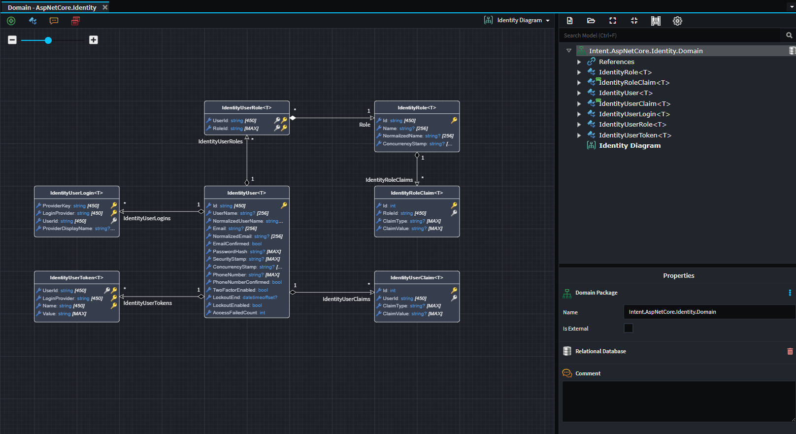

# Intent.AspNetCore.Identity
This module adds ASP.NET Core Identity to your application.

# What is ASP.NET Core Identity?
ASP.NET Core Identity is a membership system for ASP.NET Core applications.

It provides a comprehensive framework for managing users, passwords, roles, claims, tokens, and external logins in a secure and extensible way.

Learn more here: [documentation]('https://learn.microsoft.com/en-us/aspnet/core/security/authentication/identity?view=aspnetcore-9.0&tabs=visual-studio')

# Domain Designer
Upon installation, Intent.AspNetCore.Identity will add the default ASP.NET Core Identity models to your application.

You can either use these models as is, or inherit from any of them if you want to extend them.

# What's in This Module?

## Identity Models
Provides the default Identity models.

You can use this Module with other Intent modules such as `Intent.AspNetCore.AccountController` or `Intent.AspNetCore.IdentityService`
