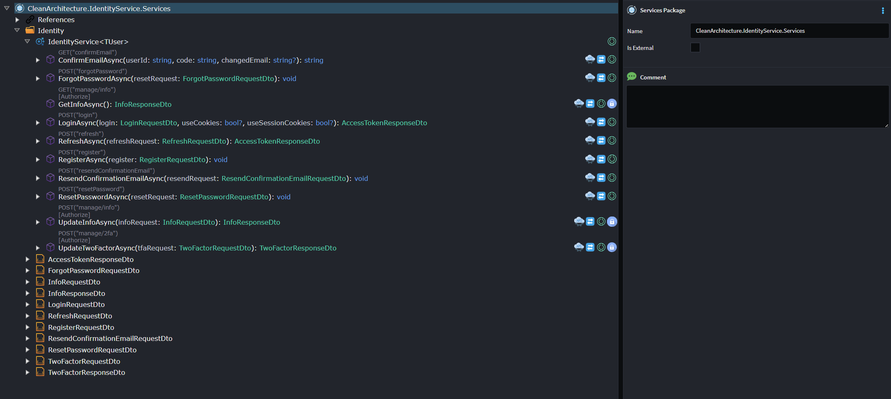

# Intent.AspNetCore.IdentityService
This module adds ASP.NET Core Identity operations as a service to your application.

# What is ASP.NET Core Identity?
ASP.NET Core Identity is a membership system for ASP.NET Core applications.

It provides a comprehensive framework for managing users, passwords, roles, claims, tokens, and external logins in a secure and extensible way.

Learn more here: [documentation]('https://learn.microsoft.com/en-us/aspnet/core/security/authentication/identity?view=aspnetcore-9.0&tabs=visual-studio')

# Service Designer
Upon installation, Intent.AspNetCore.IdentityService will create a new service called IdentityService, exposing Http Operations for user registration, email confirmation, login, and other related actions.

The IdentityService comes fully configured to handle these operations through ASP.NET Core Identity.

If you wish to customize the behavior of a specific operation, simply remove the Identity Service Handler stereotype from that operation and implement your own logic.



# What's in This Module?

## IdentityService Interface & Implementation
Provides a default IdentityService interface and implementation with methods for:

Registering users

Confirming email addresses

Logging in

Resetting and changing passwords

## HTTP Endpoint Exposure
Each identity-related operation is automatically exposed as an HTTP endpoint, enabling straightforward integration with front-end or external client applications.

## Access Token Response
Successful login operations return an AccessTokenResponseDto, which includes:

A Bearer access token

A Refresh token

Expiry information for both tokens

## Integrated with ASP.NET Core Identity
The module leverages UserManager, SignInManager, and RoleManager to perform operations securely using the built-in Identity framework.

## Customizable Handlers
To override the default implementation for an operation:

Remove the Identity Service Handler stereotype

Add your own custom logic while maintaining compatibility with the rest of the service

## Required Configuration

To enable JWT token generation, configure the following section to your application's configuration (e.g. appsettings.json):

```
"JwtToken": {
  "Issuer": "https://localhost:{sts_port}",
  "Audience": "api",
  "SigningKey": "Base64EncodedSuperStrongSigningKey",
  "AuthTokenExpiryTimeSpan": "02:00:00",
  "RefreshTokenExpiryTimeSpan": "3.00:00:00"
}
```

`Issuer`: The authority that issues the JWT.

`Audience`: The intended recipient of the JWT (e.g. your API).

`SigningKey`: A base64-encoded key used to sign and validate JWTs.

`AuthTokenExpiryTimeSpan`: Duration before the access token expires.

`RefreshTokenExpiryTimeSpan`: Duration before the refresh token expires.

This module also uses a default EmailSender implementation and the following needs to be configured:

```
"EmailSender": {
    "SmtpHost": "smtp.yourdomain.com",
    "SmtpPort": "587",
    "SenderEmail": "noreply@yourdomain.com",
    "SenderName": "YourAppName",
    "Username": "smtp-username",
    "Password": "smtp-password",
    "UseSsl": "true"
  }
```
