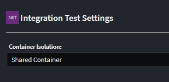

# Intent.AspNetCore.IntegrationTesting

This module adds Integration Testing for ASP.NET core applications with container support for databases (MS SQL, PostGres, CosmosDB, MongoDb), plus a container-free in-memory SQLite option.

## What is Integration Testing

Integration testing is a phase in the software development life cycle where individual software modules are combined and tested as a group. The purpose of integration testing is to ensure that the different components of a software application work together as expected when integrated. This is done to identify and address any issues that may arise when multiple modules interact with each other.

This module adds an xUnit testing project to you ASP.NET Core application which contains Integrations Tests which can be run to validate your application is working end-to-end against containerized infrastructure like databases e.g. `MS SQL Server`, `Postgres`, `MongoDb` or `CosmosDB Emulator`. These tests do not replace Unit testing but rather compliment it ensuring the individually tested pieces work together correctly.

This module uses `Test.containers` to spin up and host infrastructure in docker containers.

For more information on Test.containers read the official [documentation](https://testcontainers.com/).

The exception is `SQLite`, which runs in-process and therefore needs no container runtime at all — see [Testing against SQLite](#testing-against-sqlite).

## Module Settings

This module has the following settings.



### Container Isolation

This setting determines the default container isolation level for your test.

- `Shared Container`, the tests share a container, i.e. 1 database container is spun up and all Test Class run against this container
- `Container per Test Class`, Each Test Class spins up a new container to execute it's tests against.

### Generate Service Proxies for Testing

This setting controls whether the strongly-typed HTTP client proxies (and their supporting DTO, enum, `ProblemDetailsWithErrors` and `HttpClientRequestException` types) are generated into the test project.

- `On`, a proxy interface and HTTP client is generated per service, along with the DTO/enum contracts they need. Use these to invoke the application under test in a strongly-typed way.
- `Off` (default for new installs), no proxies are generated. Tests interact with the application under test using the raw `HttpClient` returned by `CreateClient()`.

Applications that had this module installed before version `2.0.20` are automatically pinned to `On` by a migration, preserving the previous behaviour.

### Integration Test Generation Mode

This setting controls which modelled endpoints get a scaffolded test class.

- `Generate for all Commands, Queries and Service Operations` (`all`), a test class is generated for every exposed HTTP endpoint.
- `Generate only when explicitly marked with Integration Test stereotype` (`explicit`), a test class is only generated for a Command, Query, Service or Operation that has the `Integration Test` stereotype applied in the Services designer. Applying the stereotype to a Service opts all of its operations in.

Applications that had this module installed before version `2.0.20` are automatically pinned to `all` by a migration, preserving the previous behaviour.

## What's in this module?

This module consumes your `Exposed HTTP Endpoints`, in the `Service Designer` and generates the following implementation:-

- Adds Integration xUnit Testing project.
- Generates service proxies for all service end points, to use to interact with the Application under test (when `Generate Service Proxies for Testing` is enabled).
- Add container support for `MS SQL Server`, `Postgres`, `MongoDb` and `CosmosDB`, or a container-free in-memory `SQLite` database
- Generates test classes for each modelled service end point (or only for those marked with the `Integration Test` stereotype, per `Integration Test Generation Mode`).

## Testing Isolation

The default isolation can be configured with the following implications :

`Shared Container` is significantly more performant but the database state is not reset between tests, so tests either need to be ok with this or have to clean the data themselves

`Container per Test Class` is slower, but each Test Class runs against a newly created container.

If you are running `Shared Container`, you can set up specific Test Class's to require a Clean Container. This hybrid model can give you the best of both worlds. To setup such a test ensure the Test Class implements `IClassFixture<IntegrationTestWebAppFactory>` and remove the `Collection("SharedContainer")` attribute.

```csharp
[IntentManaged(Mode.Merge, Signature = Mode.Fully)]
public class IsolatedTests : BaseIntegrationTest, IClassFixture<IntegrationTestWebAppFactory>
{
    public CustomerServiceTests(IntegrationTestWebAppFactory factory) : base(factory)
    {
    }
    ...
}
```

## Testing against containerized data stores

If your application is using our `Intent.EntityFrameworkCore` module, the following providers are currently supported for containerization

- SQL Server
- Postgres

If your application is using our `Intent.CosmosDB` module, the tests will be run against a dockerized CosmosDB Emulator. If your application is using our `Intent.MongoDb` module, the tests will be run against a dockerized MongoDb instance.

## Testing against SQLite

If your application is using our `Intent.EntityFrameworkCore` module with the `Database Provider` set to `SQLite`, the generated database fixture does **not** use a container. SQLite runs in-process, so the tests need no Docker (or other container runtime) installed — which makes this the fastest option, and the only one that works on a machine without a container runtime.

The generated `EFContainerFixture` holds a `SqliteConnection` to an in-memory database open for its lifetime and hands that live connection to EF Core:

```csharp
public class EFContainerFixture
{
    private readonly SqliteConnection _dbConnection;

    public EFContainerFixture()
    {
        _dbConnection = new SqliteConnection("Filename=:memory:");
    }

    public async Task InitializeAsync()
    {
        await _dbConnection.OpenAsync();
    }

    public void ConfigureTestServices(IServiceCollection services)
    {
        // ... the application's DbContext registration, re-pointed at the fixture's connection
        services.AddDbContext<ApplicationDbContext>((sp, options) =>
            options.UseSqlite(_dbConnection, b => b.MigrationsAssembly(/* ... */)));

        // Schema Creation
        // ...
        context.Database.EnsureCreated();
    }

    public async Task DisposeAsync()
    {
        await _dbConnection.DisposeAsync();
    }
}
```

The connection object is passed rather than a connection string on purpose: an in-memory SQLite database exists only for as long as a connection to it is open. If EF Core were allowed to open and close its own connection per operation, the schema created by `EnsureCreated()` would be discarded before the first test ran.

The `Container Isolation` setting still applies — `Container per Test Class` gives each test class a brand-new, empty in-memory database, which is considerably cheaper than spinning up a container per class.

> [!IMPORTANT]
> SQLite is not a faithful stand-in for SQL Server or PostgreSQL. Expect behavioural differences around schemas, `decimal` precision (stored as `REAL`), `DateTimeOffset`, computed columns, sequences and some constraint enforcement. Schema is created with `EnsureCreated()` rather than by running migrations, so anything expressed only in a migration (raw SQL, seed data, provider-specific DDL) will not be present. Choose SQLite when you want fast, container-free feedback; keep a container-backed provider where fidelity to production matters.

## Adding Tests

You can then simply add your integration tests to the test classes as required. Our `Intent.AspNetCore.IntegrationTesting.CRUD` module can be used to generate integration test implementations for CRUD orientated services.

```csharp
    [IntentManaged(Mode.Merge, Signature = Mode.Fully)]
    [Collection("SharedContainer")]
    public class MyCustomEndpointTests : BaseIntegrationTest
    {
        public MyCustomEndpointTests(IntegrationTestWebAppFactory factory) : base(factory)
        {
        }

        [Fact]
        public async Task MyCustomEndpoint_ShouldDoX()
        {
            //Arrange
            var client = new MyCustomServiceHttpClient(CreateClient());

            //Act
            client.InvokeMyCustomEndpoint();

            //Assert
            ...
        }
    }
```

## Top Level Statements with this module

IF you are using `top-level Statements`, you will get a compilation error around `Program is inaccessible!`, you will need to apply the following work-around to get the projects compiling. https://github.com/dotnet/AspNetCore.Docs/issues/23837

## Frequently asked questions

### How do I mock services?

Mocking of services is supported by the `Microsoft.AspNetCore.Mvc.Testing` NuGet package utilized by this Intent Architect module, refer to [Microsoft's documentation on the subject](https://learn.microsoft.com/aspnet/core/test/integration-tests#inject-mock-services) for further details and examples.
