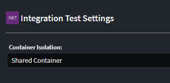

# Intent.AspNetCore.IntegrationTesting

This module adds Integration Testing for ASP.NET core applications with container support for database (MS MSQL, PostGres, CosmosDB).

## What is Integration Testing

Integration testing is a phase in the software development life cycle where individual software modules are combined and tested as a group. The purpose of integration testing is to ensure that the different components of a software application work together as expected when integrated. This is done to identify and address any issues that may arise when multiple modules interact with each other.

This module adds an xUnit testing project to you ASP.NET Core application which contains Integrations Tests which can be run to validate your application is working end-to-end against containerized infrastructure like databases e.g. `MS SQL Server`, `Postgres`, `MongoDb` or `CosmosDB Emulator`. These tests do not replace Unit testing but rather compliment it ensuring the individually tested pieces work together correctly.

This module uses `Test.containers` to spin up and host infrastructure in docker containers.

For more information on Test.containers read the official [documentation](https://testcontainers.com/).

## Module Settings

This module has the following settings.



### Container Isolation

This setting determines the default container isolation level for your test.

- `Shared Container`, the tests share a container, i.e. 1 database container is spun up and all Test Class run against this container
- `Container per Test Class`, Each Test Class spins up a new container to execute it's tests against.

## What's in this module?

This module consumes your `Exposed HTTP Endpoints`, in the `Service Designer` and generates the following implementation:-

- Adds Integration xUnit Testing project.
- Generates service proxies for all service end points, to use to interact with the Application under test.
- Add container support for `MS SQL Server`, `Postgres`, `MongoDb` and `CosmosDB`
- Generates test classes for each modelled service end point.

## Testing Isolation

The default isolation can be configured with the following implications :

`Shared Container` is significantly more performant but the database state is not reset between tests, so tests either need to be ok with this or have to clean the data themselves

`Container per Test Class` is slower, but each Test Class runs against a newly created container.

If you are running `Shared Container`, you can set up specific Test Class's to require a Clean Container. This hybrid model can give you the best of both worlds. To setup such a test ensure the Test Class implements `IClassFixture<IntegrationTestWebAppFactory>` and remove the `Collection("SharedContainer")` attribute.

```csharp

    [IntentManaged(Mode.Merge, Signature = Mode.Fully)]
    public class IsolatedTests : BaseIntegrationTest, IClassFixture<IntegrationTestWebAppFactory>
    {
        public CustomerServiceTests(IntegrationTestWebAppFactory factory) : base(factory)
        {
        }
        ...
    }
```

## Testing against containerized data stores

If your application is using our `Intent.EntityFrameworkCore` module, the following providers are currently supported for containerization

- SQL Server
- Postgres

If your application is using our `Intent.CosmosDB` module, the tests will be run against a dockerized CosmosDB Emulator.
If your application is using our `Intent.MongoDb` module, the tests will be run against a dockerized MongoDb instance.

## Adding Tests

You can then simply add your integration tests to the test classes as required.
Our `Intent.AspNetCore.IntegrationTesting.CRUD` module can be used to generate integration test implementations for CRUD orientated services.

```csharp

    [IntentManaged(Mode.Merge, Signature = Mode.Fully)]
    [Collection("SharedContainer")]
    public class MyCustomEndpointTests : BaseIntegrationTest
    {
        public MyCustomEndpointTests(IntegrationTestWebAppFactory factory) : base(factory)
        {
        }

        [Fact]
        public async Task MyCustomEndpoint_ShouldDoX()
        {
            //Arrange
            var client = new MyCustomServiceHttpClient(CreateClient());

            //Act
            client.InvokeMyCustomEndpoint();

            //Assert
            ...
        }
    }
```

## Top Level Statements with this module

IF you are using `top-level Statements`, you will get a compilation error around `Program is inaccessible!`, you will need to apply the following work-around to get the projects compiling. https://github.com/dotnet/AspNetCore.Docs/issues/23837

## Frequently asked questions

### How do I mock services?

Mocking of services is supported by the `Microsoft.AspNetCore.Mvc.Testing` NuGet package utilized by this Intent Architect module, refer to [Microsoft's documentation on the subject](https://learn.microsoft.com/aspnet/core/test/integration-tests#inject-mock-services) for further details and examples.
