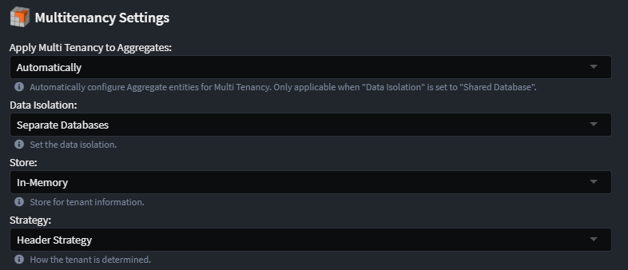

# Intent.AspNetCore.MultiTenancy

This module brings in support for Multi Tenancy through the use of FinBuckle.

## What is Finbuckle?

Finbuckle.MultiTenant is open source multitenancy middleware library for .NET. It enables tenant resolution, per-tenant app behavior, and per-tenant data isolation.
For more details check out the official [documentation](https://www.finbuckle.com/multitenant).

## What's in this module?

This module generates the following as part of the Finbuckle implementation implementation:

* DI Container wiring.
* Finbucke configuration.
* Swashbucke integration.
* Entity Framework Core Integration.

## Modules Settings

The following settings are available under the `Multitenancy Settings` section in `Application Settings`:



### Strategy

This setting configures the Finbuckle MultiTenant Strategy, i.e how the tenant is identified per request.
The available strategies are :

* `Header Strategy`, identifies the tenant from a HTTP request header.
* `Claim Strategy`, identifies the tenant from a Claim.
* `Host Strategy`, identifies the tenant from the host name.
* `Route Strategy`, identifies the tenant from the `Route Strategy Parameter` in the URL.

For more information on [MultiTenant Strategies](https://www.finbuckle.com/MultiTenant/Docs/v6.12.0/Strategies).

### Store

Configures where tenant information is stored.
The available options are :

* `Configuration`, uses an app's configuration as the underlying store. Most of the sample projects use this store for simplicity. This store is case insensitive when retrieving tenant information by tenant identifier.
* `Entity Framework Core`, uses an Entity Framework Core database context as the backing store. This store is usually case-sensitive when retrieving tenant information by tenant identifier, depending on the underlying database.
* `HTTP Remote`, Sends the tenant identifier, provided by the multitenant strategy, to an http(s) endpoint to get a TenantInfo object in return.
* `In-Memory`, uses a ConcurrentDictionary<string, TenantInfo> as the underlying store.

For more information on [stores](https://www.finbuckle.com/MultiTenant/Docs/v6.12.0/Stores).

### Data Isolation

Configures your data isolation policy.
The available options are :

* `Separate Databases`, Each tenant is routed to their own database which contains only their data.
* `Shared Database`, A single database is used and tenant data is segregated at a row level through the use of TenantId columns.

### Apply Multi Tenancy to Aggregates

When using `Shared Database` data isolation option you need to indicate which data is tenant specific and which data is not. This is done be applying the `Multi Tenant` stereotype to Tenant specify aggregate roots. This setting controls wether or not the Domain Designer automatically adds this Stereotype to all new Entities or the not.

The available options are :

* `Automatically`, Each newly added `Class` in the domain designer will have the `Multi Tenant` stereotype applied.
* `Manually`, the `Multi Tenant` must be manually applied where required.

### Route Strategy Parameter

The route paramter name which can be used in the `Services Designer` to define where and how the tenant information is included in the route. Default value is `__tenant__`.

For example, having the _Strategy_ set to `Route Strategy` with a _Route Strategy Parameter_ value of `__tenant__`, allows `Route` values on _Commands, Queries and Services_ to contain the `{__tenant__}` placeholder.

## DI Container wiring

Wire Finbuckle into your dependency injection and application configuration code.

```csharp

public void ConfigureServices(IServiceCollection services)
{
    ...
    services.ConfigureMultiTenancy(Configuration);
    ...
}

public void Configure(IApplicationBuilder app, IWebHostEnvironment env)
{
    ...
    app.UseRouting();
    app.UseMultiTenancy();
    ...
}

```

## Tenant Info Injection

The current tenant information, as well as information on all tenants (via the [store](#store)) can be injected into the relevant class, using the dependency injection container:

### Current Tenant Info

`ITenantInfo` can be injected into the relevant class, which will provide access to information about the **current tenant**:

``` csharp
public CreateProductCommandHandler(IProductRepository productRepository, ITenantInfo tenantInfo)
{
    _productRepository = productRepository;
    _tenantInfo = tenantInfo;
}
```

### All Tenants

If access to all tenants is required, then `IMultiTenantStore<TenantInfo>` can be injected:

``` csharp
public CreateProductCommandHandler(IProductRepository productRepository, IMultiTenantStore<TenantInfo> tenantStore)
{
    _productRepository = productRepository;
    _tenantStore = tenantStore;
}
```


## Finbucke configuration

Setup and configure Finbuckle inline with your configured settings.

```csharp
public static class MultiTenancyConfiguration
{
    public static IServiceCollection ConfigureMultiTenancy(
        this IServiceCollection services,
        IConfiguration configuration)
    {
        services.AddMultiTenant<TenantInfo>()
            .WithInMemoryStore(SetupInMemoryStore) // See https://www.finbuckle.com/MultiTenant/Docs/v6.12.0/Stores#in-memory-store
            .WithHeaderStrategy("X-Tenant-Identifier"); // See https://www.finbuckle.com/MultiTenant/Docs/v6.12.0/Strategies#header-strategy
        return services;
    }

    public static void UseMultiTenancy(this IApplicationBuilder app)
    {
        app.UseMultiTenant();
        InitializeStore(app.ApplicationServices);
    }

    //In-Memory Store Configuration
    [IntentManaged(Mode.Fully, Body = Mode.Ignore)]
    private static void SetupInMemoryStore(InMemoryStoreOptions<TenantInfo> options)
    {
        // configure in memory store:
        options.IsCaseSensitive = false;
    }

    [IntentManaged(Mode.Fully, Body = Mode.Ignore)]
    public static void InitializeStore(IServiceProvider sp)
    {
        var scopeServices = sp.CreateScope().ServiceProvider;
        var store = scopeServices.GetRequiredService<IMultiTenantStore<TenantInfo>>();

        store.TryAddAsync(new TenantInfo() { Id = "sample-tenant-1", Identifier = "tenant1", Name = "Tenant 1", ConnectionString = "Tenant1Connection" }).Wait();
        store.TryAddAsync(new TenantInfo() { Id = "sample-tenant-2", Identifier = "tenant2", Name = "Tenant 2", ConnectionString = "Tenant2Connection" }).Wait();
    }
}

```

## Swashbucke integration

Configure Swashbuckle to include support for Tenancy.

```csharp

public class TenantHeaderOperationFilter : IOperationFilter
{
    public void Apply(OpenApiOperation operation, OperationFilterContext context)
    {
        if (operation.Parameters == null)
        {
            operation.Parameters = new List<OpenApiParameter>();
        }

        operation.Parameters.Add(new OpenApiParameter
        {
            Name = "X-Tenant-Identifier",
            In = ParameterLocation.Header,
            Description = "Tenant Id",
            Required = true
        });
    }
}

```

## Entity Framework Core Integration

Introduce Multi Tenant concepts in the `DbContext` class and Entity Configurations.

> [!NOTE]
> In order to create and update EF Core migration scripts against a Finbuckle-managed application, you will need to make use of the `Intent.Modules.EntityFrameworkCore.DesignTimeDbContextFactory` module. More information can be found [here](https://github.com/IntentArchitect/Intent.Modules.NET/blob/master/Modules/Intent.Modules.EntityFrameworkCore.DesignTimeDbContextFactory/README.md).
> Both your API project and Infrastructure project's appsettings.json will need to be kept in sync when tenant database connection strings are updated.

```csharp
public class ApplicationDbContext : DbContext, IUnitOfWork, IMultiTenantDbContext
{
    private readonly IDomainEventService _domainEventService;

    public ApplicationDbContext(DbContextOptions<ApplicationDbContext> options,
        ITenantInfo tenantInfo) : base(options)
    {
        TenantInfo = tenantInfo;
    }

    public ITenantInfo TenantInfo { get; private set; }
    public TenantMismatchMode TenantMismatchMode { get; set; } = TenantMismatchMode.Throw;
    public TenantNotSetMode TenantNotSetMode { get; set; } = TenantNotSetMode.Throw;

    ...

    public override async Task<int> SaveChangesAsync(
        bool acceptAllChangesOnSuccess,
        CancellationToken cancellationToken = default)
    {
        this.EnforceMultiTenant();
        ...
    }

    public override int SaveChanges(bool acceptAllChangesOnSuccess)
    {
        this.EnforceMultiTenant();
        ...
    }
}


```
