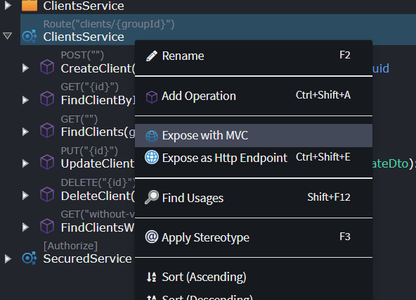
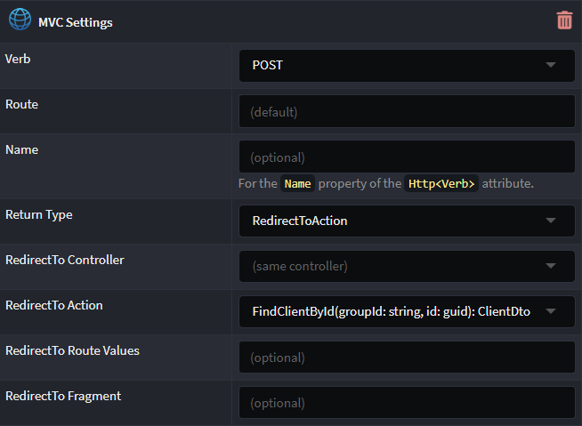

# Intent.AspNetCore.Mvc

This Intent Architect module enables generation of ASP.NET Core MVC controllers and stubs of MVC Views for Services modelled in the Services designer.

## Expose with MVC

When installed this module adds an _Expose with MVC_ option to Service and Service Operation element types in the Service Designer:

Once used, Services and Operations have an _MVC Settings_ stereotype applied to them which will cause the controller methods to be generated along with code which dispatches to the service operation that they expose as well as for other related concerns such as calling validation, unit of work, transaction handling, event bus publishing, etc.

## MVC Settings Stereotype

On a Service the stereotype allows specifying the Route for a controller, while on Operations there are more settings available:

### Verb

The HTTP verb which should be applicable to the endpoint, for example selecting `POST` will cause `[HttpPost]` to be added to the generated endpoint in the controller.

### Route

The [route](https://learn.microsoft.com/aspnet/core/mvc/controllers/routing#attribute-routing-for-rest-apis) to use for the endpoint.

### Name

Can be used to specify the `Name` property in the attribute on a controller endpoint.

### Return Type

This controls the return statement which is generated for the endpoint.

#### (Operation Return Type)

Simply returns the type that is returned by the operation, complex object are by default JSON serialized.

#### Ok

The method will simply return [Ok](https://learn.microsoft.com/dotnet/api/microsoft.aspnetcore.mvc.controllerbase.ok).

#### RedirectToAction

Returns a [RedirectToAction](https://learn.microsoft.com/dotnet/api/microsoft.aspnetcore.mvc.controllerbase.redirecttoaction) with values populated as per the additional RedirectTo properties which are available on the stereotype.

#### View

Returns a [View](https://learn.microsoft.com/dotnet/api/microsoft.aspnetcore.mvc.controller.view). When selected, the `View Name` property is left blank and there is no existing corresponding `.cshtml` file in the `Views` folder, then a stub view is generated automatically.
