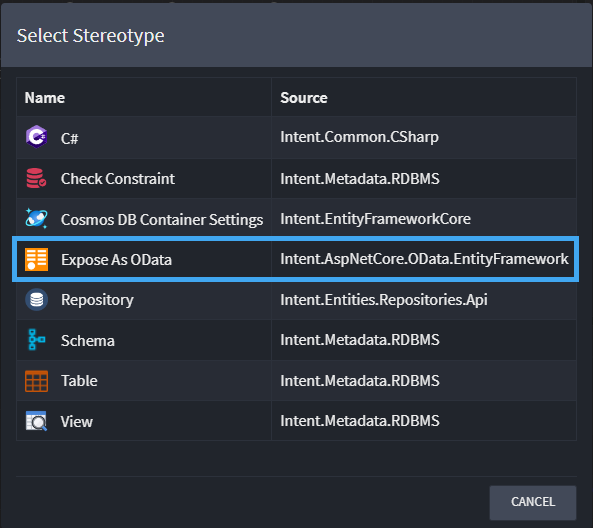
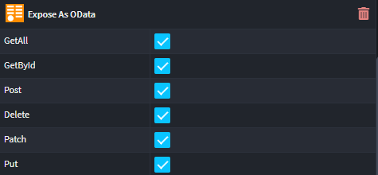

# Intent.AspNetCore.OData.EntityFramework

This module adds OData Query support to your Domain designers, specifically `Entity`s.

## What is OData Query?

OData query is a URL-based query language used to filter, sort, and retrieve specific information from the resources exposed through OData APIs. The queries follow a specific syntax and are based on URL parameters. This query language allows developers to perform operations like filtering, sorting, selecting specific fields, and navigating relationships between different entities.

This mechanism is implemented using the `Microsoft.AspNetCore.OData` NuGet package.

For more information on OData Querying read the official [documentation](https://learn.microsoft.com/en-us/odata/concepts/queryoptions-overview).

This module works in conjunction with `Intent.EntityFrameworkCore`

## Domain Designer

To leverage the OData Query functionality simply apply the `Expose As OData` stereotype to relevant `Entity`s in the domain designer.

The Stereotype must meet the following criteria:

- The `Class` must be part of a repository.

## Using the Expose As OData `options`

By default all options are enabled. Checking any of these options will either add a specific `Controller Action Method` to each `{Entity}Controller`

## What's in this module?

This module consumes your `Expose As OData` enabled `Entity`s, which you design in the `Domain Designer` and generates the following implementation:-

- Creates container registrations for OData infrastructure also enabling all `OData` options within the container.
- Maps each `Entity` and any composite `Entity`'s of that entity.
- Generates a Controller per `Entity`.
- Adds operations to each controller depending on which options have been configured.
- Swashbuckle swagger integration, updating swagger schema to include OData query parameter options.
- Can be safely used with [Intent.AspNetCore.ODataQuery](https://docs.intentarchitect.com/articles/modules-dotnet/intent-aspnetcore-odataquery/intent-aspnetcore-odata-entityframework.html). Please note all `ODataOptions` within your container registration will be enabled.

