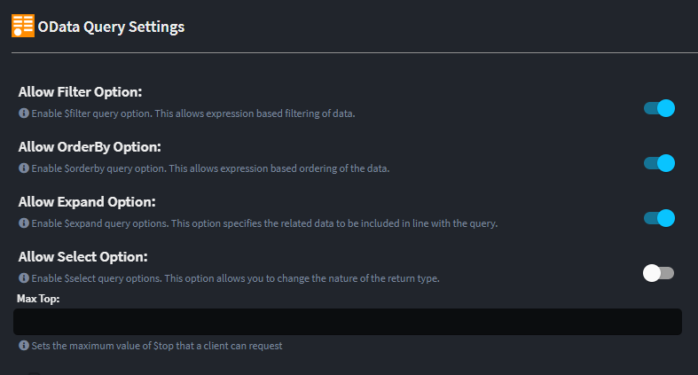

# Intent.AspNetCore.ODataQuery

This module adds OData Query support to your CQRS paradigm service end points, specifically `Query`s.

## What is OData Query?

OData query is a URL-based query language used to filter, sort, and retrieve specific information from the resources exposed through OData APIs. The queries follow a specific syntax and are based on URL parameters. This query language allows developers to perform operations like filtering, sorting, selecting specific fields, and navigating relationships between different entities.

This mechanism is implemented using the `Microsoft.AspNetCore.OData` NuGet package.

For more information on OData Querying read the official [documentation](https://learn.microsoft.com/en-us/odata/concepts/queryoptions-overview).

This module works in conjunction with `Intent.EntityFrameworkCore` and `Intent.CosmosDb`

## Module Settings

This module has the following settings.

These settings let you configure which OData Query options your application will support.

## Domain Designer

To leverage the OData Query functionality simply apply the `ODataQuery` stereotype to relevant `Query`s in the service designer.

The Query must meet the following criteria:

- The `Query` must be mapped onto a domain `Class` (which has a repository).
- The `Query` must return a `Dto` collection.

## Using the OData `Select`  feature

If you wish to enable the `Select` functionality it must be enabled in the module settings, as well as opting into it on each Query you want to use this feature. The reason for this is that these endpoints become fundamentally untyped, from a response perspective, so it is something the service designer should deliberately opt into. When this feature is enabled `Controller` operations and `QueryHandler`s will be updated to return untyped `IActionResult` and `IEnumerable` respectively.

## What's in this module?

This module consumes your `ODataQuery` enabled `Query`s, which you design in the `Service Designer` and generates the following implementation:-

- Container registrations, registers OData infrastructure.
- Controller Changes, appends ODataQueryOptions and adjusts return types if required.
- Query changes, appends ODataQueryOptions.
- QueryHandler changes, adjusts return types if required.
- CRUD Changes, wires requests to new project and transform repository operations.
- EF Repository Changes, adds new OData projection and transformation operations to repositories .
- Swashbuckle swagger integration, updates swagger schema to include OData query parameter options.

