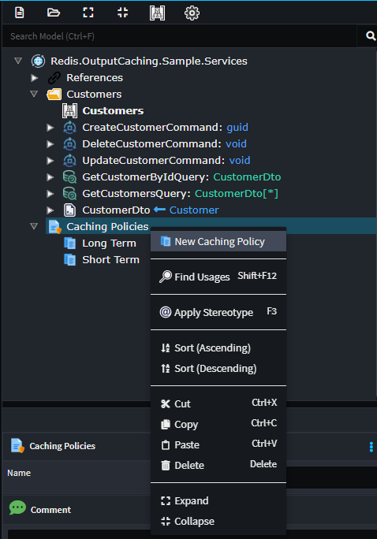

# Intent.AspNetCore.OutputCaching.Redis

This module provides patterns for ASP.NET Output caching using Redis as the caching mechanism.

## What is Output caching?

ASP.NET Core output caching with Redis involves leveraging Redis as a distributed caching solution to store the output of HTTP responses generated by ASP.NET Core applications. By integrating Redis, a high-performance, in-memory data store, developers can cache the results of expensive operations, such as database queries or complex calculations, and serve them directly from memory on subsequent requests. This significantly reduces the processing time and improves the overall performance and scalability of web applications. This approach enhances the responsiveness of web applications by minimizing the need to regenerate dynamic content for each request, thereby improving user experience and optimizing resource utilization.

For more information on Output caching, check out their [official docs](https://learn.microsoft.com/en-us/aspnet/core/performance/caching/output?view=aspnetcore-8.0).

## What's in this module?

This module consumes your `Service Model`, which you build in the `Service Designer` and integrates this design into your ASP.NET application:-

* Hosting setup and configuration.
* Controller annotations for caching.
* `app.settings` configuration.

## Service Designer

Caching is typically done through policies which describe the caching behaviour. Caching on your end-point operations can by done with or without policies, and policies can be tailored per end-point.

To create Policies simply:

- `Right Click` on the `Package` and select `Add Caching Policies`.
- `Right Click` on the `Caching Policies` and select `New Caching Policy`.



On the policy you can configure all the various caching options, which output caching supports.

To apply caching to you end-points, simply apply the `Caching` stereotype, and select the appropriate `Caching Policy`.


The `Caching` stereotype can also be applied at a service level in which case, all the appropriate end-points will cache according to this configuration.
These service level caching can be overridden or adjusted on specific end-points, by simply applying the `Caching` stereotype to the end-point.
As how this works, the settings are merged, with closest to the end-point win. For example if the service specifies `Tags`, but the end-point doesn't, the end-point will have the services tags. If the end point specifies `Tags`, it's tags will override the service tags.


You can also apply caching with out setting up policies, simply add the `Caching` stereotype and fill in the caching criteria.
Similarly you can use a policy and vary it per end-point, simply add the `Caching` stereotype, select your policy and override the criteria you need to.


## Important Notes

Firstly, out the box the pattern configures no caching for all end-points. Caching needs to be opted-in.

Secondly, ASP.Net Core output caching operates off a default set of rules which can be changed in code if required. These rules are as follows:-

By default, output caching follows these rules:

- Only HTTP 200 responses are cached.
- Only HTTP GET or HEAD requests are cached.
- Responses that set cookies aren't cached.
- Responses to authenticated requests aren't cached.

For more details on this, check out their [official docs](https://learn.microsoft.com/en-us/aspnet/core/performance/caching/output?view=aspnetcore-8.0#default-output-caching-policy).

## Reconfigure Policy 

You can add a `Policies` section in your `appsettings.json` under `OutputCaching` to adjust policy timeouts. This allows for runtime tuning of the values if required.
If the example below the policy `MyPolcy`'s time out duration is reconfigured to 500 seconds.

```json
{
  "OutputCaching": {
    ...
    "Policies": {
      "MyPolicy": {
        "Duration" : 500,
      }
    }
  }
```

## Related Modules

### Intent.AspNetCore.HealthChecks

This modules provides Health Check support, allowing you to validate your Redis cache is running and your application is correctly configured to connect to it.