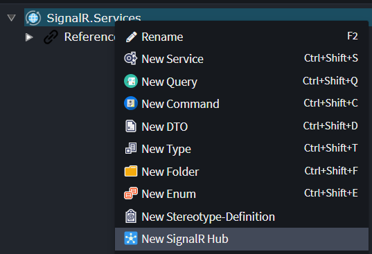
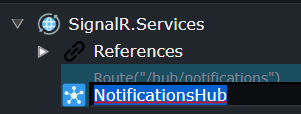
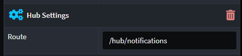
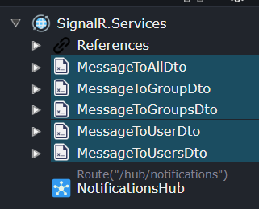
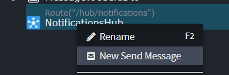
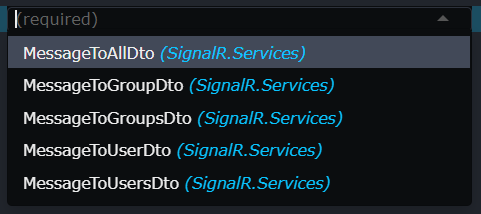
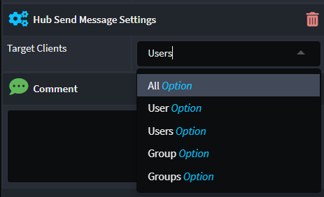
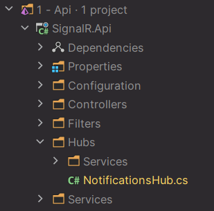

# Intent.AspNetCore.SignalR

This module allows you to model SignalR hubs using Intent Architect and can be done as follows:

* Install the `Intent.AspNetCore.SignalR` module if its not installed already.
* Open the `Services` designer.
* Right-click on the Services package (or a folder) to make a new SingalR Hub element.

  
* Give it a name.

  
* Change the route if necessary which is located inside `Hub settings` on the right-hand-side.

  
* Model some DTOs that will be used to send information to a prospective client.

  
* Add a new message to send on the hub.

  
* Select a DTO to be sent to a client.

  
* Select how to notify the client with this DTO on the `Hub Publish Message Settings`.

  
* Run the Software Factory.
* Inject the `INotificationsHub` (uses convention of `I` and `Hub Name`) into your target service or handler code's constructor like this:
  ``` c#
  public class MyService
  {
      private readonly INotificationsHub _notificationsHub;

      public MyService(INotificationsHub notificationsHub)
      {
          _notificationsHub = notificationsHub;
      }
      
      // ...
  }
  ```
* Invoke this hub service in one of the following ways:
  ``` c#
  // A DTO to be sent to ALL clients.
  await _hub.SendAsync(new MessageToAllDto { Message = request.Message });
  // A DTO to be sent to only a single user.
  await _hub.SendAsync(new MessageToUserDto { Message = request.Message }, SomeUserId);
  // A DTO to be sent to multiple users.
  await _hub.SendAsync(new MessageToUsersDto { Message = request.Message }, new[] { UserId1, UserId2 /*, ... */ });
  // A DTO to be sent to a single group of clients.
  await _hub.SendAsync(new MessageToGroupDto { Message = request.Message }, SomeGroupName);
  // A DTO to be sent to multiple groups of clients.
  await _hub.SendAsync(new MessageToGroupsDto { Message = request.Message }, new[] { GroupName1, GroupName2 /*, ... */ });
  ```
* If you need to work in the original `Hub` class, it can be located here:

  
  * Within your API Project's root `Hub` folder.