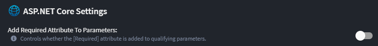

# Intent.AspNetCore

This module generates the foundational code for hosting web services on the ASP.NET Core infrastructure.

## What is ASP.NET Core?

ASP.NET Core is Microsoft's modern, cross-platform framework for building web applications and services. It provides a unified programming model for building web UI and web APIs, and includes built-in support for dependency injection, configuration, logging, and more.

For more information on ASP.NET Core fundamentals, see the [official documentation](https://learn.microsoft.com/en-us/aspnet/core/).

## What This Module Generates

The `Intent.AspNetCore` module generates the essential scaffolding for ASP.NET Core applications:

- **Program.cs** - Application entry point with host builder configuration
- **Dependency injection container** - Service registration and lifetime management
- **Middleware pipeline** - Request processing pipeline with essential middleware
- **Application configuration** - Settings management via `appsettings.json` and environment variables
- **Launch settings** - Development server configuration for local debugging

## Module Settings

### Enable HTTPS Redirect

By default, the `UseHttpsRedirection` middleware is **included** in the application's HTTP request pipeline.  
This can be disabled using the `Enable HTTPS Redirect` setting found on the Application Settings screen:


### Add Required Attribute to Parameters

To control whether *qualifying parameters* on an endpoint are decorated with the `[Required]` attribute, use the `Add Required Attribute to Parameters` setting:



If **off**, the `[Required]` attribute will **not** be explicitly added to controller method parameters.  
If **on**, the `[Required]` attribute will be added if:

- The parameter source is `Query`, `Header`, or `Form` AND
- The parameter does **not have a default value** AND
- The parameter type is **not nullable**.

### Example

Here's an example of the generated controller code with `pageNo` and `pageSize` decorated with `[Required]`:

```csharp
[HttpGet("api/customers")]
[ProducesResponseType(typeof(PagedResult<CustomerDto>), StatusCodes.Status200OK)]
[ProducesResponseType(StatusCodes.Status400BadRequest)]
[ProducesResponseType(typeof(ProblemDetails), StatusCodes.Status500InternalServerError)]
public async Task<ActionResult<PagedResult<CustomerDto>>> GetCustomers(
    [FromQuery][Required] int pageNo,
    [FromQuery][Required] int pageSize,
    [FromQuery] string? orderBy,
    CancellationToken cancellationToken = default)
{
    var result = await _mediator.Send(
        new GetCustomersQuery(pageNo: pageNo, pageSize: pageSize, orderBy: orderBy),
        cancellationToken);

    return Ok(result);
}
```

## Technical Details Specific to Intent Generation

### Generated Program.cs Structure

Intent generates a `Program.cs` file that follows modern ASP.NET Core patterns:

```csharp
var builder = WebApplication.CreateBuilder(args);

// Add services to the container.
builder.Services.AddControllers();
builder.Services.AddEndpointsApiExplorer();
builder.Services.AddSwaggerGen();

// Configure Intent-specific services
builder.Services.ConfigureIntentServices();

var app = builder.Build();

// Configure the HTTP request pipeline.
if (app.Environment.IsDevelopment())
{
    app.UseSwagger();
    app.UseSwaggerUI();
}

app.UseHttpsRedirection();
app.UseAuthorization();
app.MapControllers();

app.Run();
```

### Generated Launch Settings

Intent creates `launchSettings.json` with development profiles:

```json
{
  "profiles": {
    "https": {
      "commandName": "Project",
      "dotnetRunMessages": true,
      "launchBrowser": true,
      "applicationUrl": "https://localhost:5001;http://localhost:5000",
      "environmentVariables": {
        "ASPNETCORE_ENVIRONMENT": "Development"
      }
    }
  }
}
```

### Configuration & Environment Management

Intent sets up a standard configuration hierarchy:

- `appsettings.json` - Base configuration
- `appsettings.{Environment}.json` - Environment-specific overrides
- Environment variables - Runtime overrides
- User secrets - Development secrets

### Dependency Injection Integration

Intent registers services with appropriate lifetimes:

```csharp
// Singleton services (configuration, logging)
builder.Services.AddSingleton<IConfiguration>(builder.Configuration);

// Scoped services (per-request services)
builder.Services.AddScoped<IMyService, MyService>();

// Transient services (lightweight, stateless)
builder.Services.AddTransient<IMyTransientService, MyTransientService>();
```

### Middleware Pipeline Scaffolding

Intent includes essential middleware in the correct order:

1. **Exception Handling** - Global error handling
2. **HTTPS Redirection** - Redirect HTTP to HTTPS (configurable)
3. **Static Files** - Serve static content
4. **Routing** - URL routing
5. **CORS** - Cross-origin resource sharing (when configured)
6. **Authentication** - User authentication
7. **Authorization** - Access control
8. **Endpoints** - MVC controllers or minimal APIs

## Practical Guidance

### Integration with Intent.VisualStudio.Projects

The `Intent.AspNetCore` module integrates with `Intent.VisualStudio.Projects` to provide a complete development experience in Visual Studio.

#### Launch Settings Configuration

Intent generates `launchSettings.json` with default development profiles. You can add your own environments through the Visual Studio Designer.

#### Top-Level Statements

Intent supports generating `Program.cs` using top-level statements (available in .NET 6+), eliminating the need for an explicit `Main` method:

```csharp
using Intent.AspNetCore;

var builder = WebApplication.CreateBuilder(args);

// Add services to the container.
builder.Services.AddControllers();

var app = builder.Build();

// Configure the HTTP request pipeline.
app.UseHttpsRedirection();
app.UseAuthorization();
app.MapControllers();

app.Run();
```

#### Minimal Hosting Model

Intent uses ASP.NET Core's minimal hosting model, where application configuration is consolidated in `Program.cs` without requiring a separate `Startup.cs` file. This approach:

- Simplifies the application structure
- Reduces boilerplate code
- Keeps configuration and middleware setup in one place
- Improves startup performance

In the minimal hosting model, services are registered and the middleware pipeline is configured directly in `Program.cs`, as shown in the example above. The traditional `Startup.cs` with `ConfigureServices` and `Configure` methods is not generated.

## Related ASP.NET Core Modules

The `Intent.AspNetCore` module serves as the foundation for various ASP.NET Core-specific modules:

### API Endpoints
- **Intent.AspNetCore.Controllers** - Traditional MVC controllers with routing
- **Intent.FastEndpoints** - High-performance endpoint classes (alternative to controllers)

### Security & Authentication
- **Intent.AspNetCore.IdentityService** - Identity server configuration
- **Intent.Security.Jwt** - JWT bearer token authentication
- **Intent.Security.Msal** - Microsoft Authentication Library integration

### Cross-Cutting Concerns
- **Intent.AspNetCore.Cors** - Cross-Origin Resource Sharing configuration
- **Intent.AspNetCore.HealthChecks** - Application health monitoring
- **Intent.AspNetCore.OpenTelemetry** - Distributed tracing and metrics
- **Intent.AspNetCore.Serilog** - Structured logging (if available)
- **Intent.AspNetCore.Multitenancy** - Multi-tenant application support

### Development & Deployment
- **Intent.AspNetCore.Docker** - Docker containerization support
- **Intent.AspNetCore.Grpc** - gRPC service hosting
- **Intent.AspNetCore.SignalR** - Real-time communication
- **Intent.ContinuousIntegration.AzurePipelines** - CI/CD pipeline generation

For detailed module documentation, refer to individual module pages.

## External Resources

- [ASP.NET Core Fundamentals](https://learn.microsoft.com/aspnet/core/fundamentals/)
- [Configuration in ASP.NET Core](https://learn.microsoft.com/aspnet/core/fundamentals/configuration/)
- [Dependency Injection](https://learn.microsoft.com/aspnet/core/fundamentals/dependency-injection)
- [Middleware](https://learn.microsoft.com/aspnet/core/fundamentals/middleware)
