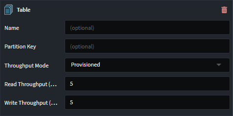

# Intent.Aws.DynamoDB

This module provides patterns for working with Amazon DynamoDB.

## What is DynamoDB?

Amazon DynamoDB is a serverless, NoSQL database service that allows you to develop modern applications at any scale.

For more information on DynamoDB, check out their [official docs](https://aws.amazon.com/dynamodb/).

## What's in this module?

This module consumes your `Domain Model`, which you build in the `Domain Designer` and generates the corresponding DynamoDB implementation:

- Unit of Work and associated artifacts.
- DynamoDB Documents and associated artifacts.
- Repositories and associated artifacts.
- `appsettings.json` configuration.
- Dependency Injection wiring.

These DynamoDB patterns are realized mostly using the [DynamoDBContext class from the .NET object persistence model](https://docs.aws.amazon.com/amazondynamodb/latest/developerguide/DotNetDynamoDBContext.html).

## Developing and testing with a local DynamoDB emulator

Amazon provides [NoSQL Workbench for DynamoDB](https://docs.aws.amazon.com/amazondynamodb/latest/developerguide/workbench.html) which includes a DynamoDB emulator you can run on your own machine for development and testing purposes.

By default this module adds the `AWS:DynamoDB:UseLocalEmulator` with a value of `true` to the generated `appsettings.json`:

```json
"AWS": {
  "DynamoDB": {
    "UseLocalEmulator": true
  }
}
```

When deploying your application to production this setting key will need to be removed or set to `false`. For more information on customizing configuration settings in production, refer to Microsoft's [Configuration in ASP.NET Core](https://learn.microsoft.com/aspnet/core/fundamentals/configuration) article.

## Domain Designer

When designing domain models for DynamoDB your domain package must be annotated with the `Document Database` stereotype. If you have multiple Document DB technologies modules, you must explicitly indicate which Domain Packages contain DynamoDB domain models, by setting `Document Database`'s `Provider` property to DynamoDB.


### Configuring Tables

A `Table` Stereotype can be applied to `Class`es, `Folder`s and `Domain Package`s to control the DynamoDB table to be used for particular entities.




To determine the Table settings for a particular `Class`, the elements are checked in the following priority for the presence of `Table` stereotype: the `Class` itself, then any parent folders from most deeply to less deeply nested for the class, and then finally the `Domain Package` itself.

#### Name

The optional `Name` property controls the name for the table.

If it has a blank value on a `Class` or any of its ancestor elements or the package, then it uses the pluralized and [kebab cased](https://developer.mozilla.org/en-US/docs/Glossary/Kebab_case) version of the class name.

#### Partition Key

The optional `Partition Key` property controls the [partition key](https://docs.aws.amazon.com/amazondynamodb/latest/developerguide/HowItWorks.Partitions.html#HowItWorks.Partitions.SimpleKey) for the table.

If it has a blank value on a `Class` or any of its ancestor elements or the package, then it will use the name of the on the attribute on the same class with the `Primary Key` stereotype applied to it and the default name for these attributes is `id`.

#### Throughput

The `Throughput Mode` property controls the [throughput capacity](https://docs.aws.amazon.com/amazondynamodb/latest/developerguide/capacity-mode.html) for the table.

##### On-demand

When [`On-demand`](https://docs.aws.amazon.com/amazondynamodb/latest/developerguide/on-demand-capacity-mode.html) is selected for the `Throughput Mode` property the `Maximum Read Throughput (Units)` and `Maximum Write Throughput (Units)` values can be specified.

##### Provisioned

When [`Provisioned`](https://docs.aws.amazon.com/amazondynamodb/latest/developerguide/provisioned-capacity-mode.html) is selected for the `Throughput Mode` property the `Read Throughput (Units)` and `Write Throughput (Units)` values can be specified.

## Optimistic Concurrency

[Optimistic concurrency in DynamoDB](https://docs.aws.amazon.com/amazondynamodb/latest/developerguide/DynamoDBContext.VersionSupport.html) uses a Version attribute to manage concurrent updates, ensuring that updates only succeed if the Version in the update request matches the current Version of the item in the database. This prevents overwriting changes made by other transactions, maintaining data consistency without locking resources.

You opt into optimistic concurrency through the  `Use Optimistic Concurrency` setting, which is on by default.

 The patterns in this module support this in 2 ways

- Implicit optimistic concurrency
- Explicit optimistic concurrency

### Implicit optimistic concurrency

The repositories will track the `Version` of all read documents and ensure that any writes to the DB use the `Version` which was read, ensure the documents have not been changed between you reading them and writing back to them, with a single service call.

### Explicit optimistic concurrency

In this scenario you can explicitly model an `Version` attribute of type nullable `int?` on your domain entity. e.g.:


If you want the attribute to have a name other than `Version` give the attribute any name you want and then apply the `Version` stereotype:


## Related Modules

### Intent.Metadata.DocumentDB

This modules provides Document DB related stereotypes for extending the Domain Designer with Document DB technology specific data.

### Intent.Entities

This module generates domain entities as C# classes, which are used by this model.
