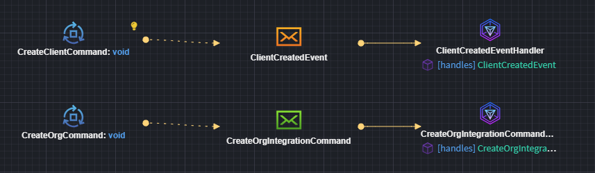
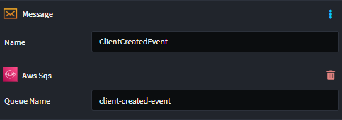
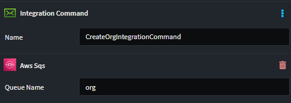

# Intent.Aws.Sqs

This module provides patterns for working with AWS SQS directly.

## What is AWS SQS?

Amazon Simple Queue Service (AWS SQS) is a fully managed message queuing service that enables you to decouple and scale microservices, distributed systems, and serverless applications. It provides reliable, scalable, and cost-effective message delivery between independent application components, offering features like message ordering, message deduplication, visibility timeouts, and dead-letter queues.

For more information on AWS SQS, check out their [official docs](https://docs.aws.amazon.com/sqs/).

## Modeling Integration Events and Commands

Modeling Integration Events can be achieved from within the Services designer. 
This module automatically installs the `Intent.Modelers.Eventing` module which provides designer modeling capabilities for integration events and commands. 
For details on modeling integration events and commands, refer to its [README](https://docs.intentarchitect.com/articles/modules-common/intent-modelers-eventing/intent-modelers-eventing.html).



You can model Integration Events (orange Message envelope element), and it will automatically configure to work against an SQS Queue with a derived name.
However, you can customize the name of the Queue by applying an `AWS SQS` stereotype and setting the `Queue Name` to the desired name.



Similarly, you can model Integration Commands (green Message envelope element), and it will automatically configure to work against an SQS Queue with a derived name.
You can customize the name by applying an `AWS SQS` stereotype and setting the `Queue Name` to the desired name.



## AWS SQS Implementation

Provides an AWS SQS specific implementation of the `IEventBus` interface for dispatching messages.

## Message Publishing

Message publishing can be done through the `IEventBus` interface using the `Publish` method to send messages to SQS queues.

## Message Consumption

For every message subscribed to in the `Services Designer` will receive its own Integration Event handler.

This is what the Business logic Integration Event handler looks like:

```csharp
[IntentManaged(Mode.Merge, Signature = Mode.Fully)]
public class ClientCreatedIntegrationEventHandler : IIntegrationEventHandler<ClientCreatedEvent>
{
    [IntentManaged(Mode.Ignore)]
    public ClientCreatedIntegrationEventHandler()
    {
    }

    [IntentManaged(Mode.Fully, Body = Mode.Ignore)]
    public async Task HandleAsync(ClientCreatedEvent message, CancellationToken cancellationToken = default)
    {
        // Business logic here
        throw new NotImplementedException();
    }
}
```

> [!NOTE]
>
> This module will not be generating consumer code automatically for you. Look at the [Related Modules](#related-modules) section to see which modules cause this to happen.

## Configuring SQS

When you're publishing using AWS SQS, you will need to configure it in your `appsettings.json` file.

### AWS Configuration

```json
{
  "AWS": {
    "Region": "us-east-1"
  },
  "AwsSqs": {
    "ClientCreated": {
      "QueueUrl": "https://sqs.us-east-1.amazonaws.com/123456789012/client-created"
    },
    "OrderPlaced": {
      "QueueUrl": "https://sqs.us-east-1.amazonaws.com/123456789012/order-placed"
    }
  }
}
```

### LocalStack Support

For local development, set the following in your `appsettings.Development.json`:

```json
{
  "AWS": {
    "ServiceURL": "http://localhost:4566",
    "Region": "us-east-1"
  }
}
```

The module automatically detects the `ServiceURL` setting and configures the SQS client accordingly for local development with LocalStack.

## Message Attributes

The module automatically sets the `MessageType` attribute on published messages for routing and filtering purposes. This enables consumers to identify the message type without parsing the message body.

## Related Modules

### Intent.Aws.Lambda.Functions.Sqs

This module handles the consumer code for AWS SQS when AWS Lambda is selected as the hosting technology, allowing Lambda functions to process messages from SQS queues.

> [!NOTE]
>
> Currently, this module only supports AWS Lambda Functions as the hosting technology through the `Intent.Aws.Lambda.Functions.Sqs` module. Support for other hosting technologies may be added in future releases. If you need support for a different hosting platform, please reach out to us on [GitHub](https://github.com/IntentArchitect/Support) or email us at [support@intentarchitect.com](mailto://support@intentarchitect.com).

