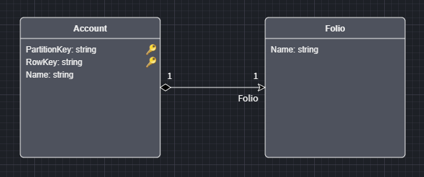
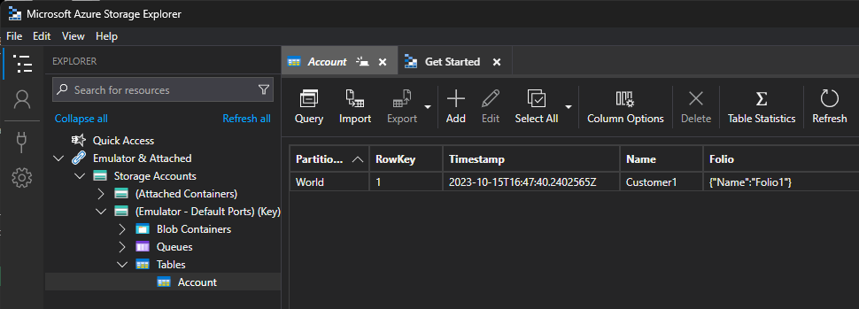

# Intent.Modules.Azure.TableStorage

This module provides patterns for working with Azure Table Storage.

## What is Azure Table Storage?

Azure Table Storage is a cloud-based NoSQL data storage service provided by Microsoft Azure, designed for storing structured, semi-structured, or unstructured data at scale. It offers a highly available and scalable platform for storing and querying large amounts of data, making it suitable for various applications such as IoT, web applications, and data analytics. Azure Table Storage uses a key-based schema to organize data, allowing for efficient and flexible data access while providing features like automatic load balancing, high availability, and seamless integration with other Azure services.

For more information on Azure Table Storage, check out their [official docs](https://learn.microsoft.com/en-us/azure/storage/tables/table-storage-overview).

## What's in this module?

This module consumes your `Domain Model`, which you build in the `Domain Designer` and generates the corresponding Azure Table Storage implementation:

* Unit of Work and associated artifacts.
* Azure Table Storage table entities and associated artifacts.
* Repositories and associated artifacts.
* `app.settings` configuration.
* Dependency Injection wiring.

## Domain Modeling Notes

When Domain Modeling using the Table Storage primary keys will composite keys [PartitionKey, RowKey] this is different to some of the other paradigms. In those paradigms primary keys are typically surrogate keys, where as in Table Storage the primary key more business orientated.

It's also worth noting that the Table Storage paradigm the data is flat, if you do model compositional relationship's in you model, these will be `json` serialized into the flat table.

## Locally based development

You can develop locally using `Azurite` and `Microsoft Azure Storage Explorer`.
`Azurite` installs as part of Visual Studio.
`Microsoft Azure Storage Explorer` is available [here](https://azure.microsoft.com/en-us/products/storage/storage-explorer).

For assistance around this refer to the official [documentation](https://learn.microsoft.com/en-us/azure/storage/common/storage-use-azurite?tabs=visual-studio).
