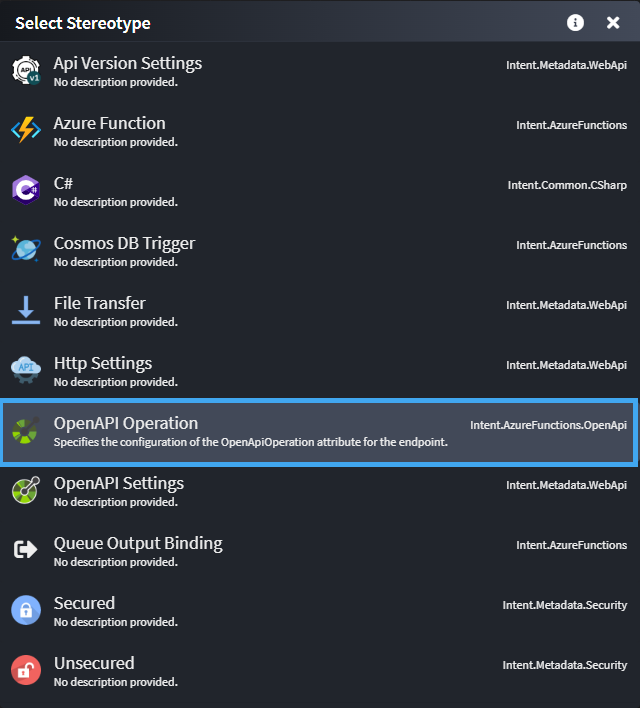
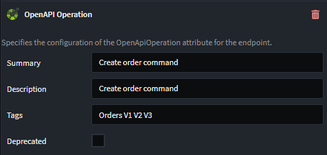

# Intent.AzureFunctions.OpenApi

This module adds exposes a stereotype called `OpenAPI Operation` that allows you to modify the [OpenApiOperation] attribute.

## Service Designer

To leverage OpenAPI Operation functionality, simply apply the `OpenAPI Operation` stereotype to the relevant `Azure Function`, `Operation`, `Command`, `Query` in the service designer.

## Using the `OpenAPI Operation` Options

By default, all options will be populated with their default values.

## What's in This Module?

This module consumes your `OpenAPI Operation`-enabled `Operation`s, which you design in the Service Designer, and generates the following:

- Summary
- Description
- Tags
- Deprecated
