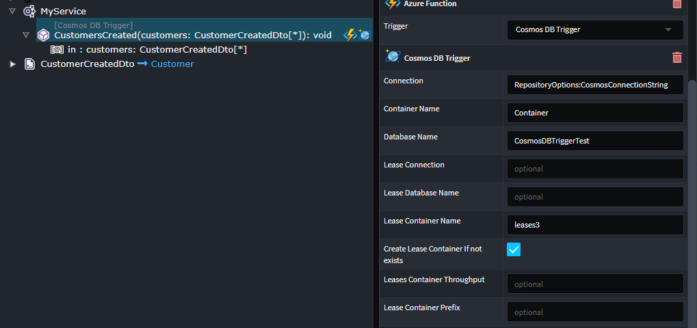

# Intent.AzureFunctions

Azure Functions is a serverless computing service provided by Microsoft Azure that enables developers to build and deploy event-driven, scalable, and cost-effective applications without managing the underlying infrastructure. With Azure Functions, developers can write code in various languages like C#, Python, JavaScript, etc., and trigger its execution in response to events from a wide range of sources, such as HTTP requests, timers, message queues, and more. The service automatically scales to handle increased workloads and charges only for the actual compute resources used during the function execution, making it a flexible and efficient solution for building lightweight microservices, automating tasks, and integrating different services in the cloud.

In the service's designer you can model your services in any of the following ways.

* `Azure Function`.
* `Command`s and `Query`s' (Expose as `Azure Function`)
* `Service`s. (Expose the `Operation`s as `Azure Function`)

## Http Triggers

Configure the Azure Function Stereotype:

* Trigger to be `Http Trigger`.

On the `Http Settings` stereotype you can configure the following :

* Verb, the http Verb for the service end point.
* Route, the http route for the service end point.
* Return Type Mediatype, the content type of the service response.

For more information on Azure Function Http Triggers, refer to the official [docs](https://learn.microsoft.com/en-us/azure/azure-functions/functions-bindings-http-webhook-trigger).

## Cosmos DB Triggers

Configure the Azure Function Stereotype:

* Trigger to be `Cosmos DB Trigger`.

On the `Cosmos DB Trigger` stereotype configure the following :

* Connection, name of the Cosmos DB connection string configured in your app.settings.
* Database name, the name of the Azure Cosmos DB database with the container being monitored.
* Container name, the name of the container being monitored.
* LeaseContainerName, the name of the container used to store leases.
* CreateLeaseContainerIfNotExists, when set to true, the leases container is automatically created when it doesn't already exist. The default value is false. When using Azure AD identities if you set the value to true, creating containers is not an allowed operation and your Function won't be able to start.



Your generated Azure Function will look similar to this:-

```csharp

[Function("CustomersCreated")]
public async Task Run(
    [CosmosDBTrigger(
        databaseName: "CosmosDBTriggerTest", 
        containerName: "Customers", 
        Connection = "RepositoryOptions:CosmosConnectionString", 
        CreateLeaseContainerIfNotExists = true, 
        LeaseContainerName = "leases")] IReadOnlyCollection<CustomerCreatedDto> rawCollection,
    CancellationToken cancellationToken)
{
    if (rawCollection == null || rawCollection.Count == 0) return;
    var customers = rawCollection.ToList();
    await _appService.CustomersCreated(customers, cancellationToken);
}

```

> **NOTE**
> I you model a `Command` or a `Service` which accepts a non-collection argument, the dispatching will be batched as per the example below.

```csharp

[Function("CustomersCreated")]
public async Task Run(
    [CosmosDBTrigger(
        databaseName: "CosmosDBTriggerTest", 
        containerName: "Customers", 
        Connection = "RepositoryOptions:CosmosConnectionString", 
        CreateLeaseContainerIfNotExists = true, 
        LeaseContainerName = "leases")] IReadOnlyCollection<CustomerCreatedDto> rawCollection,
            CancellationToken cancellationToken)
{
    if (rawCollection == null || rawCollection.Count == 0) return;

    foreach (var customer in rawCollection)
    {
        await _mediator.Send(customer, cancellationToken);
    }
}

```

For more information on Azure Function Cosmos DB Triggers, refer to the official [docs](https://learn.microsoft.com/en-us/azure/azure-functions/functions-bindings-cosmosdb-v2-trigger).

## Timer Triggers

Configure the Azure Function Stereotype:

* Trigger to be `Timer Trigger`.
* Schedule Expression, the NCRONTAB expressions for the timer interval.

For more information on Azure Function Timer Triggers, refer to the official [docs](https://learn.microsoft.com/en-us/azure/azure-functions/functions-bindings-timer).

## Queue Triggers

Configure the Azure Function Stereotype:

* Trigger to be `Queue Trigger`.
* Queue Name, the name of the queue consume.
* Connection, name of the Azure Queue Storage connection string configured in your app.settings.


Producing an azure function as follows:

```csharp
[Function("CreateCustomer")]
public async Task Run(
    [QueueTrigger("my-queue", Connection = "myconnection")] CreateCustomerCommand createCustomerCommand,
    CancellationToken cancellationToken)
{
    await _mediator.Send(createCustomerCommand, cancellationToken);
}
```

If you want to gain access to the underlying raw queue message check the `Include Message Envelope`, which will give you access the `QueueMessage` version of the message.

Producing an azure function as follows:

```csharp
[Function("CreateCustomer")]
public async Task Run(
    [QueueTrigger("my-queue", Connection = "myconnection")] QueueMessage message,
    CancellationToken cancellationToken)
{
    var createCustomerCommand = JsonConvert.DeserializeObject<CreateCustomerCommand>(message.Body.ToString())!;
    await _mediator.Send(createCustomerCommand, cancellationToken);
}
```

If you configure your `Queue Trigger` Azure function with a result, an additional stereotype will be added to the service `Queue Output Binding`. This stereotype allows you to configure which queue you would like the result of the service to be written to.


Producing an azure function as follows:

### For InProcess functions:

```csharp
[FunctionName("CreateCustomer")]
public async Task Run(
    [QueueTrigger("my-queue", Connection = "myconnection")] QueueMessage message,
    [Queue("out-queue")] QueueClient queueClient,
    CancellationToken cancellationToken)
{
    var createCustomerCommand = JsonConvert.DeserializeObject<CreateCustomerCommand>(message.Body.ToString())!;
    var result = await _mediator.Send(createCustomerCommand, cancellationToken);
    await queueClient.SendMessageAsync(JsonConvert.SerializeObject(result), cancellationToken);
}
```

### For Isolated functions:
```csharp
[Function("CreateCustomer")]
[QueueOutput("out-queue")]
public async Task<CustomerDto> Run(
    [QueueTrigger("my-queue", Connection = "myconnection")] QueueMessage message,
    CancellationToken cancellationToken)
{
    var createCustomerCommand = JsonConvert.DeserializeObject<CreateCustomerCommand>(message.Body.ToString())!;
    var result = await _mediator.Send(createCustomerCommand, cancellationToken);
    return result;
}
```

## Related Modules

### Intent.AzureFunctions.OpenApi

This module introduces Swagger generation and Swagger UI support for Http Trigger functions.

## Local Development

You can use the follow tools to work and test locally for things like QueueStorage
**[Azurite](https://learn.microsoft.com/en-us/azure/storage/common/storage-use-azurite?tabs=visual-studio)**, this is a Azure storage emulator. This is installed and running by default if you are using Visual Studio 2022+.
**[MS Azure Storage Explorer](https://azure.microsoft.com/en-us/products/storage/storage-explorer/)**, this tool allows you to browse and interact with Azurite.
