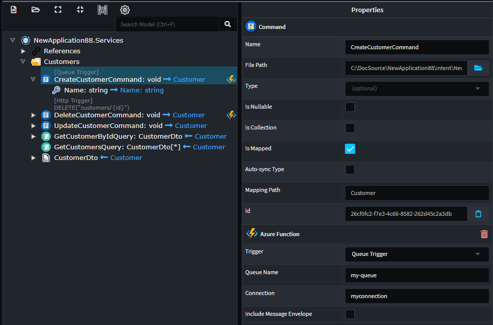
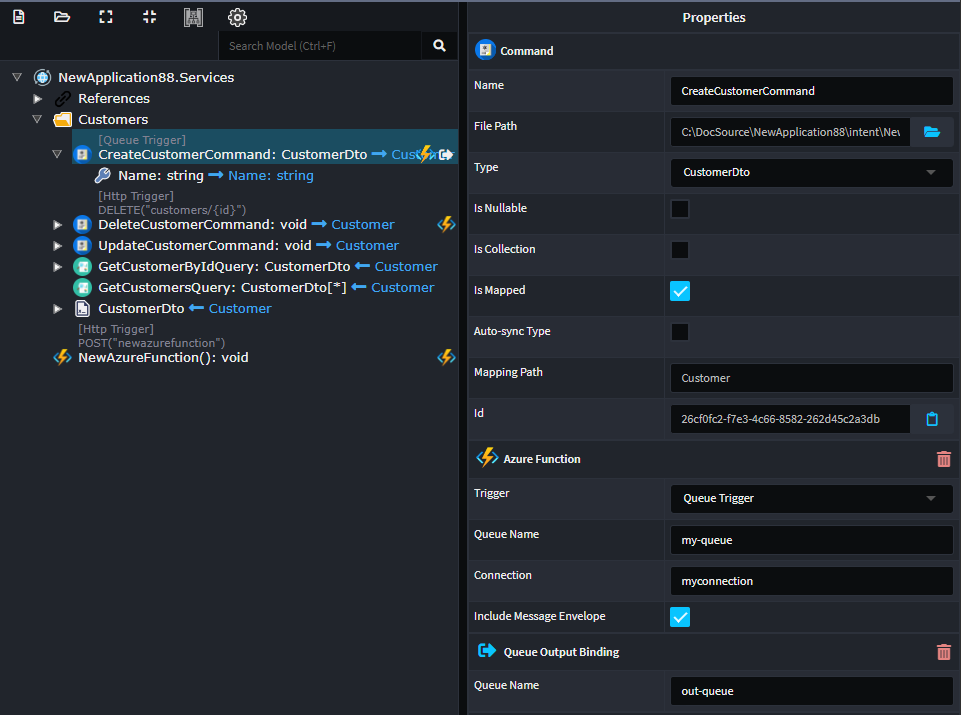

# Intent.AzureFunctions

Azure Functions is a serverless computing service provided by Microsoft Azure that enables developers to build and deploy event-driven, scalable, and cost-effective applications without managing the underlying infrastructure. With Azure Functions, developers can write code in various languages like C#, Python, JavaScript, etc., and trigger its execution in response to events from a wide range of sources, such as HTTP requests, timers, message queues, and more. The service automatically scales to handle increased workloads and charges only for the actual compute resources used during the function execution, making it a flexible and efficient solution for building lightweight microservices, automating tasks, and integrating different services in the cloud.

In the service's designer you can model your services in any of the following ways.

* `Azure Function`.
* `Command`s and `Query`s' (Expose as `Azure Function`)
* `Service`s. (Expose the `Operation`s as `Azure Function`)

## Queue Triggers

Configure the Azure Function Stereotype:

* Trigger to be `Queue Trigger`.
* Queue Name, the name of the queue consume.
* Connection, name of the Azure Queue Storage connection string configured in your app.settings.



Producing an azure function as follows:

```csharp
[FunctionName("CreateCustomer")]
public async Task Run(
    [QueueTrigger("my-queue", Connection = "myconnection")] CreateCustomerCommand createCustomerCommand,
    CancellationToken cancellationToken)
{
    await _mediator.Send(createCustomerCommand, cancellationToken);
}
```

If you want to gain access to the underlying raw queue message check the `Include Message Envelope`, which will give you access the `QueueMessage` version of the message.

Producing an azure function as follows:

```csharp
[FunctionName("CreateCustomer")]
public async Task Run(
    [QueueTrigger("my-queue", Connection = "myconnection")] QueueMessage message,
    CancellationToken cancellationToken)
{
    var createCustomerCommand = JsonConvert.DeserializeObject<CreateCustomerCommand>(message.Body.ToString())!;
    await _mediator.Send(createCustomerCommand, cancellationToken);
}
```

If you configure your `Queue Trigger` Azure function with a result, an additional stereotype will be added to the service `Queue Output Binding`. This stereotype allows you to configure which queue you would like the result of the service to be written to.



Producing an azure function as follows:

```csharp
[FunctionName("CreateCustomer")]
public async Task Run(
    [QueueTrigger("my-queue", Connection = "myconnection")] QueueMessage message,
    [Queue("out-queue")] QueueClient queueClient,
    CancellationToken cancellationToken)
{
    var createCustomerCommand = JsonConvert.DeserializeObject<CreateCustomerCommand>(message.Body.ToString())!;
    var result = await _mediator.Send(createCustomerCommand, cancellationToken);
    await queueClient.SendMessageAsync(JsonConvert.SerializeObject(result), cancellationToken);
}
```

## Local Development

You can use the follow tools to work and test locally for things like QueueStorage
**[Azurite](https://learn.microsoft.com/en-us/azure/storage/common/storage-use-azurite?tabs=visual-studio)**, this is a Azure storage emulator. This is installed and running by default if you are using Visual Studio 2022+.
**[MS Azure Storage Explorer](https://azure.microsoft.com/en-us/products/storage/storage-explorer/)**, this tool allows you to browse and interact with Azurite.
