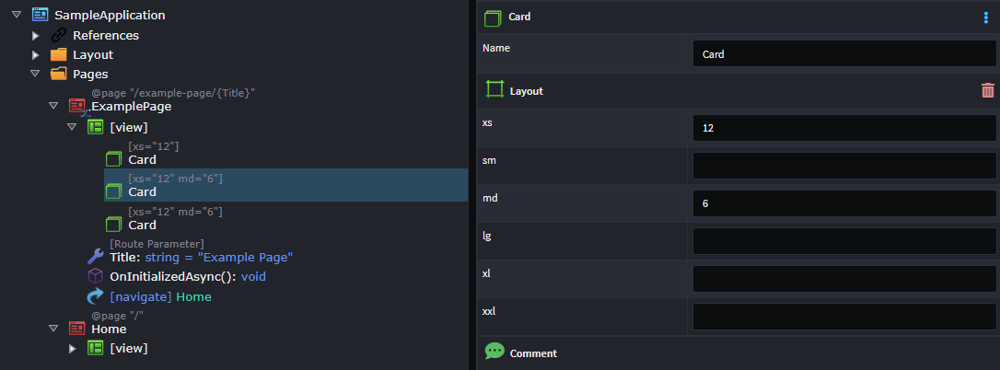

# Intent.Blazor.Components.MudBlazor

MudBlazor is a modern, open-source UI component library for Blazor that follows Material Design principles, providing a rich set of customizable components for building sleek and responsive web applications. 
It simplifies Blazor development by offering built-in theming, form validation, and a wide range of ready-to-use components like tables, dialogs, and charts.

This module realizes your UI design using MudBlazor.

For more information on MudBlazor, refer to the official [docs](https://mudblazor.com/docs/overview).

## 	Webinar - Blazor Frontend Automation

In this [webinar](https://intentarchitect.com/#/redirect/?category=resources&subCategory=frontendwebinar)  we'll explore how we can automate and continuously manage these patterns in Blazor & MudBlazor, and massively accelerate our .NET development!

## Sample Application

We also have a technology sample available, which you can download and try out available on our GitHub [here](https://github.com/IntentArchitect/Intent.Samples.MudBlazor.git).

## Tips for Styling you MudBlazor Application

### Customize your Site Colors and Fonts

You can setup a custom `MudTheme` to customize your sites color palette and typography.

In the `MainLayout.razor`

1. Add a `Theme` attribute to the `MudThemeProvider`
2. Set the `Theme` attribute to your backing field for the theme.

```razor

@inherits LayoutComponentBase

<!-- Specify the backing field for your theme -->
<MudThemeProvider Theme="_mySiteTheme" />

<MudPopoverProvider />

```

In the `MainLayout.razor.cs`

1. Add a field `_mySiteTheme` of type `MudTheme`.
2. Configure the theme the way you would like it.
3. Add a `[IntentMerge]` to the `MainLayout`, so that Intent Architect preserves your customizations.


```csharp

[IntentMerge]
public partial class MainLayout
{
    private MudTheme _mySiteTheme = new MudTheme
    {
        PaletteLight = new PaletteLight
        {
            Primary = "#ADD8E6", // Light Blue
            Secondary = "#1B2550", // Dark Blue
            Background = "#F4F6F9", // Light grayish background
            Surface = "#FFFFFF", // White content area
            AppbarBackground = "#1976D2", // Match primary
            DrawerBackground = "#F4F6F9", // Darker blue for sidebar
            TextPrimary = "#212121",
            TextSecondary = "#757575"
        }
        /*
        You would probably also want to configure the following properties
        PaletteDark 
        Typography 
        */

        ...

    };
```


### Flexible Layouts using the `Layout` stereotype.

MudBlazor's layout system is based on CSS flexbox and grid principles, leveraging Bootstrap-style breakpoints to create responsive designs. 

With MudBlazor, it would be fairly typically to layout components, using a `MudGrid` and `MudItem`s as follows:

```razor

<MudGrid>
    <MudItem xs="12">
        <MudCard>Item 1</MudCard>
    </MudItem>
    <MudItem xs="12" md="6">
        <MudCard>Item 1</MudCard>
    </MudItem>
    <MudItem xs="12" md="6">
        <MudCard>Item 1</MudCard>
    </MudItem>
</MudGrid>

```

To Achieve this using the `User Interface Designer` you would model it as follows.

1. Add the 3 `Card` components.
2. Apply the `Layout` stereotype to the `Card`s.
3. Configure the stereotypes.




For more details on MudBlazor layouts, read the official [documentation](https://mudblazor.com/components/grid#basic-grid).

