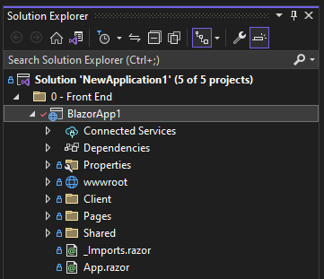
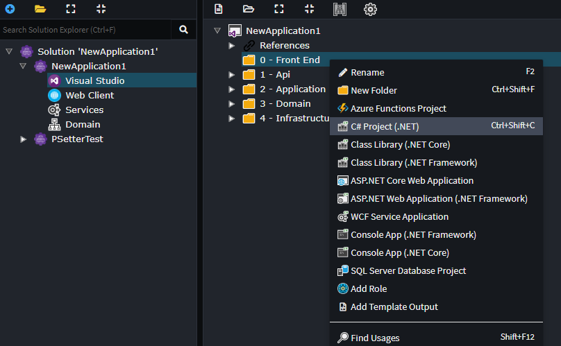
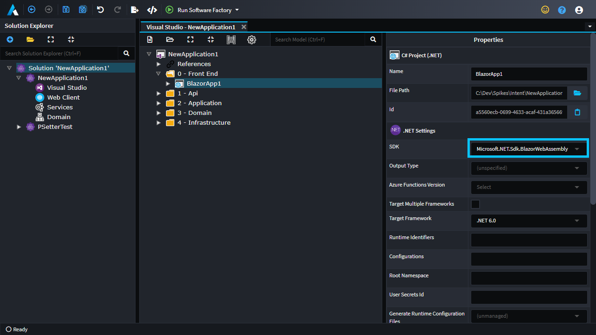
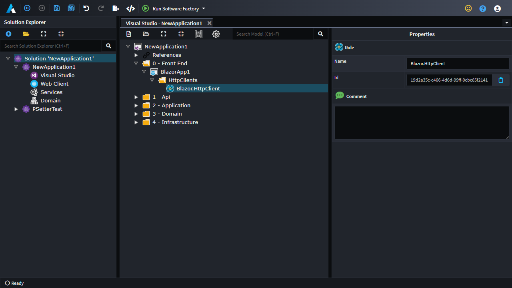
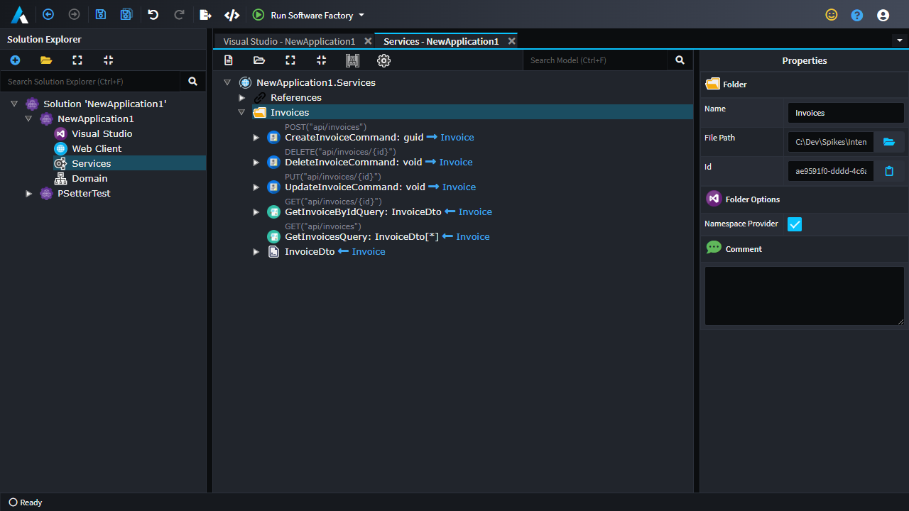
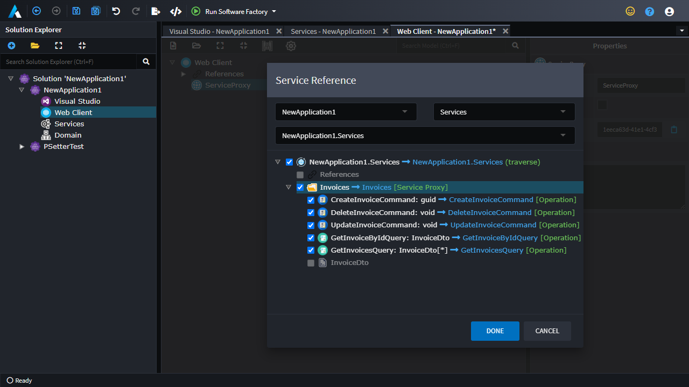

# Intent.Modules.Blazor.HttpClients

This Intent Architect module generates HttpClients for Blazor applications.

## Getting started

- In the Visual Studio IDE, if you haven't already done so, add a `Blazor WebAssembly App` to the same Visual Studio solution which is generated by Intent Architect:
  
- In Intent Architect, open `Visual Studio` designer.
- Create a new `.NET Project` with a name and folder structure which matches that of the Blazor project in the Visual Studio IDE:
  
- Set the SDK fro the project to `Microsoft.NET.Sdk.BlazorWebAssembly` (if you don't see such an option, ensure you have at least `3.3.28-pre.0` of the `Intent.VisualStudio.Projects` module installed):
  
- Within the desired location within the project you wish for the `HttpClient`s and contracts to be generated, create a `Blazor.HttpClient` role:
  
- Install the `Intent.Blazor.HttpClients` module.

## Modelling service proxies

- Ensure you already have one or more HTTP endpoints already modelled in the `Services` designer. In the following example CRUD operations have been created for an `Invoice` class:
  
- Open the `Web Client` designer and select the `New Service Proxy` context menu option, upon selecting which the mapping dialogue will show.
- Select the available application and then select the endpoints to be included in the Service Proxy:
  

When you run the Software Factory, it will now generate the service proxies as well as supporting contracts and related types.

## Registering the HttpClients with the Blazor app's dependency injection

In the Blazor project's `Client/Program.cs` file, add the following line just before the `await builder.Build().RunAsync()` line:

```csharp
builder.Services.AddHttpClients(builder.Configuration, new Uri("https://localhost:44321/"));
```

`https://localhost:44321/` should be replaced with the URL of your application's `Api` project, in development you can get this url from the `Api` project's `Properties/launchsettings.json` file.

The `Program.cs` file should now look something like this:

```csharp
using BlazorApp1;
using BlazorApp1.HttpClients;
using Microsoft.AspNetCore.Components.Web;
using Microsoft.AspNetCore.Components.WebAssembly.Hosting;
using Microsoft.Extensions.Configuration.Memory;
using Microsoft.Extensions.DependencyInjection;

namespace BlazorApp1
{
    public class Program
    {
        public static async Task Main(string[] args)
        {
            var builder = WebAssemblyHostBuilder.CreateDefault(args);
            builder.RootComponents.Add<App>("#app");
            builder.RootComponents.Add<HeadOutlet>("head::after");
            builder.Services.AddHttpClients(builder.Configuration, new Uri("https://localhost:44321/"));

            await builder.Build().RunAsync();
        }
    }
}
```

## Adding CORS to your Api project

For the HTTP calls to be allowed by web browsers, the API has to use CORS to allow requests from the URL of the Blazor App.

In the Api's `Startup.cs` file you will need to add the following to the `ConfigureServices` method:

```csharp
// IntentIgnore
services.AddCors(options =>
{
    options.AddDefaultPolicy(
        policy =>
        {
            policy.WithOrigins("https://localhost:7014");
        });
});
```

`https://localhost:7014` should be replaced with the URL of your `Blazor` project, in development you can get this url from the `Blazor` project's `Properties/launchsettings.json` file.

And the following to the `Configure` method:

```csharp
// IntentIgnore
app.UseCors();
```

The file should now look something like this:

```csharp
using System;
using System.Collections.Generic;
using System.Linq;
using System.Threading.Tasks;
using Intent.RoslynWeaver.Attributes;
using Microsoft.AspNetCore.Builder;
using Microsoft.AspNetCore.Hosting;
using Microsoft.Extensions.Configuration;
using Microsoft.Extensions.DependencyInjection;
using Microsoft.Extensions.Hosting;
using Microsoft.Extensions.Logging;
using Microsoft.Extensions.Options;
using NewApplication1.Api.Configuration;
using NewApplication1.Api.Filters;
using NewApplication1.Application;
using NewApplication1.Infrastructure;
using Serilog;

[assembly: DefaultIntentManaged(Mode.Fully)]
[assembly: IntentTemplate("Intent.AspNetCore.Startup", Version = "1.0")]

namespace NewApplication1.Api
{
    [IntentManaged(Mode.Merge)]
    public class Startup
    {
        public Startup(IConfiguration configuration)
        {
            Configuration = configuration;
        }

        public IConfiguration Configuration { get; }

        public void ConfigureServices(IServiceCollection services)
        {
            services.AddControllers(
                opt =>
                {
                    opt.Filters.Add<ExceptionFilter>();
                });

            services.AddApplication();
            services.ConfigureApplicationSecurity(Configuration);
            services.ConfigureProblemDetails();
            services.ConfigureApiVersioning();
            services.AddInfrastructure(Configuration);
            services.ConfigureSwagger(Configuration);
            // IntentIgnore
            services.AddCors(options =>
            {
                options.AddDefaultPolicy(
                    policy =>
                    {
                        policy.WithOrigins("https://localhost:7014");
                    });
            });
        }

        // This method gets called by the runtime. Use this method to configure the HTTP request pipeline.
        public void Configure(IApplicationBuilder app, IWebHostEnvironment env)
        {
            if (env.IsDevelopment())
            {
                app.UseDeveloperExceptionPage();
            }

            app.UseSerilogRequestLogging();
            app.UseExceptionHandler();
            app.UseHttpsRedirection();
            app.UseRouting();
            // IntentIgnore
            app.UseCors();
            app.UseAuthentication();
            app.UseAuthorization();
            app.UseEndpoints(endpoints =>
            {
                endpoints.MapControllers();
            });
            app.UseSwashbuckle();
        }
    }
}
```

## Using the service proxy in a Razor file

From within a `.razor` file it is now possible to inject HttpClients and call methods from them, the following is a simple example:

```razor
@page "/fetchdata"
@using BlazorApp1.HttpClients
@using BlazorApp1.HttpClients.InvoicesServiceProxy
@inject IInvoicesServiceProxyClient Http

<PageTitle>Invoices</PageTitle>

<h1>Invoices</h1>

<p>This component demonstrates fetching data from the server.</p>

@if (_invoices == null)
{
    <p><em>Loading...</em></p>
}
else
{
    <table class="table">
        <thead>
            <tr>
                <th>Id</th>
                <th>Number</th>
            </tr>
        </thead>
        <tbody>
            @foreach (var invoice in _invoices)
            {
                <tr>
                    <td>@invoice.Id</td>
                    <td>@invoice.Number</td>
                </tr>
            }
        </tbody>
    </table>
}

@code {
    private List<InvoiceDto>? _invoices;

    protected override async Task OnInitializedAsync()
    {
        _invoices = await Http.GetInvoicesAsync();
    }
}
```

If you now run both projects, the page with the HttpClient should now be able to fetch and render the data.
