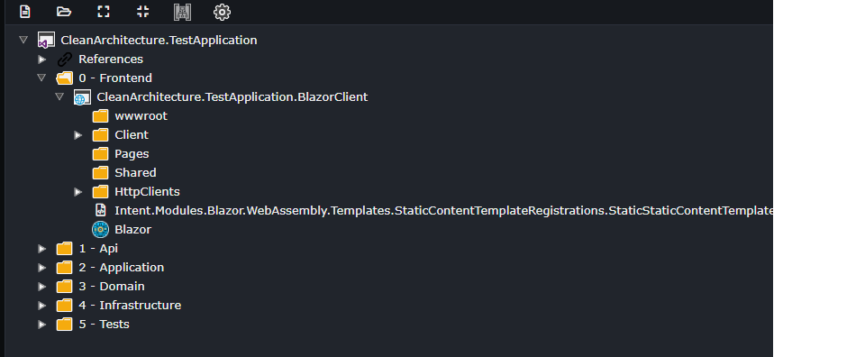
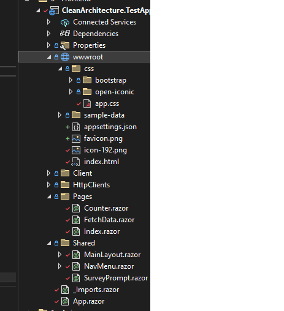

# Intent.Blazor.WebAssembly

This module installs and bootstraps up Blazor WebAssembly project into your current application.

## What is Blazor WebAssembly?

Blazor WebAssembly is a modern web development framework created by Microsoft that allows developers to build interactive and dynamic web applications using C# and .NET instead of traditional web technologies like JavaScript. It enables the execution of .NET code directly in the web browser, making it possible to create rich, single-page web applications with a familiar and powerful programming language. Blazor WebAssembly leverages WebAssembly, a binary instruction format that runs at near-native speed in modern browsers, to enable client-side execution of .NET code. This approach provides a seamless way to develop web applications with the performance and capabilities of a desktop application while maintaining the benefits of web deployment and accessibility.

For more information on Blazor WebAssembly read the official [documentation](https://learn.microsoft.com/en-us/aspnet/core/blazor/?view=aspnetcore-7.0#blazor-webassembly).

## What does this module do?

This module does the following:

* Configures Visual Studio Designer for a Blazor WebAssembly project.
* Adds Blazor WebAssembly sample HTML / razor content.
* Appsettings.json wiring
* Program.cs implementation

## Configures Visual Studio Designer for a Blazor WebAssembly project

This module updates your Visual Studio designer, to create a Blazor WebAssembly project, configured with some basic roles for other modules to target.

Here is an example of an updated Visual Studio Designer:

## Adds Blazor WebAssembly sample HTML / razor content

This module adds sample content implementations as per Visual Studio templates.

## Appsettings.json wiring

This module wires up an appsetting.json, to use for application settings. 

> ⚠️ **WARNING**
>
> You should not store sensitive information in  Blazor WebAssembly appsetting.json as this file is available client side. For more information read the official [documentation](https://learn.microsoft.com/en-us/aspnet/core/blazor/fundamentals/configuration?view=aspnetcore-7.0).

