# Intent.ContinuousIntegration.AzurePipelines

This module generates a basic `azure-pipeline.yml` file for [Azure Pipelines](https://learn.microsoft.com/azure/devops/pipelines/?view=azure-devops) which will:

- Build all `.csproj` files in the repository.
- Run unit tests for any `.csproj` whose name is suffixed with `Tests`.
- Run the [Intent Architect Software Factory CLI](https://docs.intentarchitect.com/articles/tools/software-factory-cli/software-factory-cli.html) tool to detect possible outstanding changes.

## Creating a pipeline

This readme assumes you have some familiarity with Azure DevOps Pipelines, for more information on creating a Pipeline, refer to Microsoft's [_Create your first pipeline_ article](https://learn.microsoft.com/azure/devops/pipelines/create-first-pipeline?view=azure-devops&tabs=net%2Ctfs-2018-2%2Cbrowser).

- Click on the `Pipelines` option in the pane on the left.
- Click the `Create Pipeline` button.

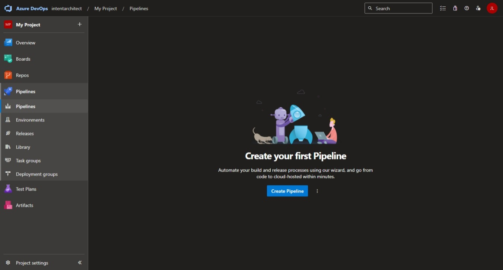

- Follow the instructions on how to choose a source code repository.
- After selecting your source code repository, it should automatically find the `azure-pipelines.yml` file which you can `Save and run`:

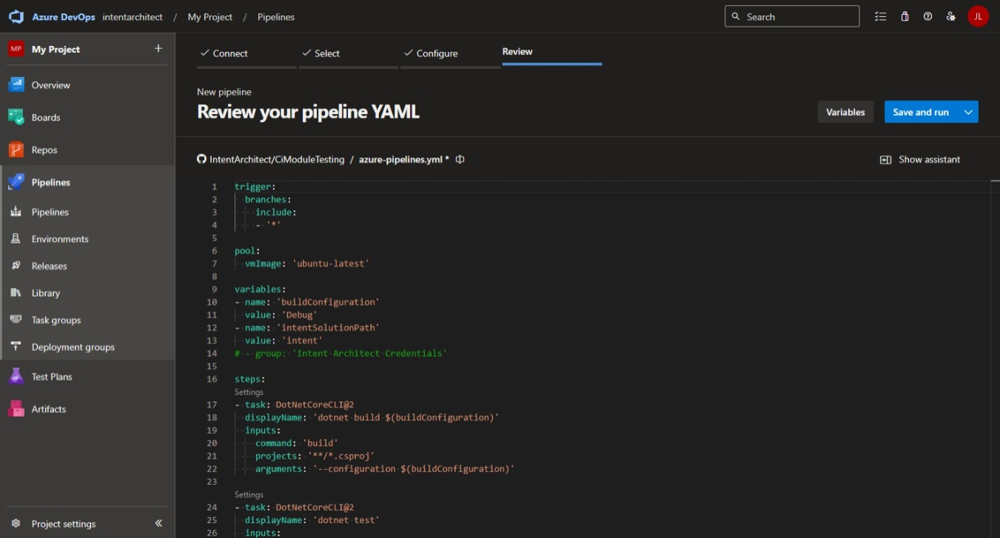

After the first run is complete, the pipeline should look somewhat like this:

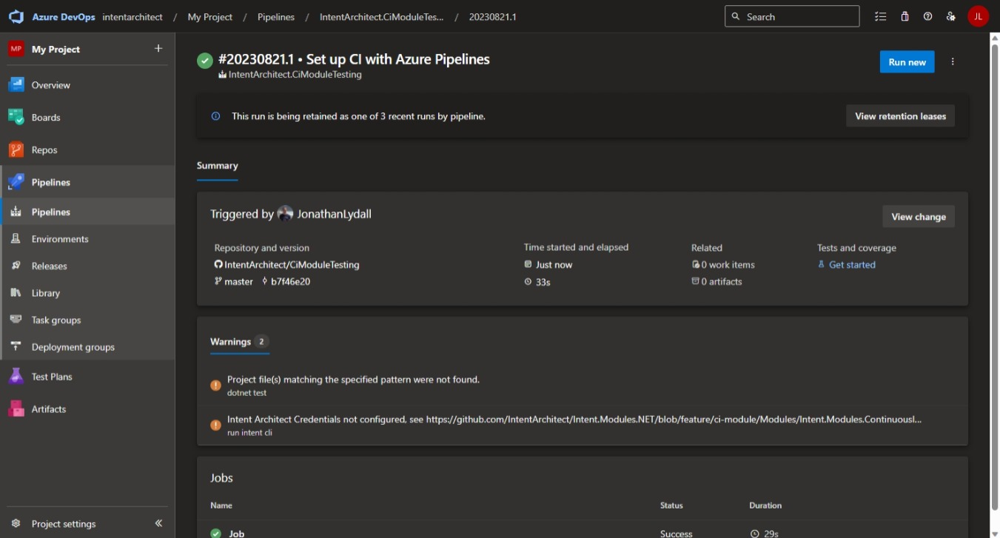

If you have a warning saying `Project file(s) matching the specified pattern were not found.`, this is because it didn't locate any "Test" projects to run. Once you have added unit test projects, the warning should disappear. You will also need to ensure that your unit test project names are suffixed with `Tests`.

If you have a warning starting with `Intent Architect Credentials not configured…`, this is because you haven't yet [configured Intent Architect Credentials](#configuring-intent-architect-credentials) for the pipeline.

## Configuring Intent Architect Credentials

Because valid Intent Architect account credentials are required to run the [Intent Architect Software Factory CLI](https://docs.intentarchitect.com/articles/cli-tools/software-factory-cli/software-factory-cli.html), some quick additional configuration will be required to make them available to the pipeline.

In the left navigation pane, go to `Library`.

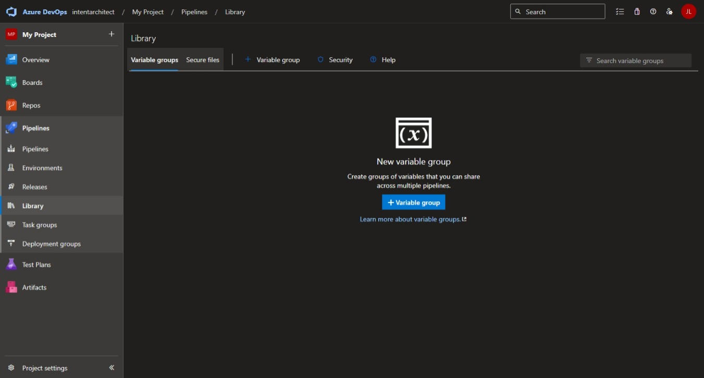

- Press the `+ Variable Group` button.
- Use `Intent Architect Credentials` for the `Variable Group Name`.
- Under variables, press the `+ Add` button.
- For the `Name` enter `intent-architect-user` and for the `Value` enter the name of a valid Intent Architect account.
- Under variables, press the `+ Add` button again.
- For the `Name` enter `intent-architect-password`, for the `Value` enter the password for the Intent Architect account and finally press the "Padlock" icon for this row which will make the variable [secret](https://learn.microsoft.com/azure/devops/pipelines/process/set-secret-variables?view=azure-devops&tabs=yaml%2Cpowershell).

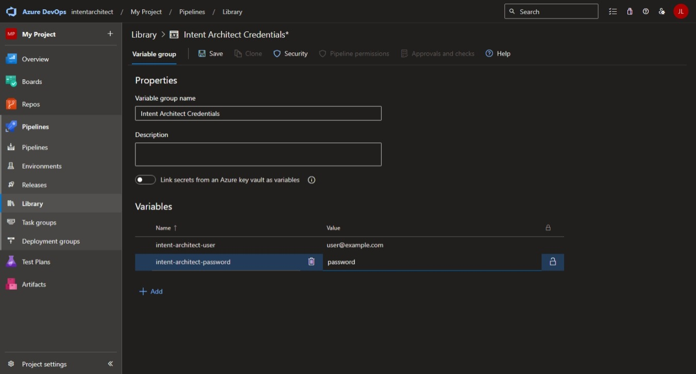

Return to the Pipelines view by using the `Pipelines` option in the navigation pane on the left.

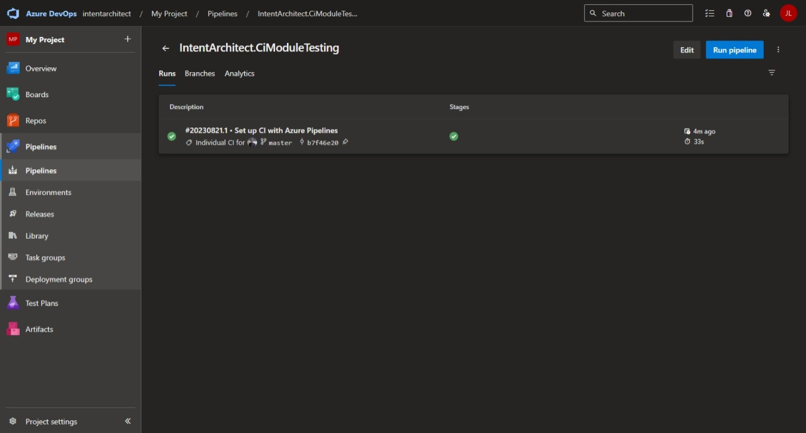

- Press the `Edit` button at the top right of the screen.
- Uncomment the `# - group: 'Intent Architect Credentials'` line by removing the leading `#` so that it becomes to `- group: 'Intent Architect Credentials'`.

Press the `Save` button at the top right of the screen.

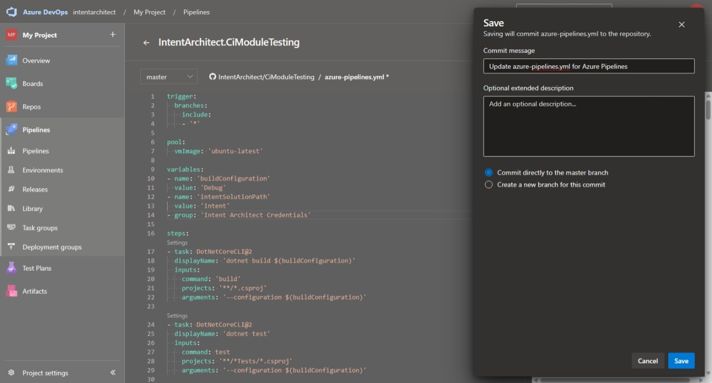

On the dialogue update any details as desired and press the `Save` button at the bottom right.

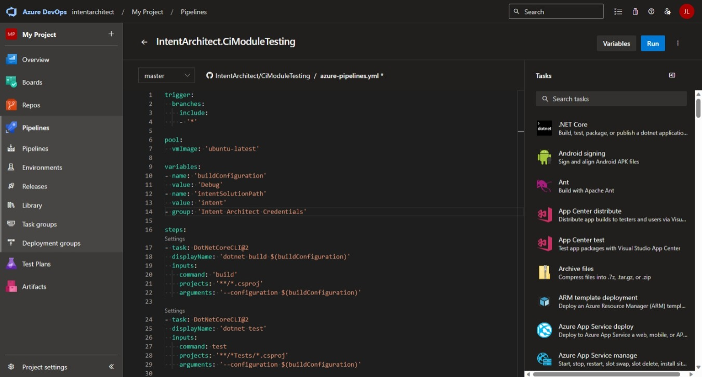

- You can now press the `Run` button at the top right of the screen.
- On the `Run Pipeline` dialogue (although not essential, you can update any details as desired and) press the `Run` button at the bottom right.

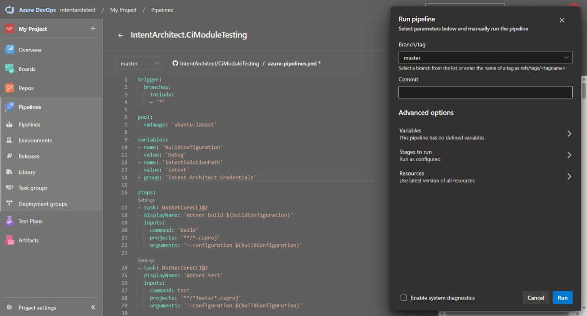

Once the pipeline has started, you will see that it shows a yellow box saying `This pipeline needs permission to access a resource before this run can continue`.

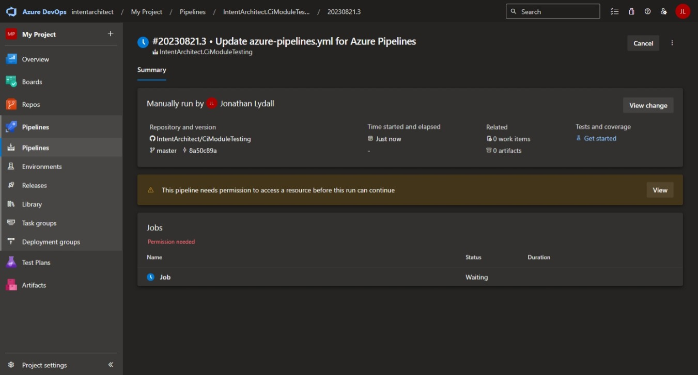

Press the `View` button in this yellow box.

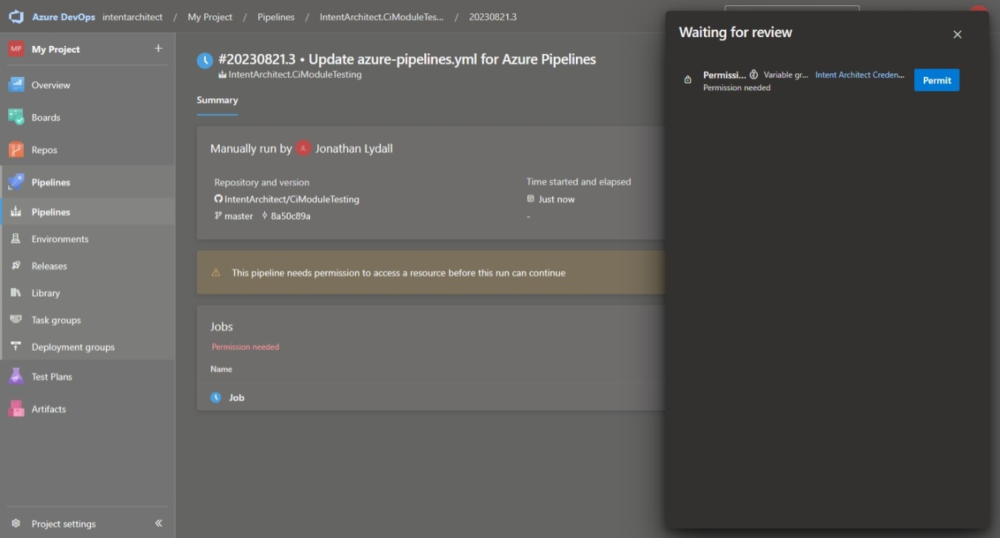

In the `Waiting for review` dialogue press the `Permit` button.

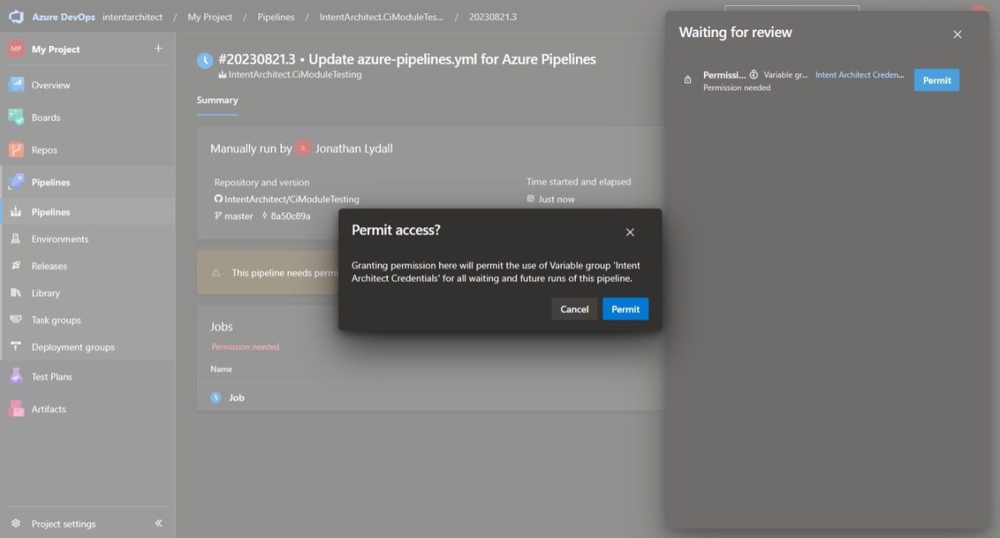

Press `Permit` on the additional dialogue.

The pipeline should now continue and from this time onwards it will run the Intent Architect Software Factory CLI without further permission granting required.
