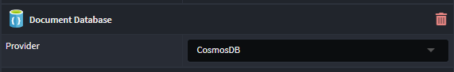
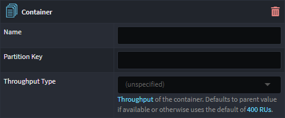
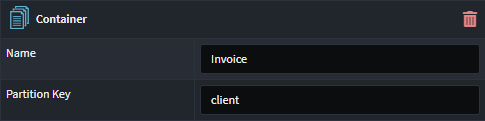
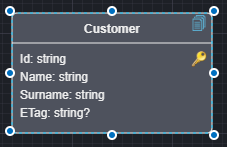

# Intent.CosmosDB

This module provides patterns for working with CosmosDB.

## What is CosmosDB?

Azure Cosmos DB is a globally distributed, multi-model database service provided by Microsoft's Azure cloud platform. It offers a highly scalable, low-latency, and globally distributed data storage solution for modern applications that require seamless scalability and high availability. Cosmos DB supports multiple data models, including document, key-value, graph, column-family, and time-series, allowing developers to choose the best model for their specific application needs. It offers automatic and configurable data replication across Azure regions, ensuring data durability and availability even in the face of regional outages. Cosmos DB also provides comprehensive SLAs for performance, availability, and latency, making it well-suited for applications with demanding requirements. Its multi-model and globally distributed capabilities make Cosmos DB a versatile and robust choice for building responsive and resilient applications on the cloud.

For more information on CosmosDB, check out their [official docs](https://learn.microsoft.com/azure/cosmos-db/).

## What's in this module?

This module consumes your `Domain Model`, which you build in the `Domain Designer` and generates the corresponding CosmosDB implementation:-

* Unit of Work and associated artifacts.
* Cosmos DBDocuments and associated artifacts.
* Repositories and associated artifacts.
* `app.settings` configuration.
* Dependency Injection wiring.

These CosmosDB patterns are realized using [Azure Cosmos DB Repository .NET SDK](https://github.com/IEvangelist/azure-cosmos-dotnet-repository).

## Domain Designer

When designing domain models for CosmosDB your domain package must be annotated with the `Document Database` stereotype. If you have multiple Document DB technologies modules, you must explicitly indicate which Domain Packages contain CosmosDB domain models, by setting `Document Database`'s `Provider` property to CosmosDB.



### Controlling the Cosmos DB Container and Partition Key for entities

A `Container` Stereotype can applied to `Class`es, `Folder`s and `Domain Package`s to control the Cosmos DB container to be used for particular Classes.



To determine the Container settings for a particular `Class`, the elements are checked in the following priority for the presence of `Container` stereotype: the `Class` itself, the any parent folders from most deeply to less deeply nested for the class, and then finally the `Domain Package` itself is checked.

Once the stereotype is applied, you can specify settings for it:



If the "Partition Key" is left blank the class's "id" is used, if specified then you need to ensure that all classes under the container have an attribute named to match the stereotype's "Partition Key" value. The Software Factory will output warnings when classes do not have a matching attribute for its partition key.

If no `Container` stereotype is found as per the above method for a particular `Class`, it uses a default container called "Container" with `id` for the partition key.

## Multi Tenancy with Separate Database

By default all tenants will have a default database and default container names in line with the `appsettings.json` configuration.

```json
{
  "RepositoryOptions": {
    "ContainerId": "{Default Container Name}",
    "DatabaseId": "{Default Database Name}"
  }
}
```

These can be changed per tenant by using configuring them in the tenant connection strings using the following syntax.

Connection String Example

```text
AccountEndpoint={End Point};AccountKey={Key};Database={TenantDb};Container={Default Container};
```

## Optimistic Concurrency

Optimistic concurrency in Cosmos DB uses an ETag (entity tag) to manage concurrent updates, ensuring that updates only succeed if the ETag in the update request matches the current ETag of the item in the database. This prevents overwriting changes made by other transactions, maintaining data consistency without locking resources.

You opt into optimistic concurrency through the  `Use Optimistic Concurrency` setting, which is on by default.

 The patterns in this module support this in 2 ways

* Implicit optimistic concurrency
* Explicit optimistic concurrency

### Implicit optimistic concurrency

The repositories will track the `ETags` of all read documents and ensure that any writes to the DB use the `ETag` which was read, ensure the documents have not been changed between you reading them and writing back to them, with a single service call.

### Explicit optimistic concurrency

In this scenario you can explicitly model an `ETag` attribute of type nullable `string?` on you domain entity. e.g.:



Now you are in full control of how you want to use the `ETag`. Typically making sure you set the `ETag` for updates to the document to be the version you read. 

## Related Modules

### Intent.Metadata.DocumentDB

This modules provides Document DB related stereotypes for extending the Domain Designer with Document DB technology specific data.

### Intent.Entities

This module generates domain entities as C# classes, which are used by this model.
