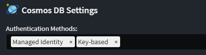

# Intent.CosmosDB

This module provides patterns for working with Cosmos DB.

## What is Cosmos DB?

Azure Cosmos DB is a globally distributed, multi-model database service provided by Microsoft's Azure cloud platform. It offers a highly scalable, low-latency, and globally distributed data storage solution for modern applications that require seamless scalability and high availability. Cosmos DB supports multiple data models, including document, key-value, graph, column-family, and time-series, allowing developers to choose the best model for their specific application needs. It offers automatic and configurable data replication across Azure regions, ensuring data durability and availability even in the face of regional outages. Cosmos DB also provides comprehensive SLAs for performance, availability, and latency, making it well-suited for applications with demanding requirements. Its multi-model and globally distributed capabilities make Cosmos DB a versatile and robust choice for building responsive and resilient applications on the cloud.

For more information on Cosmos DB, check out their [official docs](https://learn.microsoft.com/azure/cosmos-db/).

## What's in this module?

This module consumes your `Domain Model`, which you build in the `Domain Designer` and generates the corresponding Cosmos DB implementation:

- Unit of Work and associated artifacts.
- Cosmos DBDocuments and associated artifacts.
- Repositories and associated artifacts.
- `app.settings` configuration.
- Dependency Injection wiring.

These Cosmos DB patterns are realized using [Azure Cosmos DB Repository .NET SDK](https://github.com/IEvangelist/azure-cosmos-dotnet-repository).

## Domain Designer

When designing domain models for Cosmos DB your domain package must be annotated with the `Document Database` stereotype. If you have multiple Document DB technologies modules, you must explicitly indicate which Domain Packages contain Cosmos DB domain models, by setting `Document Database`'s `Provider` property to Cosmos DB.


### Configuring Cosmos DB Containers

A `Container` Stereotype can be applied to `Class`es, `Folder`s and `Domain Package`s to control the Cosmos DB container to be used for particular entities.


To determine the Container settings for a particular `Class`, the elements are checked in the following priority for the presence of `Container` stereotype: the `Class` itself, then any parent folders from most deeply to less deeply nested for the class, and then finally the `Domain Package` itself.

#### Name

The optional `Name` property controls the name for the container.

If it has a blank value on a `Class` or any of its ancestor elements or the package, then it uses the value of the `RepositoryOptions:ContainerId` key from the `appsettings.json` file which has a default value of `Container`.

#### Partition Key

The optional `Partition Key` property controls the [partition key](https://learn.microsoft.com/azure/cosmos-db/partitioning-overview#choose-a-partition-key) for the container.

If it has a blank value on a `Class` or any of its ancestor elements or the package, then it will use the name of the on the attribute on the same class with the `Primary Key` stereotype applied to it and the default name for these attributes is `id`.

Regardless of whether the value has a leading `/`, the template will always generate a leading `/` in for the container configuration.

#### Throughput

The optional `Throughput Type` property controls the [throughput](https://learn.microsoft.com/azure/cosmos-db/set-throughput#set-throughput-on-a-container) for the container.

If it has a blank value on a `Class` or any of its ancestor elements or the package, then no throughput is specified in the generated container configuration resulting the in the [default of manual throughput of 400 RUs](https://github.com/IEvangelist/azure-cosmos-dotnet-repository/blob/2c2903cf59d0f5c480276afd472d502e52e49c3d/src/Microsoft.Azure.CosmosRepository/Builders/ContainerOptionsBuilder.cs#L42-L46) being used.

##### Autoscale

When `Autoscale` is selected for the `Throughput Type` property, autoscale will be used for the generated container configuration with an argument with the value of the `Maximum Throughput (RUs)` property is it has a non-blank value.

When `Maximum Throughput (RUs)` is blank then the [default of 1000 will be used](https://github.com/IEvangelist/azure-cosmos-dotnet-repository/blob/2c2903cf59d0f5c480276afd472d502e52e49c3d/src/Microsoft.Azure.CosmosRepository/Builders/ContainerOptionsBuilder.cs#L121-L121).

##### Manual

When `Manual` is selected for the `Throughput Type` property, manual throughput will be used for the generated container configuration with an argument with the value of the `Manual Throughput (RUs)` property is it has a non-blank value.

When `Manual Throughput (RUs)` is blank then the [default of 400 will be used](https://github.com/IEvangelist/azure-cosmos-dotnet-repository/blob/2c2903cf59d0f5c480276afd472d502e52e49c3d/src/Microsoft.Azure.CosmosRepository/Builders/ContainerOptionsBuilder.cs#L104-L104).

##### Serverless

When `Serverless` is selected for the `Throughput Type` property, serverless throughput will be used for the generated container configuration.

## Multi Tenancy with Separate Database

By default all tenants will have a default database and default container names in line with the `appsettings.json` configuration.

```json
{
  "RepositoryOptions": {
    "ContainerId": "{Default Container Name}",
    "DatabaseId": "{Default Database Name}"
  }
}
```

These can be changed per tenant by using configuring them in the tenant connection strings using the following syntax.

Connection String Example

```text
AccountEndpoint={End Point};AccountKey={Key};Database={TenantDb};Container={Default Container};
```

## Optimistic Concurrency

Optimistic concurrency in Cosmos DB uses an ETag (entity tag) to manage concurrent updates, ensuring that updates only succeed if the ETag in the update request matches the current ETag of the item in the database. This prevents overwriting changes made by other transactions, maintaining data consistency without locking resources.

You opt into optimistic concurrency through the  `Use Optimistic Concurrency` setting, which is on by default.

 The patterns in this module support this in 2 ways

- Implicit optimistic concurrency
- Explicit optimistic concurrency

### Implicit optimistic concurrency

The repositories will track the `ETags` of all read documents and ensure that any writes to the DB use the `ETag` which was read, ensure the documents have not been changed between you reading them and writing back to them, with a single service call.

### Explicit optimistic concurrency

In this scenario you can explicitly model an `ETag` attribute of type nullable `string?` on your domain entity. e.g.:


Now you are in full control of how you want to use the `ETag`. Typically making sure you set the `ETag` for updates to the document to be the version you read.

## Authentication Methods

This module supports two authentication methods:

- **Key-based** (default)
- **Azure Managed Identity**

Your application can be configured with one or both methods in the Application Setting screen. Only one will be used at runtime, but you may configure both if you want different authentication methods for different environments.

If none are selected (the default configuration) then **Key-based** is used.



For example, if both **Managed Identity** and **Key-based** are enabled, the `AuthenticationMethod` must be specified in the [appsettings file](#appsettings-configuration) to indicate which method to use. If this setting is not provided, **Key-based** authentication is used by default.  

If only **Managed Identity** or **Key-based** is enabled, then `AuthenticationMethod` is not required — the selected method will automatically be used.

### Appsettings Configuration

The following options are available under the `RepositoryOptions` section in *appsettings.json*:

| Name                   | Description                                                               | Notes                                                                 | Example                                                                 |
|------------------------|---------------------------------------------------------------------------|-----------------------------------------------------------------------|-------------------------------------------------------------------------|
| **AuthenticationMethod** | The authentication method to use when multiple methods are configured      | Optional if only one method is configured. Defaults to Key-based if omitted. | `ManagedIdentity`                                                       |
| **CosmosConnectionString** | Connection string used for Key-based authentication                      | Ignored if using Managed Identity                                     | `AccountEndpoint=https://localhost:8081/;AccountKey=abc123...==`        |
| **DatabaseId**         | The name of the Cosmos DB database containing the container(s)            |                                                                       | `MyDatabase`                                                            |
| **ContainerId**        | The name of the Cosmos DB container inside the database                   |                                                                       | `MyContainer`                                                           |
| **ManagedIdentityClientId** | The client ID of the managed identity to use for authentication            | Ignored if using Key-based authentication                             | `d3c1b5a0-3f6d-4f9a-9c9e-7a5a7e1e1234`                                  |
| **AccountEndpoint**    | The URI of your Cosmos DB account                                         | Ignored if using Key-based authentication                             | `https://my-cosmos-db-account.documents.azure.com:443/`                 |

Sample `appsettings.json`:

``` json
{
  "RepositoryOptions": {
    // Choose between "KeyBased" or "ManagedIdentity" if both are configured.
    // Defaults to "KeyBased" if omitted.
    "AuthenticationMethod": "ManagedIdentity",

    // Used only for Key-based authentication
    "CosmosConnectionString": "AccountEndpoint=https://my-cosmos-db-account.documents.azure.com:443/;AccountKey=abc123...==",

    // Used only for Managed Identity authentication
    "AccountEndpoint": "https://my-cosmos-db-account.documents.azure.com:443/",
    "ManagedIdentityClientId": "d3c1b5a0-3f6d-4f9a-9c9e-7a5a7e1e1234",

    // Always required
    "DatabaseId": "MyDatabase",
    "ContainerId": "MyContainer"
  }
}

```

## JSON Serialization Considerations

### System.Text.Json and Newtonsoft.Json Conflict

When working with Cosmos DB in an API context, you may encounter serialization conflicts when working with dynamic objects. This occurs because:

- API services typically use **System.Text.Json** for request/response serialization
- The Cosmos DB SDK (**Microsoft.Azure.Cosmos.Client**) uses **Newtonsoft.Json** for database operations

This conflict can cause issues particularly with complex types like `Dictionary<string, object>` where the two serializers handle dynamic content differently.

### Handling dynamic object Properties

When storing dynamic data (for example using `Dictionary<string, object>`) in Cosmos DB through an API layer, consider these approaches:

#### Option 1: Store as string
- Change properties from `Dictionary<string, object>` to `string` in your domain models (and optionally in API DTOs)
- If keeping Dictionary in the API layer, manual conversion will be needed in your service layer
- Best when your API doesn't need to query or process this dynamic data
- Simple implementation, but sacrifices the ability to query into the dynamic content

#### Option 2: Standardize on Newtonsoft.Json
- Configure your API layer to use Newtonsoft.Json instead of System.Text.Json
- Ensures consistent serialization behavior across the application
- No need to transform data between layers
- Purely infrastructural change with no impact on your domain model or API contracts

This is not an exhaustive list but provides some options for you to consider.

For API frameworks like ASP.NET Core or Azure Functions, you can configure the serialization options to use Newtonsoft.Json instead of the default System.Text.Json.

## Related Modules

### Intent.Metadata.DocumentDB

This modules provides Document DB related stereotypes for extending the Domain Designer with Document DB technology specific data.

### Intent.Entities

This module generates domain entities as C# classes, which are used by this model.
