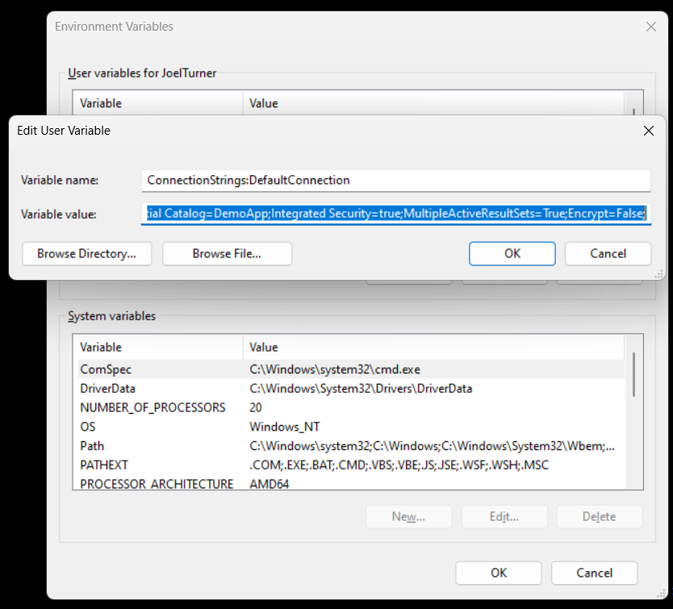

# Intent.Dapr.AspNetCore.Secrets

This module implements patterns for working with Dapr (Distributed Application Runtime) Secrets component.

## What's is Dapr Secrets component?

Dapr (Distributed Application Runtime) Secrets is a component within the Dapr framework designed to manage sensitive information such as passwords, API keys, and connection strings in a secure manner for distributed applications. It provides a standardized and consistent way to access secrets from various secret stores, like Azure Key Vault, AWS Secrets Manager, HashiCorp Vault, and more. Dapr abstracts away the complexities of interacting with different secret management systems, enabling developers to easily retrieve and utilize secrets without hard-coding them directly into their application code. This enhances security by centralizing secret management and reducing the risk of exposing sensitive data.

For more information on Dapr Secrets component, check out their [official site](https://docs.dapr.io/developing-applications/building-blocks/secrets/).
And more specifically for [.Net](https://learn.microsoft.com/en-us/dotnet/architecture/dapr-for-net-developers/secrets-management#use-the-dapr-net-sdk).

## What's in this module?

This module loads the configured secrets, and loads them into the application's `IConfiguration` for consumption in the application. Secret stores can be configured in as per the Dapr documentation.
Out the box this module will generate an Environment Variable secret store for ease of usage in the development environment. NB should be re-configured for production, as per Dapr guidance.

## Module Limitations

Because this module is designed to work with `Man.Dapr.Sidekick.AspNetCore`, there are a few limitations

- The fully configured `IConfiguration` is only available after `ConfigureServices` (Startup.cs), as this is when SideKick starts up the Sidecar, which is needed to fetch the secrets.
- The local file secret store needs to be configured with an absolute path.

## appsettings.json configuration

In the `Dapr.Secrets` section you can configure the following settings

- **StoreName**, which secrets store to connect to. 
- **Descriptors** (optional), comma separated list of which secrets you would like to load.

```json

  "Dapr.Secrets": {
    "StoreName": "secret-store",
    "Descriptors": "ConnectionStrings:DefaultConnection"
  }
```

## Developer Usage Example

Given then following Dapr Secret Store configuration:

```yaml

apiVersion: dapr.io/v1alpha1
kind: Component
metadata:
  name: secret-store
spec:
  type: secretstores.local.env
  version: v1
  metadata:

```

Create an Environment variable  as follows :



**Note**, when you modify Environment variable you need to restart applications for the new values to take effect.

Update your `appsettings.json` as follows:

```json

  "Dapr.Secrets": {
    "StoreName": "secret-store",
    "Descriptors": "ConnectionStrings:DefaultConnection"
  }

```

When you application starts up the `ConnectionStrings:DefaultConnection` will now be loaded from the configured Secret store through Dapr Secrets.