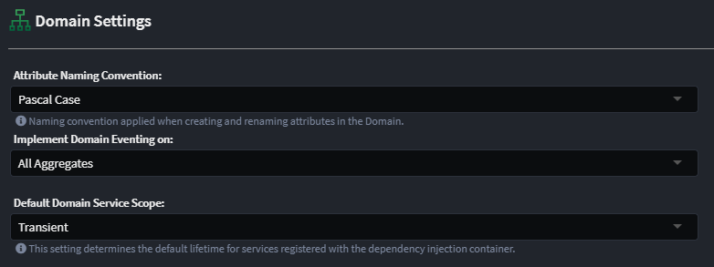
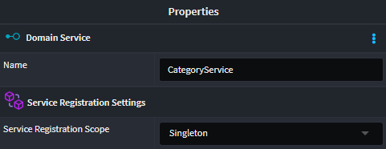

# Intent.Entities

This module realises `Domain Services` designed in the _Domain Designer_ in Intent Architect as interfaces and implementations for C#.

## Dependency Injection Registration

By default, the `Domain Service` will be registered with the dependency injection contain as `Transient`. However it is possible to change this default, as well as change the scope of an individual _Domain Service_.

> ⚠️ **NOTE**
>
> The scope set at an individual Domain Service level will always take precedence over the default scope.

### Global Default

The default scope for Domain Services can be setting under the `Domain Settings` section:

Available options are:

- Transient (the default)
- Scoped

### Individual Domain Service Scope

Changing the registration scope of an individual service can be done via the `Service Registration Scope` setting on the Domain Service itself:

Available options are:

- Transient (the default)
- Scoped
- Singleton
