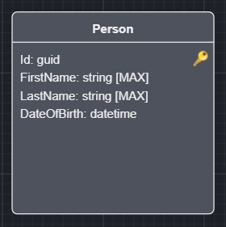
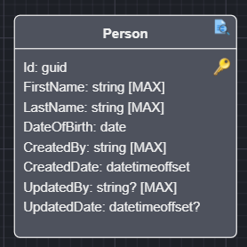

# Intent.Entities.BasicAuditing

Basic auditing in database management is a pattern used to track key information about the creation and last modification of records. This involves adding fields to your SQL table such as `CreatedBy`, `CreatedDate`, `UpdatedBy` and `UpdatedDate`. This pattern offers a straightforward way to capture and display who initially created a record and who last modified it, along with the relevant timestamps. However, it is important to note that this approach provides a snapshot of the most recent actions rather than a comprehensive audit trail of all changes made over time.

> **Note**
>
> This is not an Audit Trail but merely a way to determine who touched an Entity and when.

## General usage pattern

Select an Entity in the Domain Designer.



Right click and select `Toggle Basic Auditing`.



Your Entity will now be extended with the following attributes:

* CreatedBy - User Identity that created this Entity instance.
* CreatedDate - Timestamp when creation took place.
* UpdatedBy - User Identity that updated this Entity instance.
* UpdatedDate - Timestamp when creation took place.

> **Note**
>
> It is worth noting that the "updated" attributes remain null upon creation and only get populated when an update has taken place.

## Application Settings which affect this module

This module uses the `ICurrentUserService` to determine the current user's identity.

```csharp
public interface ICurrentUserService
{
    <UserID Type>? UserId { get; }
    string? UserName { get; }
    ...
}
```


### Basic Auditing Settings - User Identity to Audit

This setting allows you to select which field you would like to use as your audit of the user's identity, the options are:

* User Id (default), will use the `UserId` property and is typically more technical in nature.
* User Name, will use the `UserName` property.

### Identity Settings - UserId Type

This setting allows you to specify what the type of the UserId on the `ICurrentUserService` should be. Allowing you to customize how you want you audi data persisted.

* string (default)
* guid
* int
* long

The Audit fields of `CreatedBy` and `UpdatedBy` will respect the above settings.

> **Note**
>
> If you adjust the above settings after you have already modeled `Class`es with basic auditing, you can `Right Click` on any Audited class and select the `Synchronize Auditing Identifiers` option. This will update your existing `Domain Model` such that the `CreatedBy` and `UpdatedBy` attributes have the newly configured types.

This introduces a `IAuditible` interface in your `Domain`project which gets added to class Entities that are decorated with the `Basic Auditing` stereotype.

```csharp
public interface IAuditable
{
    string CreatedBy { get; set; }
    DateTimeOffset CreatedDate { get; set; }
    string? UpdatedBy { get; set; }
    DateTimeOffset? UpdatedDate { get; set; }
}
```

Example:

```csharp
public class Person : IHasDomainEvent, IAuditable
{
    public Guid Id { get; set; }

    public string FirstName { get; set; }
    
    public string LastName { get; set; }
    
    public DateTime DateOfBirth { get; set; }

    public string CreatedBy { get; set; }

    public DateTimeOffset CreatedDate { get; set; }

    public string? UpdatedBy { get; set; }

    public DateTimeOffset? UpdatedDate { get; set; }

    public List<DomainEvent> DomainEvents { get; set; } = new List<DomainEvent>();
}
```

## Intent.EntityFrameworkCore integration

If you have the `Intent.EntityFrameworkCore` module installed, your `DbContext` will also be extended to automatically populate the Entities with the `IAuditable` interface using the injected `ICurrentUserService` to resolve the "current user" at the time.  

```csharp
public override async Task<int> SaveChangesAsync(
    bool acceptAllChangesOnSuccess,
    CancellationToken cancellationToken = default)
{
    SetAuditableFields();
    
    // ...
}
```

## Intent.CosmosDB integration

If you have `Intent.CosmosDB` module installed, the `CosmosDBRepositoryBase` will be updated to set the auditable fields as appropriate.
