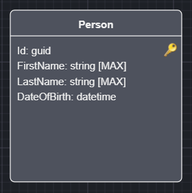
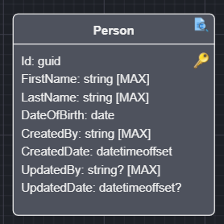

# Intent.Entities.BasicAuditing

Basic auditing in database management is a pattern used to track key information about the creation and last modification of records. This involves adding fields to your SQL table such as `CreatedBy`, `CreatedDate`, `UpdatedBy` and `UpdatedDate`. This pattern offers a straightforward way to capture and display who initially created a record and who last modified it, along with the relevant timestamps. However, it is important to note that this approach provides a snapshot of the most recent actions rather than a comprehensive audit trail of all changes made over time.

> [!NOTE]
>
> This is not an Audit Trail but merely a way to determine who touched an Entity and when.

## General usage pattern

Select an Entity in the Domain Designer.



Right click and select `Toggle Basic Auditing`.



Your Entity will now be extended with the following attributes:

* CreatedBy - User Identity that created this Entity instance.
* CreatedDate - Timestamp when creation took place.
* UpdatedBy - User Identity that updated this Entity instance.
* UpdatedDate - Timestamp when creation took place.

> [!NOTE]
>
> It is worth noting that the "updated" attributes remain null upon creation and only get populated when an update has taken place.

## Automatically applying Basic Auditing

Rather than toggling the stereotype on each `Class` individually, you can have it applied automatically to every new entity via the `Apply Basic Auditing to Entities` application setting (see [Basic Auditing Settings - Apply Basic Auditing to Entities](#basic-auditing-settings---apply-basic-auditing-to-entities) below). When enabled, any `Class` you create from that point on will automatically get the `Basic Auditing` stereotype and its configured attributes - you no longer need to `Right Click` > `Toggle Basic Auditing` yourself.

> [!NOTE]
>
> This only affects brand-new `Class`es going forward. It will not retroactively apply auditing to entities that already exist in your `Domain Model` - use `Toggle Basic Auditing` for those.

## Application Settings which affect this module

This module uses the `ICurrentUserService` to determine the current user's identity.

```csharp
public interface ICurrentUserService
{
    <UserID Type>? UserId { get; }
    string? UserName { get; }
    ...
}
```

### Basic Auditing Settings - Apply Basic Auditing to Entities

Controls how the `Basic Auditing` stereotype (and its audit attributes) gets applied to entities, the options are:

* Manually (default), you apply auditing yourself per `Class` via `Toggle Basic Auditing`, as described in [General usage pattern](#general-usage-pattern).
* Automatically when created, every newly created `Class` automatically receives the `Basic Auditing` stereotype and its configured attributes, as described in [Automatically applying Basic Auditing](#automatically-applying-basic-auditing).

### Basic Auditing Settings - User Identity to Audit

This setting allows you to select which field you would like to use as your audit of the user's identity, the options are:

* User Id (default), will use the `UserId` property and is typically more technical in nature.
* User Name, will use the `UserName` property.

### Basic Auditing Settings - Customizing the audit fields

Each of the 4 audit attributes can independently be included or excluded, and renamed, via the following application settings:

* `Include CreatedBy Field` / `CreatedBy Field Name` (default: included, named `CreatedBy`)
* `Include CreatedDate Field` / `CreatedDate Field Name` (default: included, named `CreatedDate`)
* `Include UpdatedBy Field` / `UpdatedBy Field Name` (default: included, named `UpdatedBy`)
* `Include UpdatedDate Field` / `UpdatedDate Field Name` (default: included, named `UpdatedDate`)

An `Include <Field>` switch controls whether that attribute gets added to audited entities at all - disabling it removes the attribute (and any logic that populates it) entirely rather than merely hiding it. The corresponding `<Field> Name` setting is only used while its `Include` switch is enabled, and lets you rename the attribute to whatever suits your `Domain Model`'s conventions (e.g. `CreatedByUserId` instead of `CreatedBy`).

> [!NOTE]
>
> These settings apply application-wide to every entity that has `Basic Auditing` applied - they are not configured per-entity.

### Identity Settings - UserId Type

This setting allows you to specify what the type of the UserId on the `ICurrentUserService` should be. Allowing you to customize how you want you audi data persisted.

* string (default)
* guid
* int
* long

The Audit fields of `CreatedBy` and `UpdatedBy` will respect the above settings.

> [!NOTE]
>
> If you adjust the settings above - the `UserId` type, whether a field is included, or a field's name - after you have already modeled `Class`es with basic auditing, `Right Click` on any Audited class and select the `Synchronize Auditing Identifiers` option. This re-synchronizes every audited `Class` in your `Domain Model` (not just the one you clicked) so that their attributes match your currently configured types, inclusion and names. Audited entities that disagree on a field's name (because `Synchronize Auditing Identifiers` was not run everywhere after a rename) will cause a build-time error.

This introduces an `IAuditable` interface in your `Domain` project which gets added to class Entities that are decorated with the `Basic Auditing` stereotype.

```csharp
public interface IAuditable
{
    void SetCreated(string createdBy, DateTimeOffset createdDate);
    void SetUpdated(string? updatedBy, DateTimeOffset? updatedDate);
}
```

> [!NOTE]
>
> `SetCreated` and `SetUpdated` only declare parameters for the fields that are currently included - e.g. if `Include CreatedBy Field` is disabled, `SetCreated` only takes a `createdDate` parameter, and if both `CreatedBy` and `CreatedDate` are excluded, `SetCreated` is omitted from the interface entirely. The same applies to `SetUpdated` and its `Updated*` fields.

Example:

```csharp
public class Person : IHasDomainEvent, IAuditable
{
    public Guid Id { get; set; }

    public string FirstName { get; set; }
    
    public string LastName { get; set; }
    
    public DateTime DateOfBirth { get; set; }

    public string CreatedBy { get; set; }

    public DateTimeOffset CreatedDate { get; set; }

    public string? UpdatedBy { get; set; }

    public DateTimeOffset? UpdatedDate { get; set; }

    void IAuditable.SetCreated(string createdBy, DateTimeOffset createdDate)
    {
        (CreatedBy, CreatedDate) = (createdBy, createdDate);
    }

    void IAuditable.SetUpdated(string? updatedBy, DateTimeOffset? updatedDate)
    {
        (UpdatedBy, UpdatedDate) = (updatedBy, updatedDate);
    }

    public List<DomainEvent> DomainEvents { get; set; } = new List<DomainEvent>();
}
```

## Intent.EntityFrameworkCore integration

If you have the `Intent.EntityFrameworkCore` module installed, your `DbContext` will also be extended to automatically populate the Entities with the `IAuditable` interface using the injected `ICurrentUserService` to resolve the "current user" at the time.  

```csharp
public override async Task<int> SaveChangesAsync(
    bool acceptAllChangesOnSuccess,
    CancellationToken cancellationToken = default)
{
    await SetAuditableFieldsAsync();
    
    // ...
}
```

## Intent.CosmosDB integration

If you have `Intent.CosmosDB` module installed, the `CosmosDBRepositoryBase` will be updated to set the auditable fields as appropriate.
