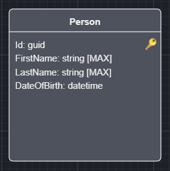
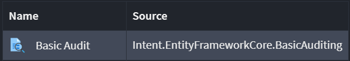
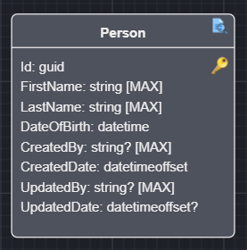

# Intent.EntityFrameworkCore.BasicAuditing

Extend Domain Entities to have fields that record which user created / updated them and at what time.

> **Note**
>
> This is not an Audit Trail but merely a way to determine who touched an Entity and when.

Select an Entity in the Domain Designer.



Right click and select `Apply Stereotype` (or press F3).



Select the `Basic Auditing` stereotype.



Your Entity will now be extended with the following attributes:

* CreatedBy - User name that created this Entity instance.
* CreatedDate - Timestamp when creation took place.
* UpdatedBy - User name that updated this Entity instance.
* UpdatedDate - Timestamp when creation took place.

> **Note**
>
> It is worth noting that the "updated" attributes remain null upon creation and only get populated when an update has taken place.

This introduces a `IAuditible` interface in your `Domain`project which gets added to class Entities that are decorated with the `Basic Auditing` stereotype.

```csharp
public interface IAuditable
{
    string? CreatedBy { get; set; }
    DateTimeOffset CreatedDate { get; set; }
    string? UpdatedBy { get; set; }
    DateTimeOffset? UpdatedDate { get; set; }
}
```

Example:

```csharp
public class Person : IHasDomainEvent, IAuditable
{
    public Guid Id { get; set; }

    public string FirstName { get; set; }
    
    public string LastName { get; set; }
    
    public DateTime DateOfBirth { get; set; }

    public string? CreatedBy { get; set; }

    public DateTimeOffset CreatedDate { get; set; }

    public string? UpdatedBy { get; set; }

    public DateTimeOffset? UpdatedDate { get; set; }

    public List<DomainEvent> DomainEvents { get; set; } = new List<DomainEvent>();
}
```

Your `DbContext` will also be extended to automatically populate the Entities with the `IAuditable` interface using the injected `ICurrentUserService` to resolve the "current user" at the time.  

```csharp
public override async Task<int> SaveChangesAsync(
    bool acceptAllChangesOnSuccess,
    CancellationToken cancellationToken = default)
{
    SetAuditableFields();
    
    // ...
}
```