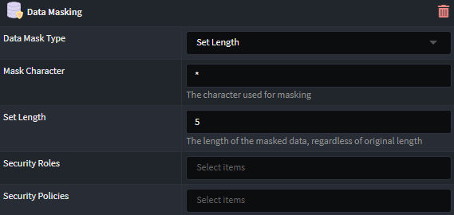

# Intent.EntityFrameworkCore.DataMasking

This module provides support for a variety of `Data Masking` options on string entity attributes.

## Configure Data Masking

To configure a class attribute to have data masking, apply the `Data Masking` stereotype to the attribute in the `Domain Designer`.

### Data Masking Annotation

Once applied, the attribute will be annotated with an icon indicating that it has been configured with data masking (as shown for `EmailAddress` in the screenshot below):

### Configuration Properties

Several properties are available to customize the behavior of data masking. Using the default values will still apply the standard data masking behavior.

- **Data Masking Type**: Defines the type of data masking to apply.

  - **Fixed Length**: The data is always masked to the specified length (default behavior).
  - **Variable Length**: The data is masked to the length of the original value.
  - **Partial Mask**: The data is partially masked based on the configured lengths.

- **Mask Character**: The character to use for masking (defaults to `*`).
- **Fixed Length**: The length of the masked data (only available when _Data Masking Type_ is set to _Set Length_).
- **Unmasked Prefix Length**: The length at the beginning of the original value that will remain unmasked.
- **Unmasked Suffix Length**: The length at the end of the original value that will remain unmasked.
- **Roles**: A comma-separated list of security roles that bypass the data masking process. Users with these roles will see unmasked data. (This option is only available if no `Security Configuration` is added; otherwise, the `Security Roles` field is used. The `Security Configuration` option is available by installing the [Intent.Metadata.Security](https://docs.intentarchitect.com/articles/modules-common/intent-metadata-security/intent-metadata-security.html) module).
- **Policies**: A comma-separated list of policies that bypass the data masking process. Users with these policies will see unmasked data. (This option is only available if no `Security Configuration` is added; otherwise, the `Security Roles` field is used. The `Security Configuration` option is available by installing the [Intent.Metadata.Security](https://docs.intentarchitect.com/articles/modules-common/intent-metadata-security/intent-metadata-security.html) module).
- **Security Roles**: A selection of security roles that bypass the data masking process. Users with these roles will see unmasked data. (This option is only available if a `Security Configuration` is added; only the roles configured in the security configuration will be available for selection).
- **Security Policies**: A selection of policies that bypass the data masking process. Users with these policies will see unmasked data. (This option is only available if a `Security Configuration` is added; only the policies configured in the security configuration will be available for selection).

## Updating Masked Data

Users with access only to the masked version of the data cannot persist updates to the data store for that attribute. Any attempted updates will be ignored. Only users with permission to access the unmasked data are allowed to update the data store.
