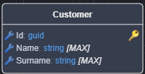
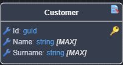

# Intent.EntityFrameworkCore.DiffAudit

Diff auditing is a type of auditing in software systems where the focus is on capturing the differences (or “diffs”) between two states of an entity - typically before and after a change.

## General usage pattern

Select an Entity in the Domain Designer.



Right click and select `Toggle Diff Audit`.



Your Entity Framework Database Provider will now include a new table called AuditLogs:

* This table will store all changes made to all entities that have the `Diff Audit` stereotype applied.

* This table will look like this:

```
public record AuditLog(int Id, string TableName,  string? Key, string ColumnName,
    string? OldValue, string? NewValue, string ChangedBy, DateTimeOffset ChangedAt);
```

## Application Settings which affect this module

This module uses the `ICurrentUserService` to determine the current user's identity.

```csharp
public interface ICurrentUserService
{
    <UserID Type>? UserId { get; }
    string? UserName { get; }
    ...
}
```

### Diff Audit Settings - User Identity to Audit

This setting allows you to select which field you would like to use as your audit of the user's identity, the options are:

* User Id (default), will use the `UserId` property and is typically more technical in nature.
* User Name, will use the `UserName` property.

### Diff Audit Interface

This introduces a `IDiffAudit` interface in your `Domain`project which gets added to class Entities that are decorated with the `Diff Audit` stereotype.

```csharp
public interface IDiffAudit { }
```

Example:

```csharp
public class Person : IHasDomainEvent, IDiffAudit
{
    public Guid Id { get; set; }

    public string FirstName { get; set; }
    
    public string LastName { get; set; }
    
    public DateOnly DateOfBirth { get; set; }

    public List<DomainEvent> DomainEvents { get; set; } = new List<DomainEvent>();
}
```

## Intent.EntityFrameworkCore integration

Your `DbContext` will also be extended to automatically track any changes to Entities with the `IDiffAudit` interface using the injected `ICurrentUserService` to resolve the "current user" at the time.  

```csharp
public override async Task<int> SaveChangesAsync(
    bool acceptAllChangesOnSuccess,
    CancellationToken cancellationToken = default)
{
    LogDiffAudit();
    
    // ...
}
```
