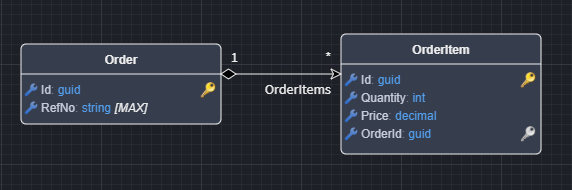
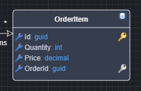

# Intent.EntityFrameworkCore.Repositories

The Repository Pattern is a design pattern used in software development to encapsulate data access logic, providing a clean separation between the domain/business logic and data persistence. It acts as an intermediary between the application and the data source (such as a database), abstracting query operations and ensuring that the underlying data access logic is centralized and reusable. This pattern improves testability, maintainability, and flexibility by allowing the data access strategy to change without affecting business logic. In .NET applications, repositories often work alongside the Unit of Work pattern and ORM frameworks like Entity Framework to manage transactions efficiently.

## Data Fetching Strategies

Eager and lazy loading are strategies within the broader topic of Object-Relational Mapping (ORM) and data fetching strategies.

- **Eager Loading**: Loads related entities immediately with the main entity using `.Include()`. This is useful when you need related data upfront to avoid multiple database queries.
- **Lazy Loading**: Loads related entities only when they are accessed for the first time. This can reduce the initial query cost but may lead to multiple queries (N+1 problem).

There are several ways to implement these strategies.

### Enabling Lazy Loading Proxies

The application setting **`Database Settings - Lazy loading with proxies`** allows you to configure whether to use Entity Framework's lazy loading with proxies feature.

- This setting is **enabled by default** but can be turned off if you don't want this behavior.
- For more details, refer to [the official documentation](https://learn.microsoft.com/ef/core/querying/related-data/lazy#lazy-loading-with-proxies).

### Modeling Owned Relationships

**Entity Framework** automatically configures any relationships modeled as owned (i.e., represented by black diamonds) to eager load. In the example below, loading an `Order` entity will always eager load the `OrderItems` collection because it is marked as `Owned`.


### Model Owned Entities with Repositories

Modeling a relationship like the following will result in only `Order` having a Repository and not `OrderItem`.



Owned entities are essentially a part of the owner Entity and cannot exist without it. It's also referred to as [aggregates](https://martinfowler.com/bliki/DDD_Aggregate.html). 

This means that `Order` will have a Repository where you can access and manipulate one in the Database and `OrderItem` will not, and so you will need to load up an `Order` to gain access to an `OrderItem`.

To provide a Repository to `OrderItem` you can apply a `Repository` stereotype on it so that you can access it directly.



> [!NOTE]
> It is generally considered safer to access a composite entity through its aggregate root. Its normally for non-functional reasons that you would want to access the composite directly if you're using a relational database.

### Extending Entity Repositories to Use `Includes`

Given the above relationships, let's assume we want to eager load `Orders` when loading a `Customer`.

Below are three approaches to implementing eager loading in a repository pattern:

1. **Configure the repository to eager load `Orders` for all repository "Find" operations**
2. **Add a custom operation that eager loads `Orders`**
3. **Override a base "Find" operation to eager load `Orders`**

```csharp
public class CustomerRepository : RepositoryBase<Customer, Customer, ApplicationDbContext>, ICustomerRepository
{
    public CustomerRepository(ApplicationDbContext dbContext, IMapper mapper) : base(dbContext, mapper)
    {
    }

    // 1. Configure the repository to eager load `Orders` for all "Find" operations
    protected override IQueryable<Customer> CreateQuery()
    {
        var result = base.CreateQuery();
        return result.Include(c => c.Orders);
    }

    // 2. Add a custom operation to eager load `Orders`
    public Task<List<Customer>> FindAllWithOrdersAsync(CancellationToken cancellationToken = default)
    {
        return QueryInternal(filterExpression: null)
            .Include(c => c.Orders)
            .ToListAsync<Customer>(cancellationToken);
    }

    // 3. Override a base "Find" operation to eager load `Orders`
    public override Task<List<Customer>> FindAllAsync(CancellationToken cancellationToken = default)
    {
        return QueryInternal(filterExpression: null)
            .Include(c => c.Orders)
            .ToListAsync<Customer>(cancellationToken);
    }
}
```

### Passing `Include` expressions into the Repository

The `Include` extension method is part of the `Microsoft.EntityFrameworkCore` NuGet package. If you are using an architecture like **Clean Architecture**, `Include` should be used only in the technology layer, as it is a technology concern.

However, some teams choose to include the `Microsoft.EntityFrameworkCore` NuGet package in the application layer to use `Include` on a per-repository call basis. For example:

```csharp
public async Task<List<CustomerDto>> Handle(GetCustomersQuery request, CancellationToken cancellationToken)
{
    // Passing an Include expression
    var customers = await _customerRepository.FindAllAsync(o => o.Include(c => c.Orders), cancellationToken);
    return customers.MapToCustomerDtoList(_mapper);
}
```

This approach is sometimes used as a **technical trade-off** for the convenience of customizing eager loading per repository call.

