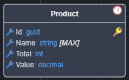
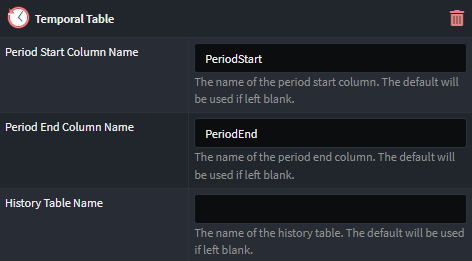

# Intent.EntityFrameworkCore.TemporalTables

This modules adds support for [SQL Server temporal tables](https://learn.microsoft.com/en-us/ef/core/providers/sql-server/temporal-tables). in Entity Framework Core. Temporal tables allow you to automatically track historical data changes, enabling you to easily query historical states of your data.

## Configure Temporal Table

To configure a class as a temporal table in the `Domain Designer`, apply the `Temporal Table` stereotype to the class.

### Temporal Table annotation

Once applied, the class will be annotated with an icon to indicate it has been configured as a _temporal table_:



### Optional Configuration Properties

There are three optional properties available for customization of the temporal table configuration. You can leave these properties blank to use the default values:



- **Period Start Column Name**: Override the default period start column name (_PeriodStart_).
- **Period End Column Name**: Override the default period end column name (_PeriodEnd_).
- **History Table Name**: Override the default history table name (_{TableName}History_)

After configuring the temporal table, you will need to create an Entity Framework migration. This will generate the necessary schema changes in the database to reflect the temporal table configuration. Follow the usual migration creation process to achieve this.

## Access Temporal Information

By default, Intent Architect does not create additional repositories for accessing the historical temporal data. To retrieve historical data, it is recommended to implement a custom repository.

### Example: Accessing Historical Data for a `Product` Entity

Below is an example implementation of a custom repository that retrieves historical data for a Product entity.

#### Repository interface

The repository interface defines a method to retrieve the history of a specific product:

``` csharp
[IntentIgnore]
public interface IProductHistoryRepository
{
    // Interface method to retrieve the history for a specific product
    Task<List<ProductHistory>> GetProductHistory(Guid id, CancellationToken cancellationToken = default);
}
```

#### Repository implementation

The `ProductHistoryRepository` implements the logic to query the temporal table and return historical records:

``` csharp
[IntentIgnore]
public class ProductHistoryRepository : IProductHistoryRepository
{
    private readonly ApplicationDbContext _dbContext;

    public ProductHistoryRepository(ApplicationDbContext dbContext)
    {
        _dbContext = dbContext;
    }

    public async Task<List<ProductHistory>> GetProductHistory(Guid id, CancellationToken cancellationToken = default)
    {
        // Ensure the temporal table columns (PeriodStart and PeriodEnd) match the configuration
        // defined in the Domain Designer

        // Retrieve history for the product by querying the temporal table
        // List<new { Product Product, ValidFrom, DateTime ValidTo}>
        var history = await _dbContext
            .Products
            .TemporalAll() // Retrieves all temporal versions of the product
            .Where(p => p.Id == id)
            .OrderBy(e => EF.Property<DateTime>(e, "PeriodStart"))
            .Select(
                p => new
                {
                    Product = p,
                    ValidFrom = EF.Property<DateTime>(p, "PeriodStart"),
                    ValidTo = EF.Property<DateTime>(p, "PeriodEnd")
                })
            .ToListAsync();

        // Map the anonymous history data to a domain entity
        return history.Select(h => new ProductHistory
        {
            Product = h.Product,
            ValidFrom = h.ValidFrom,
            ValidTo = h.ValidTo
        }).ToList();
    }
}
```

#### Using the Repository in a Handler

To use the repository, you can call it from a handler, for example, in a CQRS handler that retrieves the product history:

``` csharp
 [IntentManaged(Mode.Fully, Body = Mode.Ignore)]
 public async Task<List<ProductHistoryDto>> Handle(GetProductHistory request, CancellationToken cancellationToken)
 {
    // _productHistoryRepository and _mapper injected into the handler constructor
    List<ProductHistory>? productHistory = await _productHistoryRepository.GetProductHistory(request.ProductId, cancellationToken);

    // Map the historical product data to DTOs
    List<ProductHistoryDto>? productHistoryDtoData = productHistory.Select(h =>
    {
        return new ProductHistoryDto
        {
            Product = h.Product.MapToProductDto(_mapper),
            ValidFrom = h.ValidFrom,
            ValidTo = h.ValidTo,
        };
    }).ToList();

    return productHistoryDtoData;
 }
```
