# Intent.EntityFrameworkCore

This module provides patterns for working with the Entity Framework Core. Entity Framework Core is an open-source ORM framework by Microsoft that simplifies data access in .NET applications, mapping relational databases to .NET objects and providing LINQ support for querying. It supports multiple database providers, offers migration capabilities, and is cross-platform, making it a versatile and efficient tool for developers.

This module consumes your `Domain Model`, which you build in the `Domain Designer` and generates the corresponding Entity Framework Core implementation:-

* [Database context](#template--database-context).
* [Entity Type Configurations](#template--entity-type-configuration).
* [DB Migrations Cheat sheet](#template--db-migrations-readme).
* [`app.settings` configuration](#factory-extension--dependency-injection).
* [Dependency Injection wiring](#factory-extension--dependency-injection).

For more information on Entity Framework Core, check out their [official documentation](https://learn.microsoft.com/ef/core/).

## Module Settings

### Database Settings - `Database Provider`

This setting allows you to configure which `Database Provider` you want Entity Framework to use to connect to your database. The available options are as follows:

* In Memory
* SQL Server
* PostgresSQL
* My SQL
* Cosmos DB


### Database Settings - `Table naming convention`

This setting allows you to configure a convention for your SQL table name. The available options are as follows:

* Pluralized, SQL table name will be the pluralized version of the domain model `Class`'s name.
* Singularized, SQL table name will be the singularized version of the domain model `Class`'s name.
* None, SQL table name will be the same as domain model `Class`'s name.

### Database Settings - `Decimal precision and scale`

This setting allows you to configure a default Precision and Scale for your SQL decimal types.
The value of this setting is a string as follows : {Precision},{Scale}

For example 18,4 would be 18 precision, 4 scale.

For more info on decimal types check out [SQL Server decimal](https://learn.microsoft.com/sql/t-sql/data-types/decimal-and-numeric-transact-sql).

### Database Settings - `Lazy loading with proxies`

This setting allows you to configure whether you would like to use Entity Frameworks, Lazy loading with proxies feature.
This setting is on by default, but can be turned off if you don't want this behaviour.

For more info on lazy loading with proxies check out [the official documentation](https://learn.microsoft.com/ef/core/querying/related-data/lazy#lazy-loading-with-proxies).

### Database Settings - `Generate DbContext interface`

When enabled, an `IApplicationDbContext` will be generated in the "Application" layer. The `IApplicationDbContext` exposes all the [`DbSet<TEntity>`](https://learn.microsoft.com/dotnet/api/microsoft.entityframeworkcore.dbset-1) properties of the DbContext.

> [!NOTE]
> A NuGet package reference to `Microsoft.EntityFrameworkCore` is added to the "Application" layer project's `.csproj` as this is the assembly containing the `DbSet<TEntity>` type. This should be considered if you're adhering to the Clean Architecture principle of keeping your "application" layer as clean as possible of references.

### Database Settings - `Enable split queries globally`

When enabled, configures the DbContext to have [split queries enabled globally](https://learn.microsoft.com/ef/core/querying/single-split-queries#enabling-split-queries-globally).

### Database Settings - `Maintain column ordering`

When enabled, the EF configuration will be set up to preserve the column ordering as per your Domain model ordering. Base classes will be ordered because inherited classes.
The ordering is achieved using EF Core's `HasColumnOrder` functionality.

```csharp
    builder.Property(x => x.Id)
        .HasColumnOrder(0);

    builder.Property(x => x.Name)
        .IsRequired()
        .HasColumnOrder(1);
```

### Database Settings - `Enum check constraints`

When enabled, the EF configuration will set up a SQL table check constraints to ensure the data stored in the underlying column adheres to the `Enum`.

```csharp
    var customerTypeEnumValues = Enum.GetValuesAsUnderlyingType<CustomerType>()
        .Cast<object>()
        .Select(value => value.ToString());

    builder.ToTable(tb => tb.HasCheckConstraint("customer_customer_type_check", $"\"CustomerType\" IN ({string.Join(",", customerTypeEnumValues)})"));
```

If you are using the `Store enums as strings` setting you will get the following

```csharp
    var customerTypeEnumValues = Enum.GetNames<CustomerType>()
        .Select(e => $"'{e}'");

    builder.ToTable(tb => tb.HasCheckConstraint("customer_customer_type_check", $"\"CustomerType\" IN ({string.Join(",", customerTypeEnumValues)})"));
```

Intent will automatically do the Column ordering but if you want to get very specific you can use the `DataColumn` stereotype to explicitly set the ordering. 
This can also be using for forcing columns in base class to go to the end by assigning them a arbitrary large number.

## Domain Designer modeling

The `Domain Designer` has been extended with many stereotypes for modeling RDBMS technology specific concepts in your domain.

### Primary Key - Attribute stereotype

The `Primary Key` stereotype indicates that an `Attribute` is the database table's primary key.

By default any `Class`'s added to your domain will have an `Attribute` added named `Id` with the `Primary Key` stereotype applied to it. The type of this attribute will default to the configured 'Database Settings > Key Type', which can be configured in your application settings.

This stereotype can be manually applied to `Attribute`s and can be applied to multiple `Attribute`s in the case of composite primary keys. This stereotype is visualized as a golden key icon.

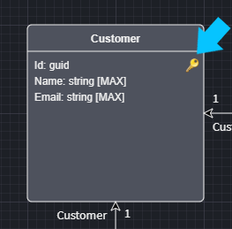

### Foreign Key - Attribute stereotype

The `Foreign Key` stereotype indicates an `Attribute` has been introduced to a `Class` as a result of a modeled `Association`, for example:

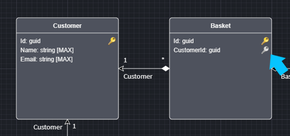

In this diagram you can see the `CustomerId` attribute has been introduced, with the `Foreign Key` stereotype, as a result of the many-to-one relationship between `Basket` and `Customer`.

The `Foreign Key` stereotypes are automatically managed when modeling associations. This stereotype is visualized as a silver key icon.

### Text Constraint - Attribute Stereotype

The `Text Constraint` stereotype allows you to configure the specifics of how an `Attribute` of type `string` should be realized in the database.

This stereotype can be used to specify:

* Maxlength, the maximum storage size of the string.
* SQL Datatype, the SQL Datatype for the database.

By default `strings` are realized in SQL as `nvarchar(max)`. The `Text Constraint` stereotype is automatically applied to any attributes of type `string`. This stereotype is visualized by the `[{size}]` text after the `string` type.

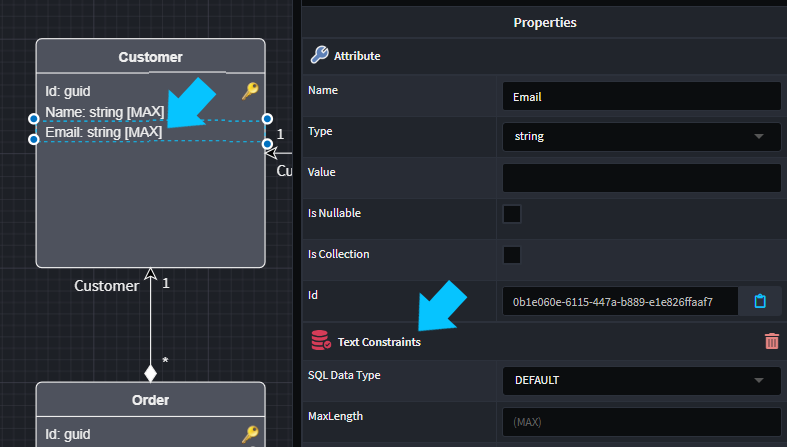

### Decimal Constraint - Attribute stereotype

The `Decimal Constraint` stereotype allows you to configure the precision and scale for your `decimal` type attributes.

The `Decimal Constraint` stereotype can be manually applied to any attribute of type `decimal`. This stereotype is visualized by the `({precision},{scale})` text after the `decimal` type.

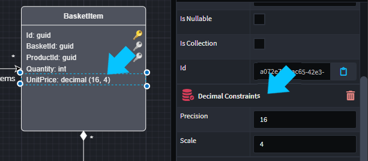

### Computed Value - Attribute stereotype

The `Computed Value` stereotype allows you to model SQL computed columns.

The `Computed Value` stereotype can be manually applied to an attribute, allowing you to specify the formula for the calculation and whether or not the calculated result is persisted in the database. This stereotype is visualized by the blue computed column icon.

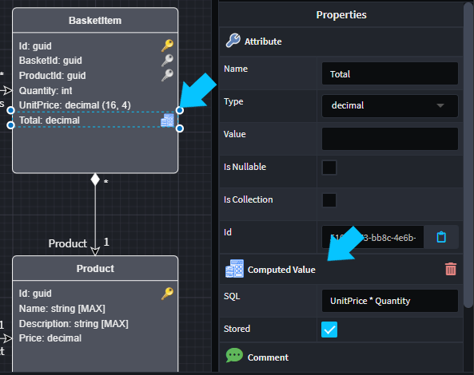

### Column - Attribute stereotype

The `Column` stereotype allows you to override the SQL column details from your model, if required.

The `Column` stereotype can be manually applied to an attribute, allowing you to specify the SQL column name and / or SQL column type. This stereotype is visualized by the stereotype's icon.

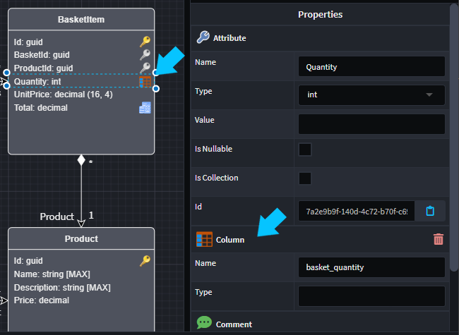

### Row Version - Attribute stereotype

The `Row Version` stereotype when applied to a byte[] `Attribute`, denotes that it should map to a database type that provides automatic row-versioning, such as the SQL Server `rowversion` type.

The `Row Version` stereotype can be manually applied. This stereotype is visualized by the time stamp icon.

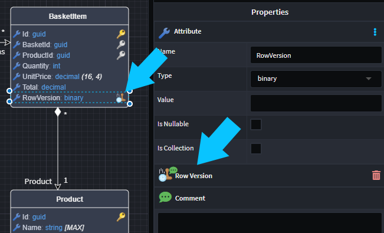

### Default Constraint - Attribute stereotype

The `Default Constraint` stereotype allows you to specify SQL column defaults in your model, if required.

The `Default Constraint` stereotype can be manually applied to an attribute, allowing you to specify either a default value or a default SQL expression. This stereotype is visualized by stereotype's icon.

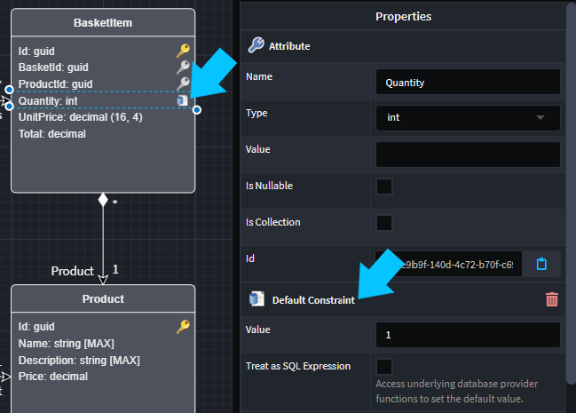

### Join Table Constraint - Association stereotype

The `Join Table` stereotype allows you to specify SQL table name for the joining table implied by a `many to many` relationshiop in your model, if required.

The `Join Table` stereotype can be manually applied to an association, allowing you to specify the joining table's name. This stereotype is visualized by stereotype's icon.

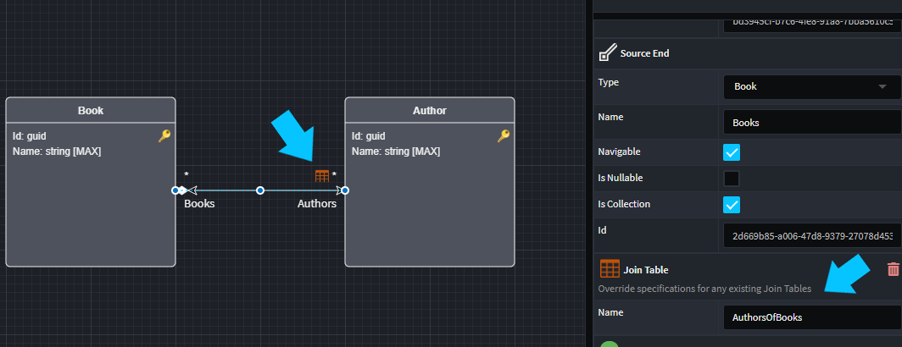

### Schema - Entity / Package / Folder stereotype

The `Schema` stereotype allows you to specify the SQL Schema for your tables / views , if required.

The `Schema` stereotype can be manually applied to a `Class`, `Folder` or `Package`.

The `Schema` stereotype can be applied hierarchically i.e. if you apply it to a `Package` all tables / views in the package will belong to that schema.
Similarly you can apply the `Schema` stereotype to a folder, all tables / views under that folder belong to that schema.

The "Closest" `Schema` stereotype to the `Class` will apply to the class.

Note. If you have `Table` or `View` stereotypes with schema's specified these are more specific and will override the `Schema` stereotype. If you do not fill the schema in on these stereotypes, the schema name will fall back to the "Closest" `Schema` stereotype.

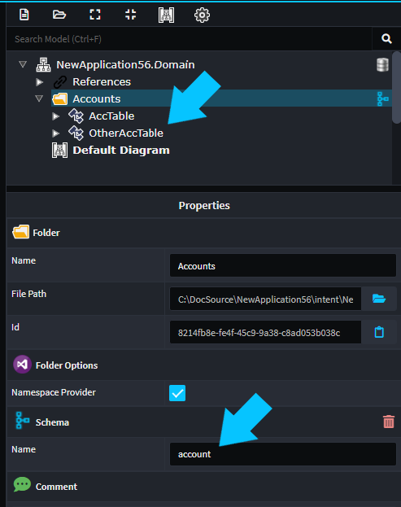

### Table - Entity stereotype

The `Table` stereotype allows you to specify a SQL tables name and/or schema name , if required.

By default SQL table names will be the pluralized version of the `Class` name, and go into the `dbo` schema.

The `Table` stereotype can be manually applied to a `Class`. If `Name` or `Schema` are not populated the default value will be used. This stereotype is visualized by stereotype's icon on the top right of the `Class`.

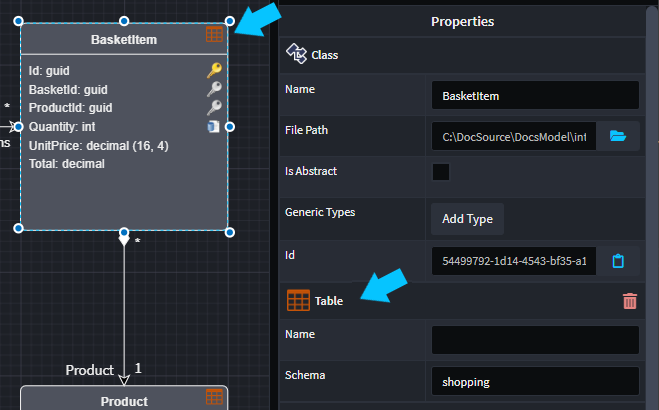

### View - Entity stereotype

If you have SQL Views in you database which you want to reference in you domain, you can model those views as `Class`s and apply the `View` stereotype to them. This will allow you to access these views through Entity Framework.

On the `View` stereotype you can specify the `Name` and `Schema` for the view, if they are not specified they will default to the pluralized version of the `Class` name, and the `dbo` schema. The SQL view must exist in the database for this to work.

The `View` stereotype can be manually applied to a `Class`. This stereotype is visualized by stereotype's icon on the top right of the `Class`.

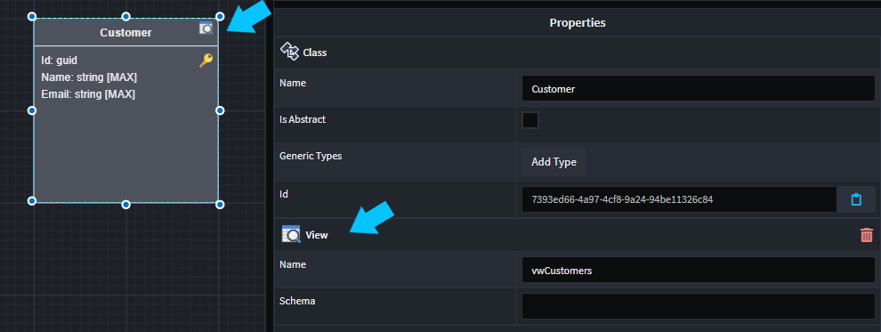

### Creating SQL Indexes

You can also model your SQL indexes in the `Domain Designer`.

* Find the `Class` you want to add an Index to, in the `Domain Designer` tree panel.
* Right-click the `Class` and select `Add Index`.

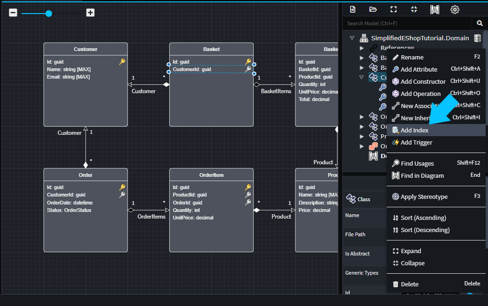

* In dialog box, select the attributes you want to include in the index.

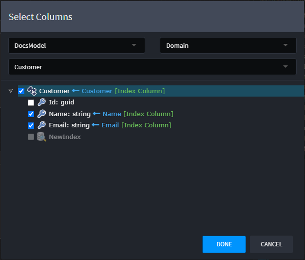

* Click `Done`.

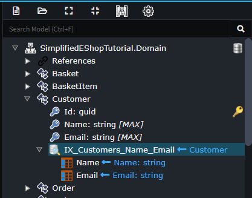

You will see an `Index` has been added to the `Class`. If the order of the attributes in the index is not correct, you can re-order them by dragging them around.
You can also configure the Sort Direction on the Index Columns, this is ascending by default.

### Modeling Inheritance

In Entity Framework Core there are 3 ways to model inheritance namely:

* Table per hierarchy (TPH).
* Table per type (TPT).
* Table per concrete type (TPC).

For more information on modeling inheritance with Entity Framework Core see the [documentation](https://learn.microsoft.com/ef/core/modeling/inheritance#table-per-hierarchy-and-discriminator-configuration).

#### Table per hierarchy

Modeling:

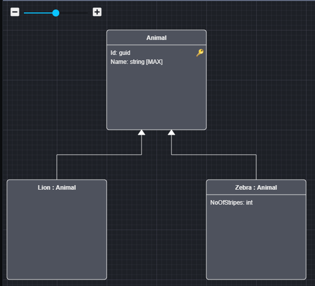

Resulting database structure:

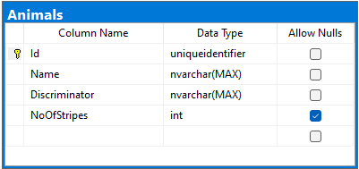

If you wish to make the base class abstract, while still maintaining TPH, simply add a `Table` stereotype to the base class.

#### Table per type

Modeling:

Note the `Table` stereotypes, you don't need to fill in the name schema if you are happy with the defaults.

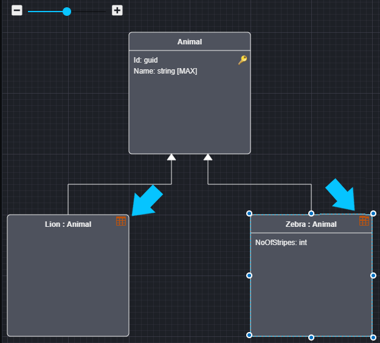

Resulting database structure:

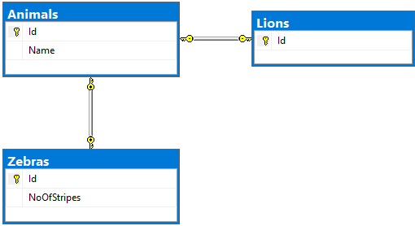

#### Table per concrete type

Modeling:

Note the base class is marked as abstract.

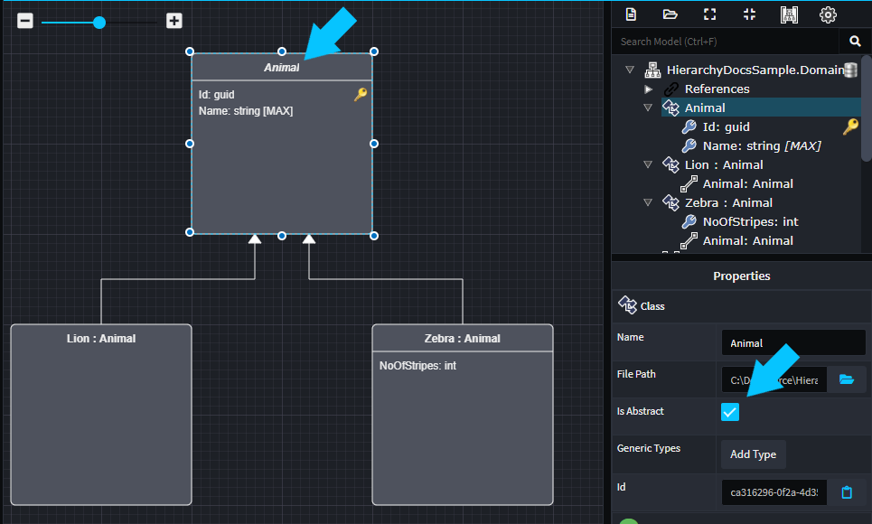

Resulting database structure:

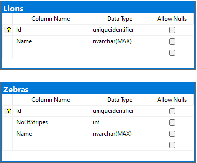

## Database Settings

### Multiple Database support

Applying the `Database Settings` stereotype on a Domain package will allow you to specify a Connection String Name as well as a Database Provider that will make a DbContext type that will contain all the Classes in that Domain package as DbSets.

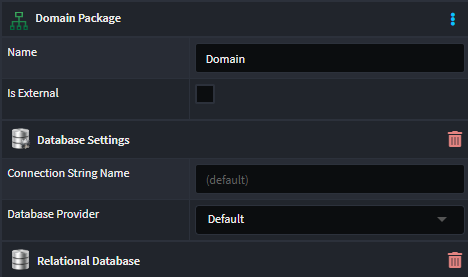

Having a `(default)` Connection String Name will make use of the connection string `DefaultConnection` and will generate the `ApplicationDbContext` type. The `Default` Database Provider will defer to the Module Database setting to determine which Database Provider to use.

Changing the Connection String name will allow you to specify a connection string for connecting to another database and you may alter the Database Provider by choose the specific one in the dropdown menu. This will also generate a DbContext type specifically for that Connection String.

> [!NOTE]
>
> For this release, the unit of work pattern still only applies to the main `ApplicationDbContext`, for the additional `DbContext`s the `SaveChanges` methods will need to be called manually. Should you have a project which requires the unit of work pattern to apply to additional `DbContext`s, please each out to us at [Intent Architect Support](https://github.com/IntentArchitect/Support).


## Code Generation Artifacts (Templates, Factory Extensions)

### Template : Database context

Generates the Application Specific DBContext file. The file will contain a `DBSet` for every aggregational `Entity` in your domain model and registers up their `EntityTypeConfiguration`s.

```csharp

    public class ApplicationDbContext : IdentityDbContext<ApplicationIdentityUser>
    {
        private readonly IDomainEventService _domainEventService;

        public ApplicationDbContext(DbContextOptions<ApplicationDbContext> options) : base(options)
        {
        }

        public DbSet<Basket> Baskets { get; set; }
        public DbSet<Customer> Customers { get; set; }
        public DbSet<Order> Orders { get; set; }
        public DbSet<Product> Products { get; set; }

        protected override void OnModelCreating(ModelBuilder modelBuilder)
        {
            base.OnModelCreating(modelBuilder);

            modelBuilder.ApplyConfiguration(new BasketConfiguration());
            modelBuilder.ApplyConfiguration(new CustomerConfiguration());
            modelBuilder.ApplyConfiguration(new OrderConfiguration());
            modelBuilder.ApplyConfiguration(new ProductConfiguration());
        }
    }
```

### Template : Entity Type Configuration

Generates a `EntityTypeConfiguration` file for every aggregational entity. This file contains all the technical database mappings for a specific domain entity.

```csharp

    public class BasketConfiguration : IEntityTypeConfiguration<Basket>
    {
        public void Configure(EntityTypeBuilder<Basket> builder)
        {
            builder.HasKey(x => x.Id);

            builder.Property(x => x.CustomerId)
                .IsRequired();

            builder.OwnsMany(x => x.BasketItems, ConfigureBasketItems);

            builder.HasOne(x => x.Customer)
                .WithMany()
                .HasForeignKey(x => x.CustomerId)
                .OnDelete(DeleteBehavior.Restrict);

            builder.Ignore(e => e.DomainEvents);
        }

        public void ConfigureBasketItems(OwnedNavigationBuilder<Basket, BasketItem> builder)
        {
            builder.WithOwner()
                .HasForeignKey(x => x.BasketId);

            builder.HasKey(x => x.Id);

            builder.Property(x => x.BasketId)
                .IsRequired();

            builder.Property(x => x.ProductId)
                .IsRequired();

            builder.Property(x => x.Quantity)
                .IsRequired();

            builder.Property(x => x.UnitPrice)
                .IsRequired();

            builder.HasOne(x => x.Product)
                .WithMany()
                .HasForeignKey(x => x.ProductId)
                .OnDelete(DeleteBehavior.Restrict);
        }
    }

```

### Template : DB Migrations Readme

Generates a cheat sheet of commonly used migration commands pre-configured for your application. These commands cover things like:

* Creating a new Migration.
* Updating the database schema.
* Generating SQL Scripts to upgrade databases.

```text

See https://learn.microsoft.com/ef/core/managing-schemas/migrations for information about
migrations using EF Core. You can perform these commands in the Visual Studio IDE using the
Package Manager Console (View > Other Windows > Package Manager Console) or using the dotnet
Command Line Interface (CLI) instructions. Substitute the {Keywords} below with the appropriate
migration name when executing these commands.

-------------------------------------------------------------------------------------------------------------------------------------------------------
Create a new migration:
-------------------------------------------------------------------------------------------------------------------------------------------------------
From the Visual Studio Package Manager Console:
Add-Migration -Name {ChangeName} -StartupProject "SimplifiedEShopTutorial.Api" -Project "SimplifiedEShopTutorial.Infrastructure"

CLI:
dotnet ef migrations add {ChangeName} --startup-project "SimplifiedEShopTutorial.Api" --project "SimplifiedEShopTutorial.Infrastructure"

-------------------------------------------------------------------------------------------------------------------------------------------------------
Remove last migration:
-------------------------------------------------------------------------------------------------------------------------------------------------------
From the Visual Studio Package Manager Console:
Remove-Migration -StartupProject "SimplifiedEShopTutorial.Api" -Project "SimplifiedEShopTutorial.Infrastructure"

CLI:
dotnet ef migrations remove --startup-project "SimplifiedEShopTutorial.Api" --project "SimplifiedEShopTutorial.Infrastructure"

-------------------------------------------------------------------------------------------------------------------------------------------------------
Update schema to the latest version:
-------------------------------------------------------------------------------------------------------------------------------------------------------
From the Visual Studio Package Manager Console:
Update-Database -StartupProject "SimplifiedEShopTutorial.Api" -Project "SimplifiedEShopTutorial.Infrastructure"

CLI:
dotnet ef database update --startup-project "SimplifiedEShopTutorial.Api" --project "SimplifiedEShopTutorial.Infrastructure" 

...

```

For more information on EF Migrations check out [Microsoft's official documentation](https://learn.microsoft.com/ef/core/managing-schemas/migrations/?tabs=dotnet-core-cli).

### Factory Extension : Dependency Injection  

This extension does the following handles various Entity Framework Core configuration concerns.

Adds a default connection string to your `app.settings.config` file, if the connection is not present.

```json
{
  ...

  "ConnectionStrings": {
    "DefaultConnection": "Server=.;Initial Catalog={Application Name};Integrated Security=true;MultipleActiveResultSets=True;"
  },

  ...

}
```

Wires up the dependency injection registrations and EF application configuration.

```csharp

namespace {{Application Name}}.Infrastructure
{
    public static class DependencyInjection
    {
        public static IServiceCollection AddInfrastructure(this IServiceCollection services, IConfiguration configuration)
        {
            services.AddDbContext<ApplicationDbContext>((sp, options) =>
            {
                options.UseSqlServer(
                    configuration.GetConnectionString("DefaultConnection"),
                    b => b.MigrationsAssembly(typeof(ApplicationDbContext).Assembly.FullName));
                options.UseLazyLoadingProxies();
            });

            ...
 
        }
    }
}

```

## Related Modules

### Intent.Metadata.RDBMS

This module provides RDBMS related stereotypes for extending the Domain Designer with RDBMS technology specific data.

### Intent.Entities

This module generated domain entities as C# classes, which are used by this model.

### Intent.EntityFrameworkCore.Repositories

This module provides an Entity Framework repository pattern implementation.
