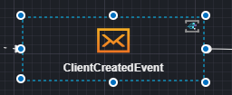
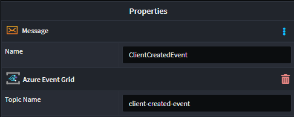

# Intent.Eventing.AzureEventGrid

This module provides patterns for working with Azure Event Grid.

## What is Azure Event Grid?

Azure Event Grid is a cloud-based event routing service that enables event-driven architectures by facilitating the seamless communication of events between different services and applications. It abstracts the complexities of event routing, allowing developers to focus on building scalable and decoupled systems. Azure Event Grid supports various event sources and handlers, making it a versatile choice for integrating disparate systems and services.

For more information on Azure Event Grid, check out their [official docs](https://docs.microsoft.com/en-us/azure/event-grid/).

## Modeling Integration Events

Modeling Integration Events can be achieved from within the Services designer. This module automatically installs the `Intent.Modelers.Eventing` module which provides designer modeling capabilities for integration events and commands. For details on modeling integration events and commands, refer to its [README](https://github.com/IntentArchitect/Intent.Modules/blob/development/Modules/Intent.Modules.Modelers.Eventing/README.md).

## Specifying Topic Names

Working with Azure Event Grid requires that Messages be assigned to an Event Grid Topic. Since Topics need to be created in advance, unless you are using Infrastructure as Code to maintain this for you, you will need to specify the Topic Name when creating a new Message. 

This module will automatically be assigned a Topic Name when you create a new Message and you can alter it by capturing the `Topic Name` property on the selected Message.





## Azure Event Grid Implementation

Provides an Azure Event Grid specific implementation of the `IEventBus` interface for dispatching messages.

## Message Publishing

Message publishing can be done through the `IEventBus` interface using the `Publish` method.

## Message Consumption

For every message subscribed to in the `Services Designer` will receive its own Integration Event handler.

The is what the Business logic Integration Event handler looks like:

```csharp

    [IntentManaged(Mode.Merge, Signature = Mode.Fully)]
    public class ClientCreatedIntegrationEventHandler : IIntegrationEventHandler<ClientCreatedEvent>
    {
        [IntentManaged(Mode.Ignore)]
        public ClientCreatedIntegrationEventHandler()
        {
        }

        [IntentManaged(Mode.Fully, Body = Mode.Ignore)]
        public async Task HandleAsync(ClientCreatedEvent message, CancellationToken cancellationToken = default)
        {
            // Business logic here
            throw new NotImplementedException();
        }
    }

``` 

> [!NOTE]
> 
> This module will not generate the consumer code for you. Look at the [Related Modules](#related-modules) section to see which modules can provide you with that capability.

## Configuring Event Grid

When you're publishing an Event Grid Message, you will need to configure it in your `appsettings.json` file.

```json
{
  "EventGrid": {
    "Topics": {
      "ClientCreatedEvent":{
        "Key": "4L6y6Nk8LFHXm0KnbK7gYpLtD0OL6Ear9VnY5ihQio8DhtljnGAdJQQJ99BDACrIdLPXJ3w3AAABAZEGvWZM",
        "Endpoint": "https://client-created-event.southafricanorth-1.eventgrid.azure.net/api/events"
      }
    }
  }
}
```

## Related Modules

### Intent.AzureFunctions.AzureEventGrid

This module handles the consumer code for Azure Event Grid when Azure Functions is selected as the hosting technology.

> [!NOTE]
> 
> Not seeing the hosting technology you're looking for? Please reach out to us on [GitHub](https://github.com/IntentArchitect/Support) or email us at [support@intentarchitect.com,](mailto://support@intentarchitect.com) and we'll be happy to help. 