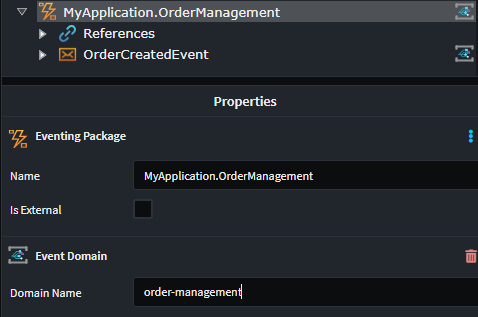

# Intent.Eventing.AzureEventGrid

This module provides patterns for working with Azure Event Grid using a flexible pipeline-based architecture that supports middleware behaviors for cross-cutting concerns.

## What is Azure Event Grid?

Azure Event Grid is a cloud-based event routing service that enables event-driven architectures by facilitating the seamless communication of events between different services and applications. It abstracts the complexities of event routing, allowing developers to focus on building scalable and decoupled systems. Azure Event Grid supports various event sources and handlers, making it a versatile choice for integrating disparate systems and services.

For more information on Azure Event Grid, check out their [official docs](https://docs.microsoft.com/en-us/azure/event-grid/).

## Pipeline Architecture

This module implements a behavior-driven pipeline pattern that allows you to add middleware behaviors for both publishing and consuming messages. This enables clean separation of concerns for cross-cutting functionality like logging, retry logic, validation, and custom processing.

### Key Components

- **Publisher Pipeline**: Processes outbound messages before sending to Event Grid
- **Consumer Pipeline**: Processes inbound messages before handler execution
- **Behaviors**: Middleware components that can inspect, modify, or act on messages
- **Cloud Event Context**: Provides access to Event Grid extension attributes and metadata

## Modeling Integration Events

Modeling Integration Events can be achieved from within the Services designer.
This module automatically installs the `Intent.Modelers.Eventing` module which provides designer modeling capabilities for integration events and commands.
For details on modeling integration events and commands, refer to its [README](https://docs.intentarchitect.com/articles/modules-common/intent-modelers-eventing/intent-modelers-eventing.html).

## Specifying Topics and Event Domains

Working with Azure Event Grid requires that Messages be assigned to either an Event Grid Custom Topic or an Event Domain Topic.

### Custom Topics

Custom Topics are standalone event routing destinations that need to be created in advance, unless you are using Infrastructure as Code to maintain this for you. When creating a new Message, you will need to specify the Topic Name.

This module will automatically assign a Topic Name when you create a new Message and you can alter it by modifying the `Topic Name` property on the selected Message.


### Event Domains

Event Domains provide a management tool for large numbers of Event Grid topics related to the same application. They allow you to group multiple topics under a single domain and manage them collectively. When using Event Domains, messages are routed to topics within the domain based on the event's type.

Event Domains can be modeled by adding an `Event Domain` stereotype to your Eventing Package. Configure the `Domain Name` property to specify which domain the events should be published to.



## Message Publishing

Message publishing can be done through the `IEventBus` interface using the `Publish` method. The interface supports publishing with additional metadata:

```csharp
public interface IEventBus
{
    void Publish<T>(T message) where T : class;
    void Publish<T>(T message, IDictionary<string, object> additionalData) where T : class;
    // ...
}
```

### Publishing with Extension Attributes

You can include Event Grid extension attributes and subject information:

```csharp
// Basic publishing
_eventBus.Publish(new ClientCreatedEvent { Id = clientId });

// Publishing with extension attributes
_eventBus.Publish(new ClientCreatedEvent { Id = clientId }, new Dictionary<string, object>
{
    ["Subject"] = $"clients/{clientId}",
    ["Priority"] = "High",
    ["CorrelationId"] = correlationId
});
```

## Message Consumption

For every message subscribed to in the `Services Designer` will receive its own Integration Event handler.

## Working with Multiple Message Bus Providers

This module can coexist with other message bus implementations in the same application. When multiple providers are installed, Intent Architect automatically generates a **Composite Message Bus** that intelligently routes messages based on configuration.

### Designating Messages for Azure Event Grid

When you have only this provider installed, all messages automatically use it—no configuration needed.

When you have **multiple providers** installed, you must designate which messages should be handled by Azure Event Grid using the **`Message Bus`** stereotype:

1. **Right-click** on a **Package** or **Folder** in the Services designer
2. Select **Add Stereotype** → **Message Bus**
3. In the stereotype properties, select `Azure Event Grid` from the **Providers** list

The stereotype can be applied at multiple levels:
- **Package level**: All messages in the package use the selected provider(s)
- **Folder level**: All messages in the folder inherit the designation
- **Message level**: Individual message-level control (rarely needed)

**Stereotype Inheritance**: Child elements inherit their parent's `Message Bus` stereotype automatically, so you typically only need to set it at the package or folder level. Intent handles all the routing transparently.

### Generated Code Filtering

When multiple providers are installed:
- Azure Event Grid **only generates** handlers, consumers, and configuration for messages marked with its provider designation
- Messages designated for other providers are ignored by this module
- Messages can be marked for multiple providers and will be handled by each

### Additional Resources

For comprehensive details on the Composite Message Bus architecture and design, see the [Intent.Eventing.Contracts documentation](https://docs.intentarchitect.com/articles/modules-dotnet/intent-eventing-contracts/intent-eventing-contracts.html).

## Accessing Event Context

In your handlers, you can access Event Grid extension attributes through the `IEventContext`:

```csharp
public class ClientCreatedIntegrationEventHandler : IIntegrationEventHandler<ClientCreatedEvent>
{
    private readonly IEventContext _eventContext;

    public ClientCreatedIntegrationEventHandler(IEventContext eventContext)
    {
        _eventContext = eventContext;
    }

    public async Task HandleAsync(ClientCreatedEvent message, CancellationToken cancellationToken = default)
    {
        // Access extension attributes
        if (_eventContext.AdditionalData.TryGetValue("Priority", out var priority))
        {
            // Handle high priority messages differently
        }
        
        // Business logic here
        throw new NotImplementedException();
    }
}
```

## Extensibility with Custom Behaviors

You can create custom behaviors to handle cross-cutting concerns:

### Publisher Behaviors

```csharp
public class LoggingPublisherBehavior : IAzureEventGridPublisherBehavior
{
    private readonly ILogger<LoggingPublisherBehavior> _logger;

    public LoggingPublisherBehavior(ILogger<LoggingPublisherBehavior> logger)
    {
        _logger = logger;
    }

    public async Task<CloudEvent> HandleAsync(CloudEvent cloudEvent, CloudEventBehaviorDelegate next, CancellationToken cancellationToken = default)
    {
        _logger.LogInformation("Publishing event {EventType} with ID {EventId}", cloudEvent.Type, cloudEvent.Id);
        
        var result = await next(cloudEvent, cancellationToken);
        
        _logger.LogInformation("Successfully published event {EventId}", cloudEvent.Id);
        return result;
    }
}
```

### Consumer Behaviors

```csharp
public class ValidationConsumerBehavior : IAzureEventGridConsumerBehavior
{
    public async Task<CloudEvent> HandleAsync(CloudEvent cloudEvent, CloudEventBehaviorDelegate next, CancellationToken cancellationToken = default)
    {
        // Validate cloud event structure
        if (string.IsNullOrEmpty(cloudEvent.Source))
        {
            throw new InvalidOperationException("Cloud event source is required");
        }

        return await next(cloudEvent, cancellationToken);
    }
}
```

### Registering Custom Behaviors

```csharp
public static IServiceCollection ConfigureEventGrid(this IServiceCollection services, IConfiguration configuration)
{
    // ... existing configuration ...
    
    // Add custom behaviors
    services.AddScoped<IAzureEventGridPublisherBehavior, LoggingPublisherBehavior>();
    services.AddScoped<IAzureEventGridConsumerBehavior, ValidationConsumerBehavior>();
    
    return services;
}
```

## Configuring Event Grid

### Publisher Configuration

Event Grid publishers are configured in your dependency injection setup. The configuration supports both Custom Topics and Event Domains:

```csharp
services.Configure<AzureEventGridPublisherOptions>(options =>
{
    // Configure Custom Topics
    options.AddTopic<ClientCreatedEvent>(
        configuration["EventGrid:Topics:ClientCreatedEvent:Key"]!, 
        configuration["EventGrid:Topics:ClientCreatedEvent:Endpoint"]!, 
        configuration["EventGrid:Topics:ClientCreatedEvent:Source"]!);
    
    // Configure Event Domains
    options.AddDomain(
        configuration["EventGrid:Domains:MainDomain:Key"]!, 
        configuration["EventGrid:Domains:MainDomain:Endpoint"]!, 
        domain =>
        {
            domain.Add<OrderCreatedEvent>(configuration["EventGrid:Topics:OrderCreatedEvent:Source"]!);
        });
});
```

### Application Settings

Configure your Event Grid settings in `appsettings.json`:

```json
{
  "EventGrid": {
    "Topics": {
      "ClientCreatedEvent": {
        "Source": "client-created-event",
        "Key": "<Azure Event Grid Key>",
        "Endpoint": "https://client-created-event.your-region.eventgrid.azure.net/api/events"
      },
      "OrderCreatedEvent": {
        "Source": "order-created-event"
      }
    },
    "Domains": {
      "MainDomain": {
        "Key": "543SDGsdfwertLFHXm0KnbK7gEar9VnY5ihQio8Dh456dfgdfyfdghfgh9BDACrIdLPXJ3w3AAABAZEdfgh5",
        "Endpoint": "https://main-domain.your-region.eventgrid.azure.net/api/events"
      }
    }
  }
}
```

> [!NOTE]
>
> This module will not generate the consumer code for you. Look at the Related Modules section to see which modules can provide you with that capability.

## Related Modules

### Intent.AzureFunctions.AzureEventGrid

This module handles the consumer code for Azure Event Grid when Azure Functions is selected as the hosting technology. It includes support for the new pipeline architecture and behavior system.

> [!NOTE]
>
> Not seeing the hosting technology you're looking for? Please reach out to us on [GitHub](https://github.com/IntentArchitect/Support) or email us at [support@intentarchitect.com](mailto://support@intentarchitect.com), and we'll be happy to help. 
